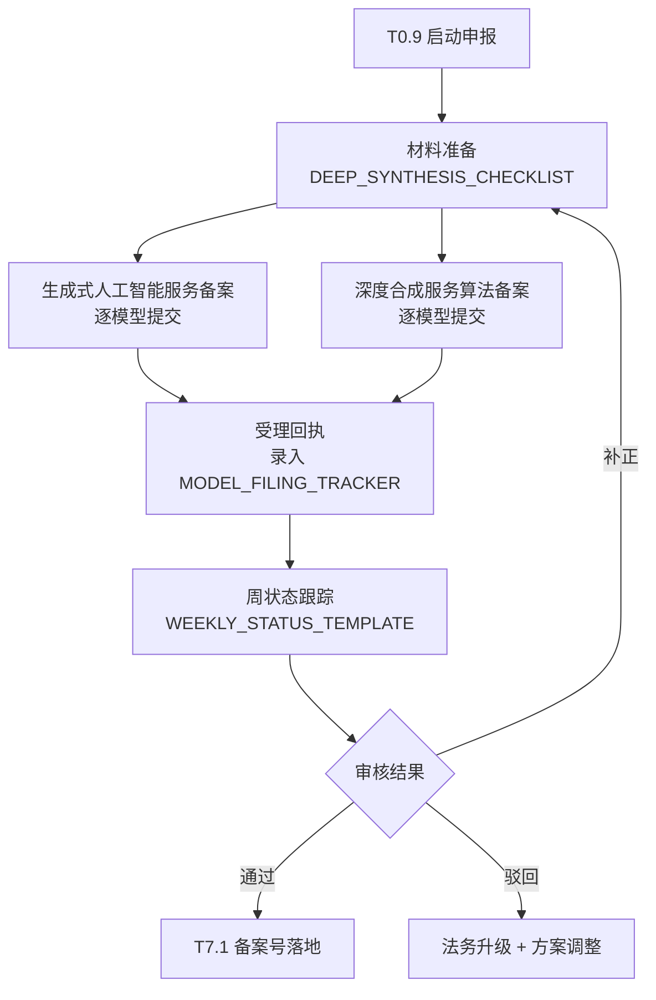
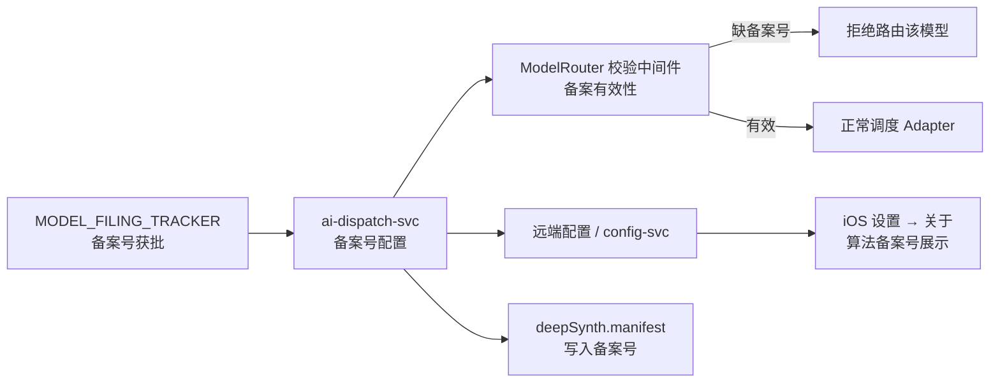

# 算法备案与深度合成合规流程

> **任务编号**：T0.9（P0 启动）→ T7.1（P7 落地）  
> **负责人**：COMP（合规法务）  
> **最后更新**：2026-06-06

## 1. 背景与目标

根据 [PRD §6.1](../../docs/PRD.md#61-生成式-ai-算法备案) 与 [dev-plan T0.9](../../docs/dev-plan.md#31-子任务清单)，国内 App Store 上架前须完成：

1. **生成式人工智能服务备案**（国家网信办）
2. **深度合成服务算法备案**（国家网信办）

V1 中国区接入的国内模型须**逐模型独立申报**（PRD §4.5.1），首批覆盖：

| 模型 | Adapter | 能力 | 厂商 |
| --- | --- | --- | --- |
| Seedream | `SeedreamAdapter` | 图像生成 | 字节跳动 |
| 通义万相 | `TongyiWanxiangAdapter` | 图像编辑 | 阿里云 |
| 即梦 | `JimengAdapter` | 图像编辑 | 字节跳动 |
| Seedance | `SeedanceAdapter` | 视频生成 | 字节跳动 |

## 2. 目录结构

```
compliance/algorithm-filing/
├── README.md                    # 本文件：流程说明与衔接
├── MODEL_FILING_TRACKER.md      # 备案受理回执跟踪表（主台账）
├── WEEKLY_STATUS_TEMPLATE.md    # 周状态汇报模板
└── DEEP_SYNTHESIS_CHECKLIST.md  # 深度合成标识与备案材料清单
```

## 3. 双备案申报流程



### 3.1 阶段说明

| 阶段 | 时间窗口 | 动作 | 产出 |
| --- | --- | --- | --- |
| **P0 启动**（T0.9） | W0–W2 | 材料准备、首批 4 模型双备案提交、建立跟踪表 | 受理回执跟踪 + 周状态流程 |
| **P0–P6 并行** | W2–W12 | 周状态汇报、补正响应、跟进审核 | 周状态记录归档 |
| **P7 落地**（T7.1） | W12–W15 | 备案号回填 ai-dispatch-svc、端侧展示、路由校验 | 缺备案号 → 拒绝路由 |

> 算法备案周期通常 ≥ 60 天（PRD 风险表）。P0 启动的目的是**不阻塞 W12 前后与 P7 汇合**。

### 3.2 分批申报策略

按 V1 接入顺序分批，降低单批补正风险：

| 批次 | 模型 | 优先级 | 说明 |
| --- | --- | --- | --- |
| **批 1**（T0.9） | Seedream、通义万相、即梦、Seedance | P0 | 覆盖图像生成 / 编辑 / 视频全链路 |
| 批 2（预留） | 后续新增国内模型 | P1+ | 新 Adapter 上线前须完成备案 |

## 4. 周状态跟踪流程

1. **频率**：每周五 17:00 前更新 `MODEL_FILING_TRACKER.md` 状态列，并填写 `WEEKLY_STATUS_TEMPLATE.md` 归档至 `compliance/algorithm-filing/weekly/`（目录按需创建）。
2. **参与人**：COMP（主）、BE（ai-dispatch 接口人）、iOS（展示位）、PM（玩法灰度）。
3. **升级规则**：
   - 任一模型受理超 **14 天**无进展 → 升级至 COMP Lead
   - 任一模型审核超 **45 天**无结论 → 启动「仅展示已备案模型」灰度预案（dev-plan 风险表）
4. **汇报渠道**：飞书合规群 + 周会 COMP 环节（5 分钟）

详细模板见 [WEEKLY_STATUS_TEMPLATE.md](./WEEKLY_STATUS_TEMPLATE.md)。

## 5. 与 ai-dispatch T7.1 的衔接

T0.9 负责**申报与跟踪**；T7.1 负责**备案号工程落地**。衔接关系如下：



### 5.1 T7.1 验收要点（预告）

| 检查项 | 实现位置 | 数据来源 |
| --- | --- | --- |
| 模型与备案号绑定 | `ai-dispatch-svc` ModelRouter | `MODEL_FILING_TRACKER` 获批备案号 |
| 缺备案号拒绝路由 | Router 中间件 `备案有效性` 分支 | design-backend §5.3 |
| 启动时拉取展示 | iOS Settings → 关于 | 远端配置 `algorithm_filing_numbers` |
| manifest 写入 | `deepSynth.manifest` | 生成任务落库时附带备案号 |

### 5.2 备案号回填 SOP（T7.1 执行时启用）

1. COMP 在 `MODEL_FILING_TRACKER.md` 更新状态为「**已通过**」，填写正式备案号。
2. BE 将备案号写入 `ai-dispatch-svc` 配置（按 `adapter_id` 映射）：

   ```yaml
   # 示例结构（T7.1 落地时完善）
   algorithm_filing:
     seedream:
       gen_ai_filing_no: ""      # 生成式 AI 备案号
       deep_synth_filing_no: ""  # 深度合成备案号
       effective_from: "2026-XX-XX"
   ```

3. QA 回归：CN 区未备案模型不可被路由；Settings 关于页展示与配置一致。
4. COMP 确认 PRD §6.1 要求的用户协议 / 隐私政策 / App Store 介绍页已明示备案号。

### 5.3 灰度降级预案

若 W10 仍未拿到任一国内模型备案号（dev-plan 风险表）：

- `config-svc` 按 region=CN 下架未备案玩法卡片
- ModelRouter 仅路由 `备案有效性=true` 的 Adapter
- OS 区不受影响

## 6. 相关文档

| 文档 | 章节 |
| --- | --- |
| [PRD.md](../../docs/PRD.md) | §6.1 算法备案、§6.2 深度合成标识 |
| [dev-plan.md](../../docs/dev-plan.md) | T0.9、T7.1、T7.13 |
| [design-backend.md](../../docs/design-backend.md) | §5.3 ModelRouter、§5.6 深度合成标识 |
| [design.md](../../docs/design.md) | §8.1 合规 |

## 7. 联系人

| 角色 | 职责 |
| --- | --- |
| COMP | 材料准备、申报提交、周状态、备案号归档 |
| BE（ai-dispatch） | T7.1 配置回填、路由校验中间件 |
| iOS | T6.10 设置中心备案号展示位 |
| 法务 | 协议条款、补正函回复终审 |
