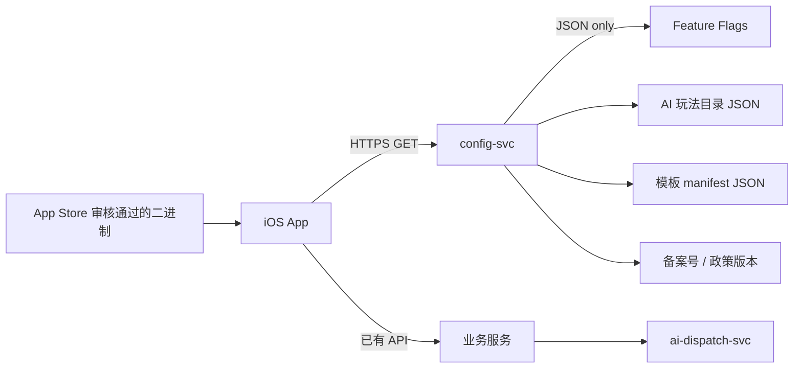

# App Store 审核备注（Review Notes）

> **任务**：T7.13  
> **用法**：复制 §1 正文至 App Store Connect → App 信息 → App 审核信息 → 备注  
> **关联**：`SUBMISSION_CHECKLIST.md`、`APP_STORE_METADATA_PLACEHOLDER.md`  
> **最后更新**：2026-06-06

---

## 1. 审核备注正文（可直接粘贴）

```text
【应用概述】
「宝宝成长相机」是一款面向家庭的成长记录 App：拍照、本地编辑、AI 共创玩法、家庭圈分享、云备份与小组件。Bundle ID：com.babycamera.app。

【演示账号】
沙盒 Apple ID：{{REVIEW_SANDBOX_APPLE_ID}}
密码：{{REVIEW_SANDBOX_PASSWORD}}
手机号登录（staging）：{{REVIEW_PHONE}} / 验证码 {{REVIEW_OTP}}（24h 有效）
说明：审核人员可用 Apple ID 登录体验完整 IAP；手机号路径用于家庭圈演示。

【核心操作路径】
1. 登录 → 创建宝宝档案 → 完成监护人同意（14 岁以下儿童信息）
2. 相机拍照 → 编辑器应用滤镜 → 选择 AI 玩法（消耗积分）→ 等待生成
3. 设置 → 会员订阅：查看价格与自动续订说明；可用沙盒账号购买
4. 设置 → 积分充值：购买积分包（消耗型 IAP）
5. 家庭圈发布 → 微信分享（失败时可用系统分享兜底）
6. 设置 → 关于：查看 ICP 备案号、算法备案摘要、政策链接

【中国区合规】
- ICP App 备案号：{{ICP_NUMBER}}（App 名称与备案一致：宝宝成长相机）
- 算法备案号：见 App 内「设置 → 关于 → 算法备案号」。正式号由 config-svc 远端下发（T7.1）；提审包展示摘要文案，获批后热更新为正式备案号，无需重新提审二进制。
- 深度合成说明：https://www.babycamera.app/legal/deep-synthesis-notice（v1.0.0）
- AI 生成内容强制带「AI 生成 · 深度合成」角标，不可关闭。

【政策链接】
- 隐私政策（CN）：https://www.babycamera.app/legal/privacy-policy-cn（v1.0.0）
- 隐私政策（OS）：https://www.babycamera.app/legal/privacy-policy-os（v1.0.0）
- 用户协议：https://www.babycamera.app/legal/terms-of-service（v1.0.0）
- 第三方 SDK 清单：https://www.babycamera.app/legal/third-party-sdk-list（v1.0.0）

【订阅与内购 — Guideline 4.5.4】
- 自动续订订阅：月 / 季 / 年会员（Product ID 见 IAP_PRODUCTS.md）
- 非续期购买：终身会员（一次性购买，非订阅组）
- 消耗型：积分充值 4 档
- 订阅权益：去广告、可关闭品牌水印、滤镜全开、年度回顾免费重生成；不含 AI 算力（AI 走积分）
- 价格、续费周期、自动续订与取消方式已在「设置 → 会员订阅」页明示；取消路径：iOS 设置 → Apple ID → 订阅 → 宝宝成长相机
- 详细披露文案见仓库 compliance/app-store/SUBSCRIPTION_DISCLOSURE.md

【ATT 不申请说明】
本 App 不调用 App Tracking Transparency（ATT）框架，Info.plist 未配置 NSUserTrackingUsageDescription，工程未链接 AppTrackingTransparency.framework。
理由：
1. 我们不将用户或设备数据与第三方数据关联用于跨 App/跨站广告跟踪（Apple 对「跟踪」的定义）；
2. 产品分析为第一方埋点（会话 / 功能使用），不上送 IDFA；
3. 广告 SDK（穿山甲/优量汇）仅在非订阅用户场景按需初始化，不向 Apple 声明为跟踪用途；用户可在系统「设置 → 隐私与安全性 → 跟踪」自行限制；
4. 订阅用户自动去广告，减少第三方广告 SDK 曝光。
App Privacy 问卷中「用于跟踪」均选「否」。

【远端配置说明 — Guideline 4.7】
本 App 通过自建 config-svc 下发 JSON 配置，用于：
- AI 玩法卡片显隐 / 排序 / 文案与积分单价展示
- 编辑器模板 manifest（预设 EditStep 数组，非可执行代码）
- Feature Flag（如备份渠道灰度、合规文案版本号）
- 合规字段热更新（ICP 备案号、算法备案摘要、政策 URL/版本）

合规边界（符合 4.7）：
- 不下发 JavaScript、WebAssembly、动态库或任何可执行代码；
- 模板素材（贴纸/字体/背景）均打包在 App 二进制内；
- 远端配置仅改变已审核 App 内既有功能的参数，不引入审核时未包含的新能力；
- AI 任务仍通过已审核的 REST API + WebSocket 与后端通信，模型路由在服务端完成。
提审时 config snapshot 版本：20250606001。如需冻结配置，请联系 {{SUPPORT_EMAIL}}。

【微信 OpenSDK】
仅用于分享至微信朋友圈/好友；不支持公众号/视频号代发。分享失败时用户可使用系统分享（UIActivityViewController）。

【儿童信息】
处理 14 周岁以下儿童照片前须监护人明示同意；未同意时 AI 与家庭圈等关键功能受限。

【联系方式】
审核问题请联系：{{SUPPORT_EMAIL}}（工作日 9:00–18:00 CST）
```

---

## 2. 占位符回填表

| 占位符 | 含义 | 回填来源 | 提审前状态 |
| --- | --- | --- | --- |
| `{{ICP_NUMBER}}` | App ICP 备案号 | `ICP_FILING_TRACKER.md` | ⬜ 占位 |
| `{{REVIEW_SANDBOX_APPLE_ID}}` | 沙盒 Apple ID | QA 测试账号池 | ⬜ 待填 |
| `{{REVIEW_SANDBOX_PASSWORD}}` | 沙盒密码 | QA | ⬜ 待填 |
| `{{REVIEW_PHONE}}` | 演示手机号 | staging 账号池 | ⬜ 待填 |
| `{{REVIEW_OTP}}` | 演示验证码 | staging mock / 短信 | ⬜ 待填 |
| `{{SUPPORT_EMAIL}}` | 客服邮箱 | config-svc `compliance.support_email` | support@babycamera.app |

---

## 3. ATT 不申请 — 技术佐证

| 检查点 | 预期 | 代码 / 配置位置 |
| --- | --- | --- |
| `NSUserTrackingUsageDescription` | **不存在** | `ios/BabyCamera/Resources/Info-Supplement.plist` |
| `AppTrackingTransparency` 框架 | **未链接** | Xcode Target → Frameworks |
| `ATTrackingManager` 调用 | **无** | 全仓 grep 结果为 0 |
| IDFA 读取（`ASIdentifierManager`） | **无** | 全仓 grep |
| 埋点标识 | 第一方 `deviceId`（UserDefaults） | `SettingsIntegrationContext+Live.swift` |

---

## 4. 远端配置 — 技术佐证（4.7）



| 下发类型 | 格式 | 是否可执行 | 示例 Key |
| --- | --- | --- | --- |
| 玩法目录 | JSON | 否 | `ai.play.*` |
| 模板 manifest | JSON（EditStep 数组） | 否 | `editor.remote_templates` |
| 合规文案 | string / URL | 否 | `compliance.*` |
| Feature Flag | bool + rollout | 否 | `backup.baidu_netdisk` |
| **禁止** | JS / WASM / dylib | — | 架构红线 |

设计依据：`docs/design-ios.md` §8.2（模板资源打包、远端仅 manifest）、`docs/PRD.md` §6.5（4.7 条款）。

---

## 5. 审核附件清单（可选上传）

| 附件 | 文件 |
| --- | --- |
| 订阅披露截图 | `SUBSCRIPTION_DISCLOSURE.md` 对应 UI 截图 |
| 深度合成标识截图 | AI 输出角标 |
| IAP 产品列表 | `IAP_PRODUCTS.md` |
| 自查清单签字页 | `SUBMISSION_CHECKLIST.md` §J |

---

## 6. 更新记录

| 日期 | 变更 |
| --- | --- |
| 2026-06-06 | T7.13 初版：审核备注（含 ATT、远端配置、4.5.4/4.7） |
