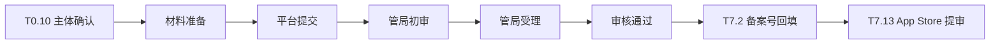

# ICP 备案（App 备案）

> **任务**：T0.10（P0 启动）→ T7.2（P7 完成）  
> **验收**：已确认主体可用；管局受理跟踪；上架材料预填入备案号占位  
> **关联**：`docs/dev-plan.md` §3.1 T0.10、`docs/PRD.md` §6.5、`docs/dev-plan.md` §10.1 T7.2 / T7.13

---

## 1. 目录说明

| 文件 | 用途 |
| --- | --- |
| [SUBJECT_VERIFICATION.md](./SUBJECT_VERIFICATION.md) | 备案主体（公司或现成主体）可用性确认 checklist |
| [ICP_FILING_TRACKER.md](./ICP_FILING_TRACKER.md) | 主体信息、App 名称、备案类型、提交/受理状态、备案号占位与周跟踪 |
| [APP_STORE_METADATA_PLACEHOLDER.md](./APP_STORE_METADATA_PLACEHOLDER.md) | App Store 介绍页、设置页 ICP 备案号占位字段（待 T7.2 回填） |

---

## 2. ICP 备案流程概览

2024 年起，在中国区 App Store 上架的 App 须完成 **工信部 App ICP 备案**（与网站 ICP 备案体系衔接，通过各省通信管理局 / 云服务商备案平台办理）。

### 2.1 T0.10 阶段（本目录，P0 W0–W2 启动）

1. **确认主体**：完成 [SUBJECT_VERIFICATION.md](./SUBJECT_VERIFICATION.md) checklist（公司主体或购买现成主体）。
2. **锁定 App 名称**：备案 App 名称须与 App Store Connect 上架名称 **完全一致**（见 [ICP_FILING_TRACKER.md](./ICP_FILING_TRACKER.md) §2）。
3. **选择备案类型**：含 IAP / 订阅 / 广告等商业化能力 → 一般为 **经营性 App 备案**；纯工具无经营行为可评估非经营性（需法务确认）。
4. **提交备案**：通过接入商（阿里云 / 腾讯云等）或 Apple 备案通道提交；取得 **受理回执**。
5. **占位预填**：在 [APP_STORE_METADATA_PLACEHOLDER.md](./APP_STORE_METADATA_PLACEHOLDER.md) 中预填占位字段，供 T6.10 设置页、T7.13 提审材料引用。

### 2.2 与 T7.2 的衔接（P7 W12–W16）

| 阶段 | 任务 | 本目录产出如何衔接 |
| --- | --- | --- |
| P0 T0.10 | 启动备案、受理跟踪 | `ICP_FILING_TRACKER.md` 周状态更新 |
| P6 T6.10 | 设置 → 关于：ICP 备案号 | 远端配置 key `compliance.icp_number`，占位见 APP_STORE 文档 |
| P7 T7.2 | ICP 备案完成 + 隐私政策等 | 备案号正式回填 Tracker + 政策网页；替换所有 `{{ICP_NUMBER}}` |
| P7 T7.13 | App Store 提审材料 | 介绍页、隐私问卷、App 信息中的 ICP 号与 Tracker 一致 |

**T7.2 完成判定（ICP 部分）**：

- [ ] 管局审核通过，取得正式 **App 备案号**
- [ ] App 名称与 App Store Connect 显示名称一致
- [ ] `ICP_FILING_TRACKER.md` 状态更新为「已通过」
- [ ] `APP_STORE_METADATA_PLACEHOLDER.md` 占位全部替换为正式备案号
- [ ] config-svc / 关于页远端配置已发布正式值
- [ ] 隐私政策（CN 版）页脚含 ICP 备案号（T7.2 法务终稿）

### 2.3 与算法备案（T0.9 / T7.1）的关系

- **ICP 备案**（工信部）：App 上架准入，展示于 App Store / 设置关于页。
- **算法备案**（网信办）：生成式 AI / 深度合成，展示于用户协议、隐私政策、AI 输出标识。
- 两者独立并行启动（P0-1 批），均在 **App Store 提审前** 取得正式编号；T7.13 提审材料需同时包含。

---

## 3. 责任分工

| 角色 | 职责 |
| --- | --- |
| COMP | 主体确认、材料提交、管局沟通、Tracker 周更、T7.2 政策网页 ICP 号 |
| INFRA | 备案域名 / 服务器接入商账号、API 域名与备案主体一致 |
| iOS | T6.10 关于页拉取 `compliance.icp_number`；占位文案 i18n |
| BE | config-svc 远端配置项 `compliance.icp_number` |
| 法务 | 主体购买合同审查、经营性 vs 非经营性判定、政策页脚 |

---

## 4. 风险与依赖

| 风险 | 缓解 |
| --- | --- |
| 主体不可用（经营范围不含互联网/电信相关） | 优先完成 SUBJECT_VERIFICATION；必要时变更经营范围或换主体 |
| App 名称与上架名不一致导致退审 | T0.10 锁定名称，变更需同步重新备案 |
| 备案周期 > 8 周 | P0 即启动；Tracker 周更；W12 前未通过则阻塞 T7.13 |
| 购买现成主体资质瑕疵 | 法务尽调 + 历史备案清查 |

---

## 5. 更新记录

| 日期 | 版本 | 变更 | 作者 |
| --- | --- | --- | --- |
| 2026-06-06 | v0.1 | T0.10 初版：目录、Tracker、占位、主体 checklist | COMP |
