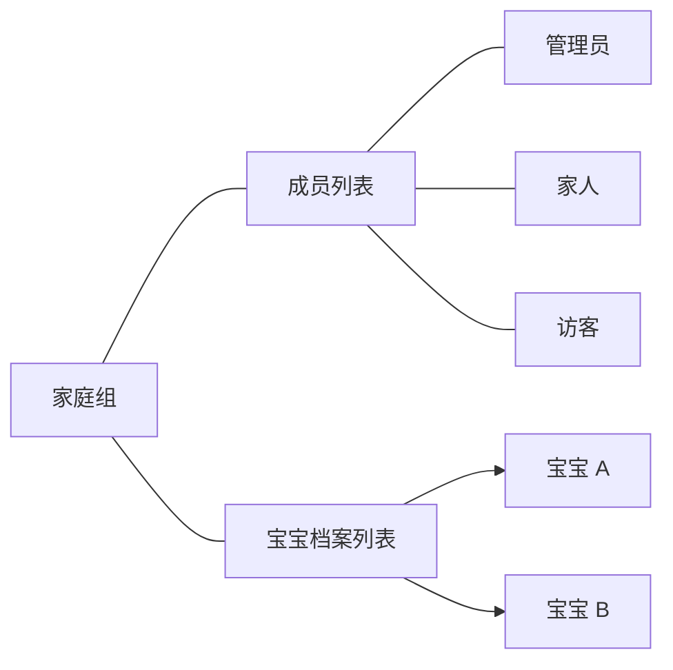
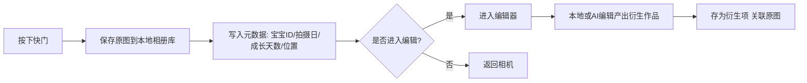
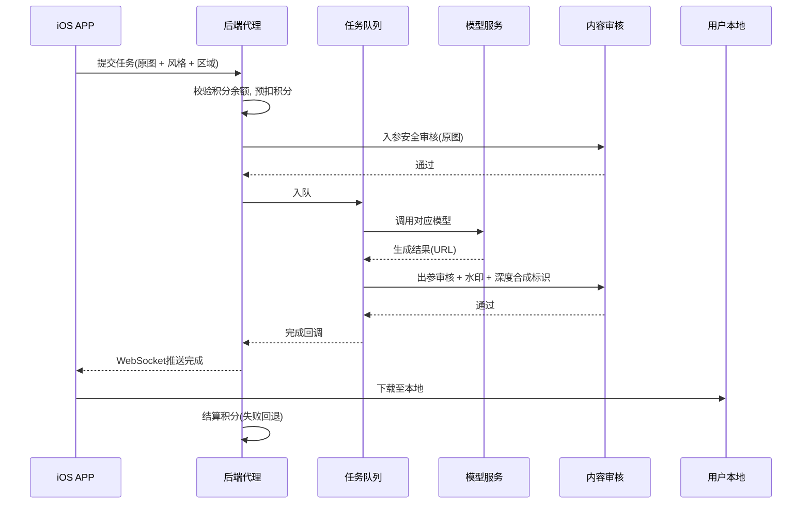
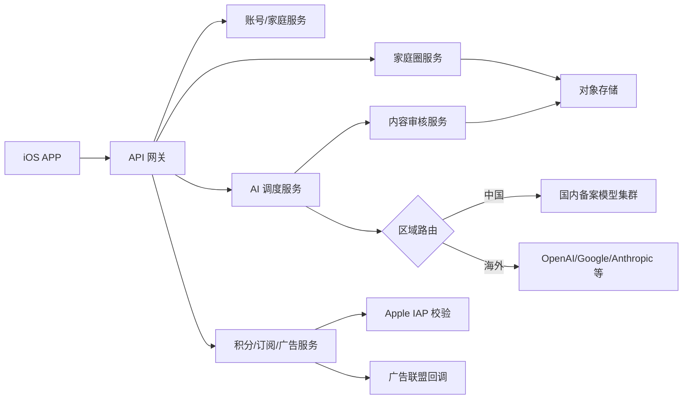
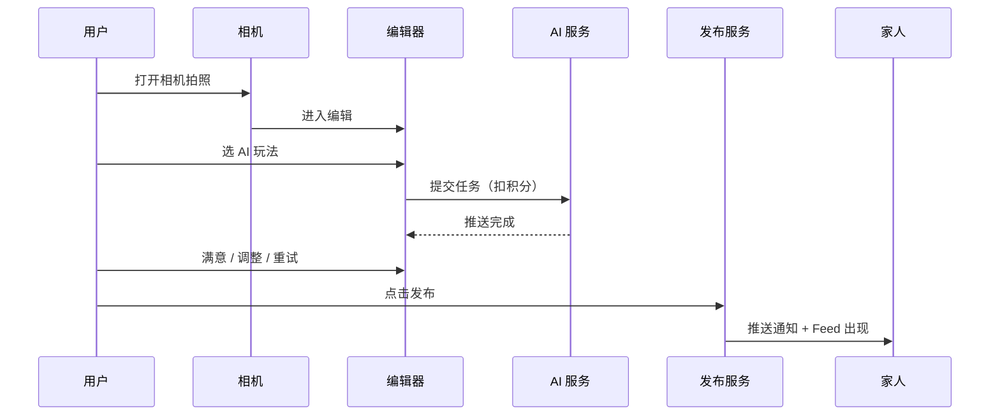
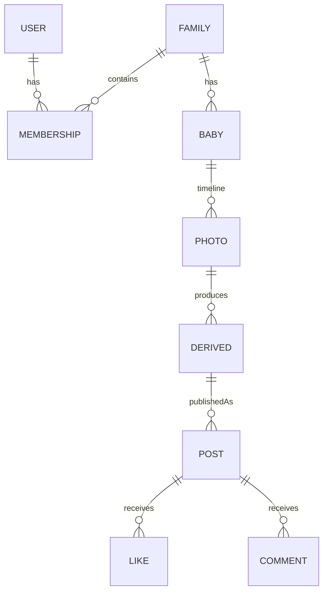
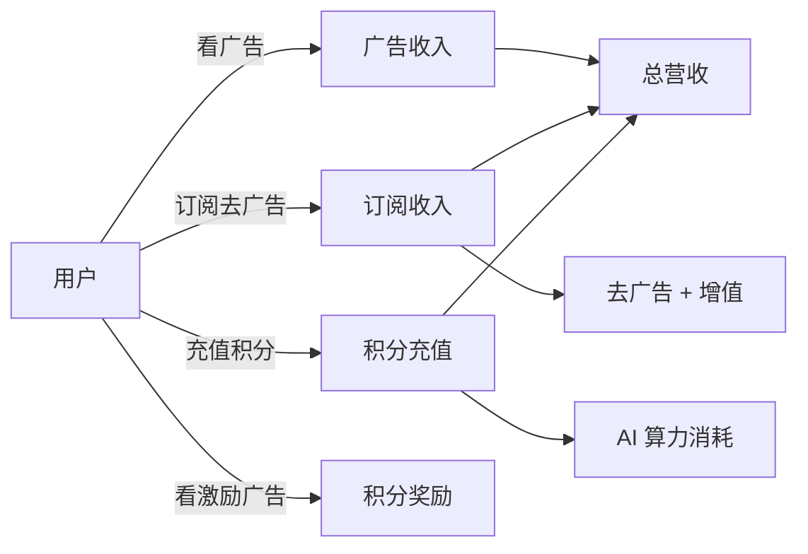

# 宝宝成长相机 PRD

> 面向 iOS 端的「宝宝成长相机」APP 产品需求文档（v0.1 Draft）

---

## 1. 文档信息

| 项目 | 内容 |
| --- | --- |
| 产品名称 | 宝宝成长相机（暂定，下文简称「本 APP」） |
| 文档版本 | v0.1 |
| 文档状态 | 草稿，待评审 |
| 目标平台 | iOS 16+（V1 仅 iPhone） |
| 文档作者 | 产品方（与 AI 协作整理） |
| 最近更新 | 2026-06-05 |
| 关联文档 | [PRD-决策记录.md](./PRD-%E5%86%B3%E7%AD%96%E8%AE%B0%E5%BD%95.md) |

### 1.1 变更记录

| 版本 | 日期 | 变更摘要 | 作者 |
| --- | --- | --- | --- |
| v0.1 | 2026-06-05 | 首版草稿，含家庭体系、相机、AI 编辑/视频、积分、合规等 | - |

---

## 2. 产品概述

### 2.1 背景

中国新生代父母对「记录宝宝每一天成长」有强烈情感需求，市场上已有「宝宝时光」「时光小屋」等相册类 APP，但普遍存在以下痛点：

- 拍照后缺乏便捷的二次创作能力，照片千篇一律
- 缺少结合最新生成式 AI（图像/视频）模型的创作能力
- 隐私顾虑：原图被强制上云、家人共享强绑定云空间
- 商业化模式以「订阅扩容」为主，对低频用户不友好

随着 Nano Banana、GPT Image 2、Seedream、Seedance 等多模态模型的成熟，将「成长记录」与「AI 共创」结合具备明确的产品机会。

### 2.2 产品定位

一句话定义：**一款以宝宝成长日历为核心、以 AI 共创为差异化的家庭相机 APP**。

- 主战场：iOS 中国区，后续延展到海外
- 用户人群：0–12 岁孩子的父母 + 家庭成员
- 核心差异化：
  1. **时间锚定**：每张照片自动绑定宝宝当下的成长天数/月数/年数
  2. **AI 共创**：调用主流图像/视频大模型，一键将日常照片变成绘本、写真、短片
  3. **隐私优先**：原图不强制入云，家庭共享只面向「已发布」的作品
  4. **公平商业化**：基础功能免费 + 看广告免费用，AI 算力走积分按量付费

### 2.3 产品目标

| 维度 | 目标（V1 上线后 6 个月） |
| --- | --- |
| 月活用户 MAU | 30 万 |
| 次日留存 | ≥ 40% |
| 30 日留存 | ≥ 20% |
| 单用户日均拍照 | ≥ 1.2 张 |
| AI 调用付费用户占比 | ≥ 8% |
| 订阅用户占比 | ≥ 3% |
| 单日均收入（含广告 + 订阅 + 积分） | ≥ 5,000 元 |

> 上述指标为初步设想，需根据冷启动数据校准。

---

## 3. 用户与场景

### 3.1 用户画像

#### P1 主用户：年轻妈妈（85% 操作集中在此角色）

- 25–38 岁，城市中产，月可支配收入 8k+
- 强爱表达：朋友圈、小红书有发图习惯
- 对宝宝隐私敏感，对「人脸入云」「人脸训练 AI」高度警惕
- 时间碎片化，希望「拍完一键出片」

#### P2 次用户：年轻爸爸

- 偶尔拍照，更关注「家庭账本式」的集中查看与回顾
- 对设备成本不敏感，对 AI 玩法接受度高

#### P3 隔代家人：爷爷奶奶 / 外公外婆

- 50–70 岁，操作能力弱
- 只想「看孙辈最新照片」，无需上传 / 编辑能力
- 强需求：通知 + 一键打开看图

### 3.2 典型场景

| 场景 | 描述 | 涉及核心功能 |
| --- | --- | --- |
| S1 日常拍照打卡 | 妈妈早上抱起宝宝随手拍一张，相机取景框上自动显示「出生第 312 天」 | 相机、时间锚定 |
| S2 补录历史照片 | 妈妈想把昨晚爸爸用系统相机拍的照片补录进 APP | 系统相册导入、EXIF 校验 |
| S3 节日里程碑 | 宝宝百天，APP 推送「今天是宝宝百天，要不要做一张写真？」 | 里程碑提醒、AI 编辑模板 |
| S4 AI 绘本风共创 | 妈妈把宝宝自拍丢给 AI，生成「吉卜力风」绘本图，分享到朋友圈 | AI 编辑、深度合成标识、分享 |
| S5 AI 图生视频 | 妈妈用宝宝学步照生成 5 秒短视频用于祖父母群 | AI 视频、积分扣费 |
| S6 年度回顾 | 宝宝生日当天，APP 自动剪辑「2025 年度成长视频」 | 自动汇编、推送 |
| S7 家人围观 | 妈妈发布后，远在老家的奶奶在 APP 里收到推送，点开看最新一组照片 | 家庭动态圈、推送、低权限只读 |
| S8 隐私优先共享 | 妈妈仅发布「精修后」的照片到家庭圈，原图仍在自己 iPhone 上 | 本地优先存储、发布机制 |

---

## 4. 功能需求

### 4.1 账号与家庭体系

#### 4.1.1 注册与登录

- 支持登录方式（按优先级）：
  1. Apple ID（苹果上架强制要求）
  2. 手机号 + 短信验证码（国内合规主路径）
  3. 微信（V1.1 接入）
- 首次登录后引导填写：昵称、与宝宝关系（爸爸/妈妈/爷爷/奶奶/其他）
- 未登录可使用「拍照 + 本地相册」基础功能（仅本地，不能加入家庭、不能调 AI、不能发布）

#### 4.1.2 家庭组（Family）

- 一个用户可创建至多 **2 个家庭组**、加入至多 **3 个家庭组**
- 一个家庭组容纳：宝宝档案 ≤ 5、家庭成员 ≤ 8（数值待最终确认，见 §12）
- 家庭组结构示意：

#### 4.1.3 角色与权限矩阵

| 能力 | 管理员 | 家人 | 访客 |
| --- | :---: | :---: | :---: |
| 创建/解散家庭组 | ✓ | ✗ | ✗ |
| 编辑宝宝档案 | ✓ | ✓ | ✗ |
| 邀请新成员 | ✓ | ✗ | ✗ |
| 移除成员 | ✓ | ✗ | ✗ |
| 转让管理员 | ✓ | ✗ | ✗ |
| 拍照与本地编辑 | ✓ | ✓ | ✗ |
| AI 编辑/视频生成（扣积分） | ✓ | ✓ | ✗ |
| 发布到家庭圈 | ✓ | ✓ | ✗ |
| 查看家庭圈已发布内容 | ✓ | ✓ | ✓ |
| 点赞 / 评论 | ✓ | ✓ | ✓ |
| 第三方分享 | ✓ | ✓ | ✓（仅其自己拍/编辑的内容） |

> 「访客」用于祖辈只看不传场景；「家人」是默认角色。

#### 4.1.4 邀请机制

- 管理员生成 **6 位数字邀请码 + 二维码**，有效期 24 小时，最多被使用 8 次（达到家庭组上限即失效）
- 被邀请者输入邀请码 → 选择关系称谓 → 进入家庭组
- 邀请记录可查询，支持立即作废邀请码

#### 4.1.5 管理员转让 / 失联接管

- **主动转让**：管理员可在「家庭设置」选择任一家人转让
- **失联接管**：当管理员账号 30 天无登录，任意家人可发起「管理员接管投票」，全体在线家人 ≥ 50% 同意且发起后 7 天无原管理员异议自动转让
- 任一家庭组始终有且仅有 1 名管理员

### 4.2 宝宝档案（Baby Profile）

#### 4.2.1 必填字段

- 小名（昵称）
- 性别（男 / 女 / 不愿透露）
- 出生日期（精确到日，时区跟随设备）
- 头像

#### 4.2.2 选填字段

- 大名
- 出生时间（精确到分，用于八字、星座、时辰展示）
- 出生体重 / 身长
- 血型
- 出生地（用于地图视图）
- 备注

#### 4.2.3 时间体系展示规则

| 阶段 | 显示格式 | 备注 |
| --- | --- | --- |
| 出生 0–99 天 | 「出生第 N 天」 | 出生当天 = 第 1 天 |
| 100–365 天 | 「N 天 / N 个月 N 天」 | 主显示天，副显示月 |
| 1 岁 – 3 岁 | 「N 岁 N 个月」 | |
| 3 岁以上 | 「N 岁」+ 当天日期 | |

#### 4.2.4 多宝宝切换

- 顶部有「宝宝切换器」（Avatar 横向滚动）
- 切换后所有相册、时间线、动态圈数据按该宝宝过滤
- 同一张照片可关联多个宝宝（双胞胎/合照场景），积分按张数 ×1 计

### 4.3 相机与拍照

#### 4.3.1 拍摄能力

| 能力 | 是否在 V1 | 备注 |
| --- | :---: | --- |
| 标准照片（HEIC/JPG） | ✓ | 默认 HEIC，可在设置改为 JPG |
| Live Photo | ✓ | iOS 系统能力 |
| Apple ProRAW | ✗ | V1.2 评估 |
| 连拍（Burst） | ✓ | 长按快门键 |
| 前后摄切换 | ✓ | |
| 闪光灯 | ✓ | 自动 / 开 / 关 |
| 滤镜实时预览 | ✓ | 至少 6 款 |
| 网格线 / 水平仪 | ✓ | |
| 倒计时拍摄 | ✓ | 3s / 10s |
| 视频录制 | ✗ | V1.2 评估，避免与 AI 视频冲突定位 |

#### 4.3.2 取景框信息浮层

- 顶部固定显示：宝宝小名 + 当前成长天数
- 拍摄后保留为「拍摄水印（可选）」，默认仅元数据保存，不烧入像素

#### 4.3.3 拍照后处理流程

#### 4.3.4 系统相册导入

- 用户可在「时间线」或「相机页面」选择「从相册导入」
- 必须读取 EXIF `DateTimeOriginal` 作为拍摄时间
- 若 EXIF 缺失，弹窗提示并禁止导入（避免污染时间线）
- 若 EXIF 时间早于宝宝出生日期，弹窗提示「该照片早于宝宝出生日，是否归类为孕期档案？」（孕期模式见 §12 待确认）
- 导入文件最大 200 MB / 张，单次最多 50 张

### 4.4 本地编辑（不消耗积分）

| 模块 | 内容 |
| --- | --- |
| 滤镜 | 至少 12 款，分「日常」「人像」「胶片」「卡通」分类 |
| 调色 | 亮度、对比度、饱和度、色温、阴影、高光、锐化 |
| 裁剪 | 自由 / 1:1 / 3:4 / 9:16 / 16:9 |
| 旋转 | 90 度旋转、镜像 |
| 贴纸 | 自研宝宝主题贴纸库（≥ 60 个），支持按分类（数字、节日、文字） |
| 文字 | 字体（≥ 6 款，含商用授权）、颜色、描边、阴影 |
| 马赛克 | 普通方块 / 高斯模糊 / 表情遮罩 |
| 涂鸦 | 画笔，颜色、粗细 |
| 模板 | 「成长卡片」「百天卡」「周岁卡」等成品模板（≥ 12 套） |

- 编辑结果作为「衍生项」保存，原图保持不动
- 支持「重新编辑」（保留编辑步骤的 JSON，类似 Photoshop psd）

### 4.5 AI 编辑（消耗积分）

#### 4.5.1 接入的模型（V1）

| 类型 | 模型 | 区域 | 用途 | 备注 |
| --- | --- | --- | --- | --- |
| 图像编辑 | Nano Banana（Google） | 海外 | 一键改风、换装、换背景 | 通过海外代理 |
| 图像编辑 | GPT Image 2（OpenAI） | 海外 | 写实风改图、文字嵌入 | 通过海外代理 |
| 图像生成 | Seedream（字节） | 中国 | 国风、绘本风 | 走国内备案模型 |
| 图像编辑 | 通义万相 / 即梦 | 中国 | 替换风格、扩图 | 走国内备案模型 |
| 视频生成 | Seedance（字节） | 中国 | 图生视频 5s/10s | 走国内备案模型 |
| 视频生成 | Runway / Veo 等 | 海外 | 备选 | V1.1 评估 |

> 用户视角只看到「风格 / 玩法」入口（如「吉卜力风」「亲子合影」「百天写真」），不暴露具体模型名，后端按区域+负载智能路由。

#### 4.5.2 玩法分类（V1 至少覆盖 18 个玩法卡片）

- 风格化：吉卜力、迪士尼、油画、水彩、漫画、皮克斯、贴纸风
- 写真：百天写真、周岁写真、汉服、宇航员、医生、警察
- 修复：模糊修复、老照片上色、抠图换背景
- 创意：亲子合影（仅父母在外地）、未来宝宝、爆款表情包

#### 4.5.3 AI 任务流转

#### 4.5.4 失败与重试

- 模型层失败：自动重试 ≤ 2 次，仍失败则全额退还积分
- 审核拒绝：积分全额退还，提示「该内容不符合社区规范」并给出申诉入口
- 超时阈值：图像 60s、视频 5 分钟，超时自动失败

### 4.6 AI 图生视频（消耗积分）

- 单次输入：1 张图（V1）；多图融合 V1.1 评估
- 时长档位：5 秒 / 10 秒（待确认，见 §12）
- 分辨率：720p（V1），1080p（V1.1）
- 输出格式：MP4，H.264，带音轨（无音 / 背景音乐二选一）
- 默认水印：右下角小尺寸品牌水印 + 「AI 生成」深度合成标识（合规要求，强制）
- 用户可在「分享前」选择是否去除品牌水印（订阅用户可去除），但深度合成标识不可移除

### 4.7 成长时间线（Timeline）

#### 4.7.1 视图

| 视图 | 描述 |
| --- | --- |
| 日视图 | 单日所有原图 + 衍生项的 Story 式滑动浏览 |
| 月视图 | 日历网格，每天显示当日代表图 |
| 年视图 | 一年 12 个月的瀑布流，含里程碑标识 |
| 地图视图 | 基于照片地理元数据的足迹地图（中国地图 + 世界地图） |
| 全部 | 倒序瀑布流 |

#### 4.7.2 年度回顾视频（自动）

- 每年宝宝生日前 1 周自动生成年度回顾视频（30s）
- 自动挑选：每月代表图 + 高互动图，含转场与字幕
- 用户可手动重选素材并重新生成（消耗积分）

### 4.8 里程碑（Milestones）

#### 4.8.1 内置里程碑（中国传统 + 国际通用）

| 名称 | 触发时机 | 默认行为 |
| --- | --- | --- |
| 三朝 | 出生第 3 天 | 推送 + 模板 |
| 满月 | 出生第 30 天 | 推送 + 模板 |
| 百天 | 出生第 100 天 | 推送 + 写真套餐 |
| 六个月 | 出生第 180 天 | 推送 |
| 周岁 | 出生 365 天 | 推送 + 年度回顾 |
| 抓周 | 周岁同日 | 模板 |
| 学步纪念 | 用户手动标记 | - |
| 入园 | 用户手动标记 | - |
| 生日 | 每年生日 | 推送 + 年度回顾 |
| 六一儿童节 | 每年 6/1 | 推送 + 模板 |

- 用户可自定义里程碑（名称 + 日期）
- 里程碑模板包含：成长卡片、推荐 AI 玩法、文字祝福模板

### 4.9 家庭动态圈（Family Feed）

#### 4.9.1 发布

- 入口：编辑完成 / 时间线照片右上角「发布」按钮
- 一次最多发布 9 张图 + 1 段视频
- 文案输入框：默认填入「{宝宝小名} · 第 {N} 天 · {AI 玩法名}」
- 选择可见范围：仅家庭（默认）/ 仅自己

#### 4.9.2 浏览

- 入口：底 Tab「家庭」
- 信息流：按发布时间倒序
- 支持双击点赞、长按评论、@ 提及家人
- 离线缓存最近 100 条

#### 4.9.3 发布即上云

- 发布操作触发：把作品文件 + 元数据上传至服务端
- 未发布的原图与衍生项 **不上云**（家庭其他成员不可见）
- 取消发布 = 服务端删除该作品（保留本地副本）

### 4.10 第三方分享

| 平台 | 接入方式 | 备注 |
| --- | --- | --- |
| 微信朋友圈 | 微信 OpenSDK 深度对接 | 自动带文案，自动适配缩略图 |
| 微信好友 | 微信 OpenSDK | 同上 |
| 小红书 | iOS 系统分享面板 | 用户选择小红书 App，APP 已通过剪贴板写入「智能文案」 |
| 抖音 | iOS 系统分享面板 + 剪贴板文案 | 同上 |
| 公众号 / 视频号 | 不支持 | PRD 内显式说明：微信开放平台无个人代发能力 |
| 系统分享 | UIActivityViewController 全量支持 | 保底通道 |

#### 4.10.1 智能文案生成

- 触发：点击「分享」时自动调用「文案生成」（轻量模型，免费，每日 50 次/账号）
- 输入：宝宝小名、成长天数、AI 玩法、地点（可选）
- 输出：3 条候选文案（含 emoji 与话题词），用户一键复制

#### 4.10.2 水印策略

- 默认开启「左下角小尺寸品牌水印」
- AI 生成内容强制带「AI 生成 · 深度合成」角标（不可关闭，合规要求）
- 订阅用户可关闭品牌水印（但深度合成标识仍保留）

### 4.11 积分与商业化

#### 4.11.1 积分获取渠道

| 来源 | 数量（建议） | 频率 |
| --- | --- | --- |
| 新用户注册 | 100 积分 | 一次性 |
| 完善宝宝档案 | 20 积分 | 一次性 |
| 每日签到 | 5–20 积分（连签递增） | 每天 |
| 看激励视频广告 | 5 积分 / 次 | 每天上限 5 次 |
| 邀请新用户 | 50 积分 | 不限次，被邀请方实名后到账 |
| 充值 | 见下表 | 任意 |

#### 4.11.2 积分充值档位（建议）

| 档位 | 金额（元） | 积分 | 单价（元/积分） |
| --- | --- | --- | --- |
| 体验装 | 6 | 60 | 0.10 |
| 入门装 | 30 | 330 | 0.091 |
| 常用装 | 68 | 800 | 0.085 |
| 大礼包 | 198 | 2500 | 0.079 |

> 充值走苹果内购（IAP），遵守 Apple 30% 抽成规则。

#### 4.11.3 AI 算力定价（建议草案）

| 玩法 | 扣积分 | 说明 |
| --- | :---: | --- |
| 风格化图像（Nano Banana / Seedream） | 8 | 720p 输出 |
| 高质量写真（GPT Image 2） | 15 | 1024px 输出 |
| 老照片修复 / 上色 | 10 | |
| AI 图生视频 5s | 60 | |
| AI 图生视频 10s | 120 | |
| 年度回顾视频重生成 | 50 | |
| 智能文案 | 0 | 免费，每日 50 次/账号 |

> 定价待与算法成本对账后最终敲定。

#### 4.11.4 订阅（去广告 + 增值）

| SKU | 价格（建议） | 权益 |
| --- | --- | --- |
| 月会员 | ¥18 | 去广告、品牌水印可关、滤镜全开、年度回顾免费重生成 1 次/年 |
| 季会员 | ¥45 | 同上，平均 ¥15/月 |
| 年会员 | ¥128 | 同上 + 200 积分赠送 |
| 终身会员 | ¥498 | 同上 + 500 积分赠送，限量首发 |

> 订阅 **不包含** AI 算力，AI 算力始终走积分；定价以最终调研为准。

#### 4.11.5 广告策略

| 广告位 | 频次 | 触发条件 |
| --- | --- | --- |
| 开屏广告 | 冷启动每日首次 1 次 | 非订阅用户 |
| 插页广告 | 关闭编辑器时偶发 | 非订阅用户，单日 ≤ 3 次 |
| 激励视频 | 用户主动点击「看广告得积分」 | 全量用户 |

- 接入：穿山甲 / 优量汇 / 快手联盟，国内通过聚合 SDK；海外可接入 AdMob
- 广告与儿童内容隔离：审核「儿童不宜」类目广告，不展示

#### 4.11.6 退款规则

- 积分一经消耗不退（界面强提示）
- 充值未消耗部分支持 7 日内整笔退款，按苹果退款流程走
- 订阅按苹果统一规则处理

### 4.12 通知与提醒

| 类型 | 默认 | 用户可关 |
| --- | :---: | :---: |
| 每日拍照提醒 | 关 | ✓（开关 + 自定义时间） |
| 里程碑提醒 | 开 | ✓ |
| 家人动态（点赞 / 评论 / 新发布） | 开 | ✓ |
| 年度回顾生成完成 | 开 | ✗ |
| 积分到账 / 退还 | 开 | ✓ |
| AI 任务完成 | 开 | ✗ |
| 系统活动 / 营销 | 关 | ✓ |

- 推送通道：APNs
- 通知中心内含红点，进入「我的」清空

### 4.13 存储与备份

#### 4.13.1 本地数据结构

- 沙盒内独立 `Library/BabyCameraStore/` 目录
- 子目录：`originals/`（原图）、`derived/`（编辑衍生）、`videos/`（AI 视频）、`meta/`（SQLite + JSON 元数据）
- 启用 iOS Data Protection: `CompleteUnlessOpen`

#### 4.13.2 备份目标（多选）

| 备份目标 | 接入方式 | V1 是否支持 |
| --- | --- | :---: |
| iCloud Drive | iOS 系统 API（CloudKit / FileProvider） | ✓ |
| 系统相册 | Photos 框架（用户授权后双写） | ✓ |
| 百度网盘 | OAuth + 官方 OpenAPI | ✓ |
| 阿里云盘 | OAuth + 官方 OpenAPI | V1.1 |
| 坚果云 | WebDAV | V1.1 |
| 自建 WebDAV | 用户填地址 | V1.2 |

#### 4.13.3 备份策略

- 增量备份：按文件 hash 去重
- 触发条件：仅在 Wi-Fi + 电量 > 30% + 充电中 自动备份；用户也可手动触发
- 备份失败可见日志；连续 3 次失败弹窗提示
- 卸载 APP 提示：弹窗提示「本地相册库将被删除，请先备份」

### 4.14 桌面小组件 & 锁屏

- 主屏小组件（V1 提供）：
  - 小尺寸：宝宝头像 + 当前成长天数
  - 中尺寸：当日最新一张照片 + 文字
  - 大尺寸：当周拍摄网格 4 宫格
- 锁屏组件（iOS 16+）：宝宝当前成长天数（小角标）
- 实时活动（Live Activities）：里程碑当日全天倒计时（V1.1 评估）

### 4.15 设置中心

- 账号：登录方式、绑定/解绑、注销
- 家庭：当前家庭、邀请管理、转让管理员、退出家庭
- 隐私：相机/相册/通知/位置授权、隐私政策、儿童信息同意
- 数据：导出（zip）、清理缓存、备份目标管理
- 通知：分类开关
- 关于：版本、用户协议、隐私政策、深度合成说明、ICP 备案号、算法备案号
- 客服反馈：内置反馈表 + 邮件通道

---

## 5. 非功能需求

| 维度 | 指标 |
| --- | --- |
| 性能：相机启动 | ≤ 800ms（iPhone 12 及以上） |
| 性能：编辑器打开 | ≤ 500ms |
| 性能：AI 任务平均完成（图像） | ≤ 15s（P50），≤ 60s（P95） |
| 稳定性：崩溃率 | ≤ 0.2% |
| 稳定性：AI 任务成功率 | ≥ 95% |
| 离线能力 | 拍照、本地编辑、查看本地相册、查看已下载家庭圈 全部可用 |
| 可访问性 | 支持系统大字号、VoiceOver 主流程可用 |
| 国际化 | V1：中文（简体），V1.2：英文 |
| 可观测性 | 接入埋点（关键事件 ≥ 60 项）+ 崩溃监控（Bugly/Sentry） + APM |
| 资源占用 | 安装包 ≤ 80 MB，常驻内存 ≤ 200 MB |

---

## 6. 合规要求（强约束）

### 6.1 生成式 AI 算法备案

- 国内 App Store 上架前完成「**生成式人工智能服务备案**」（网信办），覆盖每一个调用的国内模型
- 同步申报「**深度合成服务算法备案**」
- 用户协议、隐私政策、App Store 介绍页明示备案号

### 6.2 深度合成内容标识

- 所有 AI 生成（图像 / 视频）作品必须包含：
  - 显式标识：「AI 生成 · 深度合成」角标（不可关闭）
  - 隐式标识：写入元数据（C2PA 风格或自定义协议）
- 用户分享时随作品一并带出

### 6.3 未成年人 / 儿童信息保护

- 主体内容涉及 ≤14 岁儿童照片，按《个人信息保护法》《未成年人保护法》《未成年人网络保护条例》要求：
  - 单独同意：收集儿童照片前弹窗「监护人同意书」
  - 数据最小化：原图不强制上云（已通过本地优先策略实现）
  - 严禁向第三方（含算法训练）共享儿童照片：需在与所有 AI 模型提供方的协议中明确「不用于训练」条款
- 全 APP 默认关闭「营销推送」（避免对儿童相关账号过度推送）

### 6.4 个人信息保护

- 隐私政策必须覆盖：收集字段、目的、第三方 SDK 清单、跨境传输（海外区涉及）、用户权利
- 提供 **账号注销 + 数据导出（zip 含照片 + 元数据 + 时间线 HTML 预览）** 入口
- 跨境传输（海外 AI）需通过个人信息出境标准合同/安全评估，或仅对海外区开放

### 6.5 App Store 上架要求

- 完成工信部 **ICP 备案**（2024 起 App 必须）
- 满足 4.5.4 条款：明示订阅价格、续费规则、取消方式
- 4.7 条款：远端代码（含 AI 玩法模板）必须经过 Apple 审核认可的方式下发

### 6.6 内容审核

- **入参审核**：原图调 AI 前过儿童照片可识别能力 + 涉黄/涉政过滤
- **出参审核**：所有 AI 输出（图像/视频）由审核服务过滤后再回传 APP
- **UGC 审核**：家庭圈虽限家人可见，仍按 UGC 标准审核文字与文件（自动 + 人工抽检）
- 接入：阿里云内容安全 / 网易易盾（国内）；AWS Rekognition / Cloudflare（海外）

### 6.7 字体 / 素材版权

- 字体：购置 6 款商用授权字体（如方正、思源系），并保留授权证书
- 贴纸：自研为主，避免任何 IP 形象（迪士尼/三丽鸥等）；外采的素材必须明确商用范围
- 滤镜算法：原创参数；引用开源算法需保留 LICENSE

---

## 7. 技术架构概要

### 7.1 端侧（iOS）

- 语言：Swift 5.10+
- UI：SwiftUI 为主，UIKit 兜底（相机模块）
- 最低系统：iOS 16.0
- 关键框架：AVFoundation、Photos、Vision、CoreImage、Metal（滤镜）、StoreKit 2、WidgetKit、UserNotifications、AppIntents（V1.1）
- 数据持久化：GRDB（SQLite）+ 文件系统
- 网络：URLSession + async/await，AI 任务回调走 WebSocket / SSE
- 安全：Keychain 存储 Token、Data Protection、网络请求强制 ATS

### 7.2 后端服务

- 部署：中国区（阿里云/华为云）+ 海外区（AWS 新加坡）双中心
- 数据库：PostgreSQL（账号/家庭/积分） + MongoDB（任务/作品） + Redis（缓存/队列）
- 对象存储：阿里云 OSS（中国） + AWS S3（海外）
- CDN：阿里云 CDN + CloudFront
- 任务队列：Kafka + 自研 Worker
- 监控：Prometheus + Grafana + Sentry

### 7.3 关键三方

| 类别 | 服务 |
| --- | --- |
| 推送 | APNs（iOS 系统） |
| 三方登录 | Apple、微信 OpenSDK |
| 内容审核 | 阿里云内容安全 / Cloudflare |
| 广告 SDK | 穿山甲 / 优量汇 / AdMob |
| 国内 AI | Seedream（豆包）/ 通义万相 / 即梦 / Seedance |
| 海外 AI | OpenAI（GPT Image 2）/ Google（Nano Banana / Veo）/ Runway |
| 网盘 | 百度网盘 OpenAPI、阿里云盘、iCloud、WebDAV |
| 短信 | 阿里云短信 |
| 崩溃监控 | Bugly + Sentry |

---

## 8. 信息架构与主流程

### 8.1 底部 Tab

| Tab | 名称 | 默认页 |
| --- | --- | --- |
| 1 | 首页 | 今日成长卡 + 推荐玩法 |
| 2 | 时间线 | 月视图 |
| 3 | 相机（中间圆形大按钮） | 相机取景框 |
| 4 | 家庭 | 家庭圈 Feed |
| 5 | 我的 | 账号 + 积分 + 设置 |

### 8.2 拍照 → AI → 发布 主流程

### 8.3 家庭组关系

---

## 9. 数据模型概要

### 9.1 核心实体

| 实体 | 关键字段 | 备注 |
| --- | --- | --- |
| User | id, appleSub, phone, nickname, avatar, createdAt | |
| Family | id, name, adminUserId, plan, createdAt | |
| Membership | userId, familyId, role(admin/family/visitor), nickname, joinAt | |
| Baby | id, familyId, name, gender, birthDate, birthTime, avatar | |
| Photo | id, babyIds[], userId, takenAt, location, exif, sha256, localOnly | localOnly=true 表示从未发布 |
| Derived | id, sourcePhotoId, type(local/aiImage/aiVideo), spec, fileRef | |
| AiTask | id, userId, model, costCredits, status, inputRef, outputRef, createdAt | |
| Post | id, familyId, ownerUserId, items[], caption, visibleScope, createdAt | 发布后实体 |
| CreditTxn | id, userId, type(charge/consume/refund/grant), amount, ref, createdAt | |
| Subscription | id, userId, sku, periodStart, periodEnd, autoRenew, originalTxnId | |
| InviteCode | code, familyId, expireAt, usedCount, maxUses | |

### 9.2 本地存储要点

- 原图：仅在本地 + 用户自配置网盘
- 衍生作品：本地 + 选择性上云（发布时）
- 元数据：本地 SQLite 完整副本；服务端仅持有「已发布作品」对应的元数据

---

## 10. 商业化模型一览

- **核心商业化逻辑**：低门槛免费用（看广告获积分）+ 高频用户付费（订阅 + 充值积分）
- 订阅 ≠ 包含 AI 算力，避免「订阅后无限 AI」导致成本失控
- 广告与订阅互斥：订阅用户自动去广告

---

## 11. MVP 范围与发版节奏

### V1.0（首次上架，预计 4 个月）

| 模块 | 范围 |
| --- | --- |
| 账号家庭 | Apple + 手机号登录，家庭组、角色权限、邀请、转让管理员 |
| 宝宝档案 | 多宝宝、必填字段、时间体系展示 |
| 相机 | 标准拍照 + Live Photo + 实时滤镜 |
| 本地编辑 | 滤镜、贴纸、文字、马赛克、裁剪、模板 |
| AI 编辑 | 接入 2 家国内模型 + 2 家海外模型，18+ 玩法 |
| AI 视频 | 接入 Seedance，5s 与 10s |
| 时间线 | 日/月/年视图、地图视图 |
| 里程碑 | 内置 10+ 节点 + 推送 |
| 家庭圈 | 发布、Feed、点赞、评论 |
| 第三方分享 | 微信 OpenSDK + 系统分享 + 智能文案 |
| 积分商业化 | 充值、签到、激励广告、订阅、扣费 |
| 广告 | 开屏 + 插页 + 激励视频 |
| 备份 | iCloud + 百度网盘 + 系统相册双写 |
| 小组件 | 桌面小/中/大三尺寸 + 锁屏 |
| 合规 | 算法备案 + 深度合成标识 + ICP + 内容审核全链路 |

### V1.1（V1.0 后 1.5 个月）

- 孕期模式（含 EXIF 早于出生日期的归档）
- Apple Watch 简易入口（最新照片 + 拍照触发）
- 阿里云盘、坚果云备份
- 海外区视频生成（Runway / Veo）
- 实时活动（里程碑倒计时）
- 多图融合 AI

### V1.2（V1.0 后 3 个月）

- 英文版（海外上架）
- iPad 适配
- 自定义 WebDAV 备份
- Apple ProRAW 支持
- AI 头像 / 动态贴纸（GIF 输出）

---

## 12. 待确认事项 & 风险

### 12.1 待用户最终拍板

1. 订阅价格档位是否按草案（¥18/45/128/498）执行？
2. 积分单价与 AI 单次扣减表是否按草案执行？需要算法成本对账。
3. 新用户赠 100 积分 + 每日签到 5–20 + 看广告每天 5 次每次 5 积分，三个数值是否合适？
4. AI 模型默认选择策略：用户手动选玩法（无需选模型，后端智能路由） vs 暴露模型选择？建议前者。
5. 视频生成时长：是否就 5s / 10s 两档？是否要 3s 试用档？
6. 家庭成员上限 8 / 宝宝上限 5 是否合理？双胞胎家庭是否多给名额？
7. 邀请码：6 位数字 + 24 小时 + 最多 8 次是否合理？
8. 管理员失联接管阈值：30 天无登录 + 50% 家人投票 + 7 天异议期，是否要调整？
9. 孕期模式是 V1.0 还是 V1.1？（PRD 当前置于 V1.1，倾向是收敛 V1 范围）
10. AI 生成图自动加「品牌水印 + 深度合成标识」：品牌水印订阅可去，深度合成标识强制不可去（合规要求） — 是否确认？
11. 桌面小组件 V1 三尺寸全做，还是只做小尺寸？
12. 字体 / 贴纸版权方案：自研 + 外采字体 6 款 + 自研贴纸 60 个，预算是否充足？
13. 数据导出格式：zip（原图 + 元数据 JSON + 时间线 HTML 预览），是否需要 PDF 相册版？
14. 海外版的隐私政策与中国区差异：海外区是否允许将原图（脱敏后）上传 OpenAI / Google？这影响合规设计。
15. PRD 中是否需要明确写入「微信仅支持朋友圈 + 好友，不支持代发到公众号、视频号」？（建议明确）
16. Apple Watch / iPad：V1 是否完全不做？建议 V1.0 都不做，V1.1+ 评估。

### 12.2 主要风险

| 风险 | 等级 | 缓解 |
| --- | :---: | --- |
| 算法备案周期长（≥ 60 天） | 高 | 立项即启动备案，按子模型分批申报 |
| 海外 AI 跨境数据合规复杂 | 高 | V1 先只服务中国区 + 国内模型，海外能力做灰度 |
| AI 模型成本波动 | 中 | 积分按量收费 + 后端定期对账动态调价 |
| 儿童照片高敏感舆情风险 | 高 | 全链路内容审核 + 默认不上云 + 显式监护人同意 + 不参与训练协议 |
| iOS 隐私政策审查（IDFA / 跟踪权限） | 中 | 默认不申请 ATT，广告以无 IDFA 模式接入 |
| 微信 OpenSDK 政策变动 | 中 | 提供系统分享兜底 |
| 苹果对「AI 大模型类」加强审查 | 中 | 严格执行深度合成标识、上架材料留底 |

---

> 本 PRD 为 v0.1 草稿，待与设计、研发、合规、商务团队评审后修订定版。  
> 评审 checklist：产品 → 设计 → iOS → 后端 → AI 算法 → 合规 → 法务 → CEO。
