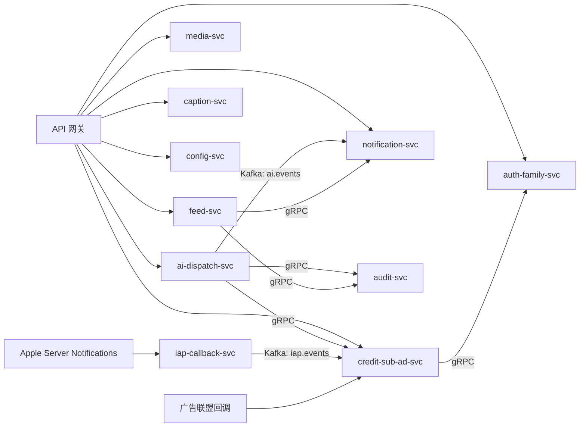
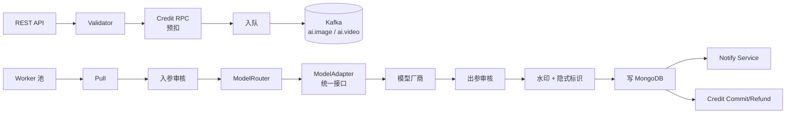
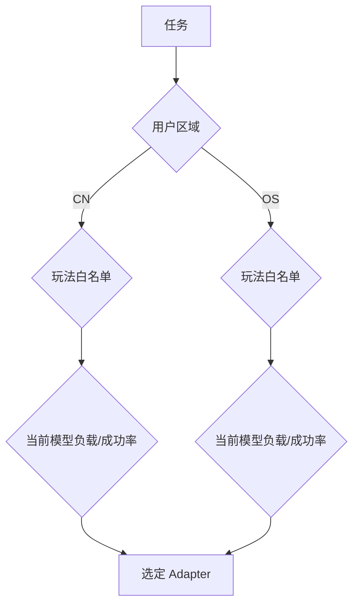
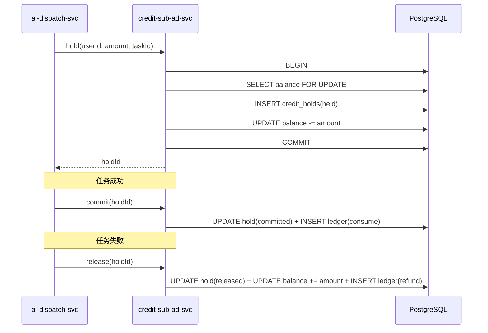
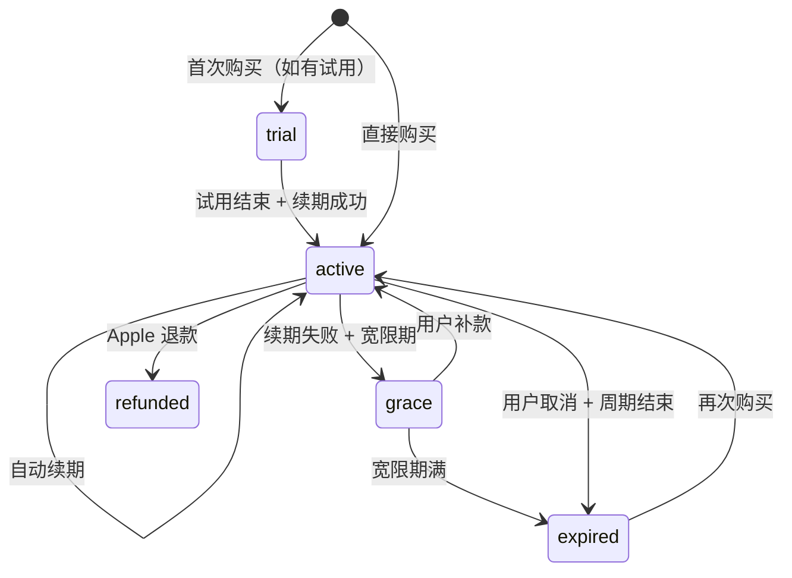

# 宝宝成长相机 详细设计：后端服务

> 后端微服务详设文档，聚焦服务边界、数据存储、AI 调度、积分账本与合规审核。

---

## 1. 文档信息

| 项目 | 内容 |
| --- | --- |
| 文档名称 | 宝宝成长相机 · 详细设计 · 后端 |
| 文档版本 | v0.1 |
| 目标版本 | V1.0 |
| 最近更新 | 2026-06-05 |
| 关联文档 | [PRD.md](./PRD.md)、[PRD-决策记录.md](./PRD-%E5%86%B3%E7%AD%96%E8%AE%B0%E5%BD%95.md)、[design.md](./design.md)、[design-ios.md](./design-ios.md)、[design-api.md](./design-api.md) |

### 1.1 与 PRD / 决策记录映射

| 本文章节 | 对应 PRD | 对应决策 |
| --- | --- | --- |
| §2 技术选型 | §7.2、§7.3 | - |
| §3 服务划分 | §4 全章、§7.2 | D1、D4 |
| §4 数据存储 | §9 | D2、D3 |
| §5 AI 调度服务 | §4.5、§4.6 | D8 |
| §6 积分/订阅/广告 | §4.11 | D9 |
| §7 内容审核 | §6.6 | - |
| §8 通知服务 | §4.12 | - |
| §9 网关与认证 | §6 | - |
| §10 跨境合规 | §6.4 | D8 |
| §11 可观测性 | §5 | - |
| §12 容量评估 | §2.3、§5 | - |

---

## 2. 总体技术选型

| 维度 | 选型 | 备注 |
| --- | --- | --- |
| 语言 / 框架 | Go 1.22（主） + Python 3.11（caption-svc / 算法工具） | 服务间 gRPC |
| 网关 | Kong 或 APISIX | 鉴权、限流、灰度路由 |
| 服务编排 | Kubernetes | 阿里云 ACK / AWS EKS |
| 数据库 | PostgreSQL 15（主）、MongoDB 6、Redis 7 | 见 §4 |
| 消息队列 | Kafka 3 | AI 任务、积分对账事件 |
| 对象存储 | 阿里云 OSS（CN） + AWS S3（OS） | CDN 前置 |
| CDN | 阿里云 CDN / CloudFront | |
| 监控 | Prometheus + Grafana + Loki + Sentry | |
| CI/CD | GitLab CI + ArgoCD | 蓝绿 / 渐进发布 |
| Secret 管理 | HashiCorp Vault | |

---

## 3. 服务划分

### 3.1 服务清单

| 服务 | 端口（内部） | 职责 | 主要存储 |
| --- | --- | --- | --- |
| `auth-family-svc` | 8001 | 账号、家庭、成员、邀请码、宝宝档案、注销 | PostgreSQL + Redis |
| `feed-svc` | 8002 | 发布、Feed、点赞、评论、UGC 审核接入 | PostgreSQL + Redis + OSS |
| `media-svc` | 8003 | OSS 直传 STS、对象生命周期 | OSS |
| `ai-dispatch-svc` | 8004 | AI 任务编排、模型路由、回调、积分预扣 | MongoDB + Kafka |
| `audit-svc` | 8005 | 入参 / 出参 / UGC 审核 + 申诉 | PostgreSQL + Redis + 三方审核 |
| `credit-sub-ad-svc` | 8006 | 积分账本、订阅、IAP 校验、广告回调 | PostgreSQL + Redis |
| `caption-svc` | 8007 | 智能文案生成（轻量模型） | Redis |
| `notification-svc` | 8008 | APNs 推送、消息中心、订阅类目 | PostgreSQL + Redis |
| `config-svc` | 8009 | 灰度、玩法目录、运营配置 | PostgreSQL + Redis |
| `iap-callback-svc` | 8010 | Apple Server Notifications v2 接收 + 投递到 credit-sub-ad-svc | Redis |

### 3.2 服务通信



- 服务内部 gRPC；对外 REST（经网关）。
- 跨服务异步事件统一走 Kafka，按业务域划分 topic（`ai.events`, `iap.events`, `feed.events`, `credit.events`）。
- 服务间不共享数据库（每个服务独立 schema），跨服务读必须走 RPC。

### 3.3 服务部署形态

- 中国区与海外区各自一套独立的服务集群与存储，不跨区共享数据库。
- 仅 `config-svc` 的灰度配置允许跨区同步（通过对象存储 + 哈希校验）。
- `caption-svc` 在两区分别接入对应轻量模型（国内：通义千问 Turbo / 海外：GPT-4o-mini）。

---

## 4. 数据存储

### 4.1 PostgreSQL 主表设计

#### 4.1.1 auth-family-svc

| 表 | 关键字段 | 索引 |
| --- | --- | --- |
| `users` | id, apple_sub?, phone?, region, nickname, avatar_url?, status, created_at, updated_at, last_seen_at | UK(apple_sub), UK(phone, region), IDX(last_seen_at) |
| `families` | id, name, admin_user_id, region, plan, created_at | IDX(admin_user_id) |
| `memberships` | user_id, family_id, role(admin/family/visitor), nickname, joined_at, removed_at? | PK(user_id, family_id), IDX(family_id) |
| `babies` | id, family_id, name, full_name?, gender, birth_date, birth_time?, birth_weight?, birth_place?, avatar_url?, created_at | IDX(family_id) |
| `invite_codes` | code, family_id, created_by, expire_at, max_uses, used_count, revoked_at? | PK(code), IDX(family_id, expire_at) |
| `child_consents` | user_id, baby_id, family_id, granted_at, version | PK(user_id, baby_id), IDX(baby_id) |
| `admin_takeover_votes` | id, family_id, initiator_user_id, status, opens_at, ends_at | IDX(family_id, status) |
| `admin_takeover_ballots` | vote_id, user_id, choice, voted_at | PK(vote_id, user_id) |
| `account_deletions` | user_id, requested_at, scheduled_at, completed_at? | PK(user_id) |

#### 4.1.2 feed-svc

| 表 | 关键字段 | 索引 |
| --- | --- | --- |
| `posts` | id, family_id, owner_user_id, baby_ids(JSONB), caption, visibility(family/self), status(audit/published/removed), created_at, audited_at? | IDX(family_id, created_at DESC), IDX(owner_user_id) |
| `post_items` | id, post_id, kind(image/video), object_key, mime, width, height, duration?, deep_synth(bool), thumbnail_key? | IDX(post_id) |
| `comments` | id, post_id, user_id, parent_id?, text, status, created_at | IDX(post_id, created_at) |
| `likes` | post_id, user_id, liked_at | PK(post_id, user_id) |
| `feed_audit_logs` | id, target_kind, target_id, result, reasons(JSONB), reviewer, created_at | IDX(target_kind, target_id) |

#### 4.1.3 credit-sub-ad-svc

| 表 | 关键字段 | 索引 |
| --- | --- | --- |
| `credit_balances` | user_id, balance, version, updated_at | PK(user_id) |
| `credit_ledger` | id, user_id, type(grant/charge/consume/refund/adjust), amount, ref_kind, ref_id, balance_after, created_at | IDX(user_id, created_at DESC), UK(ref_kind, ref_id) |
| `credit_holds` | id, user_id, ai_task_id, amount, status(held/committed/released), created_at | UK(ai_task_id) |
| `iap_receipts` | id, user_id, transaction_id, original_transaction_id, product_id, signed_payload, verified_at, status | UK(transaction_id) |
| `subscriptions` | id, user_id, original_transaction_id, sku, period_start, period_end, state, auto_renew, last_event_at | UK(original_transaction_id), IDX(user_id) |
| `ad_rewards` | id, user_id, network, placement_id, signature, granted_credits, created_at | UK(network, signature) |
| `sign_ins` | user_id, date, credits_granted, streak | PK(user_id, date) |

#### 4.1.4 notification-svc

| 表 | 关键字段 | 索引 |
| --- | --- | --- |
| `device_tokens` | user_id, device_id, apns_token, region, app_version, updated_at | PK(user_id, device_id), IDX(apns_token) |
| `notifications` | id, user_id, category, payload(JSONB), read_at?, created_at | IDX(user_id, created_at DESC) |
| `notification_subscriptions` | user_id, category, enabled | PK(user_id, category) |

#### 4.1.5 audit-svc

| 表 | 关键字段 | 索引 |
| --- | --- | --- |
| `audit_jobs` | id, kind(input/output/ugc), target_ref, status, result, reasons(JSONB), vendor, created_at, completed_at? | IDX(status, created_at), IDX(target_ref) |
| `appeals` | id, audit_job_id, user_id, reason, status, created_at, resolved_at? | IDX(user_id), IDX(status) |

### 4.2 MongoDB（ai-dispatch-svc）

集合 `ai_tasks`：

```json
{
  "_id": "tsk_...",
  "userId": "usr_...",
  "region": "cn",
  "style": "ghibli_kid",
  "model": "seedream-v3",
  "input": { "objectKey": "tmp/ai-in/...", "sha256": "..." },
  "output": { "objectKey": "ai-out/...", "thumbnailKey": "..." },
  "audit": { "input": "passed", "output": "passed" },
  "deepSynth": { "watermark": "v1", "manifest": "c2pa-v1" },
  "state": "succeeded",
  "stateHistory": [ { "state": "pending", "at": "..." }, ... ],
  "costCredits": 8,
  "creditHoldId": "hld_...",
  "modelInvocations": [ { "vendor": "bytedance", "latencyMs": 4200, "retry": 0 } ],
  "createdAt": "...",
  "updatedAt": "..."
}
```

索引：`{ userId: 1, createdAt: -1 }`、`{ state: 1, createdAt: 1 }`、`{ "input.sha256": 1 }`、`{ creditHoldId: 1 }`。

### 4.3 Redis 用法

| 用途 | 键模式 | TTL |
| --- | --- | --- |
| 邀请码缓存 | `inv:{code}` | 24h（按 PRD） |
| 短信验证码 | `sms:{region}:{phone}` | 5m |
| 短信限流 | `sms:rate:{phone}` | 60s 滑窗 |
| Token 黑名单 | `bl:{jti}` | Access Token 过期前 |
| AI 任务幂等 | `ai:idem:{userId}:{idemKey}` | 10m |
| Feed 列表缓存 | `feed:family:{familyId}:{cursor}` | 60s |
| 签到状态 | `signin:{userId}:{yyyymmdd}` | 36h |
| 广告反作弊频次 | `ad:freq:{userId}:{yyyymmdd}` | 36h |

### 4.4 对象存储分区

```
oss://baby-camera-cn/
├── family/<familyId>/post/<postId>/<itemId>.<ext>
├── family/<familyId>/post/<postId>/thumb/<itemId>_512.jpg
├── ai-tmp/<userId>/<taskId>.<ext>          # 24h 生命周期
├── ai-out/<userId>/<taskId>.<ext>          # 30 天，被发布则迁移到 family/...
├── avatar/<userId|babyId>.jpg
└── caption-cache/<hash>.json
```

桶级策略：

- `ai-tmp/*`：24h 自动清理。
- `ai-out/*`：30 天清理；未被引用即彻底删除。
- `family/*`：长期保存；用户撤回发布触发对应 object 立即删除（异步任务对账）。

---

## 5. AI 调度服务（重点）

### 5.1 内部结构



### 5.2 ModelAdapter 抽象

统一协议字段：

```go
type ModelAdapter interface {
    Name() string
    Region() Region                   // cn / os
    Capabilities() Capability         // image-edit, image-gen, video-gen
    Cost(input TaskInput) int         // 预估积分
    Invoke(ctx, input) (output, error)
}
```

实现：

| Adapter | Region | 能力 | 备注 |
| --- | --- | --- | --- |
| `NanoBananaAdapter` | OS | image-edit | 通过海外 GCP 代理 |
| `GptImage2Adapter` | OS | image-edit / image-gen | OpenAI |
| `SeedreamAdapter` | CN | image-gen | 字节 / 备案 |
| `TongyiWanxiangAdapter` | CN | image-edit | 阿里 / 备案 |
| `JimengAdapter` | CN | image-edit | 字节 / 备案 |
| `SeedanceAdapter` | CN | video-gen | 字节 / 备案 |

适配器内部需处理：

- 输入参数翻译（玩法 → 模型 prompt + 参数）
- 错误归一化（vendor 错误码 → 内部错误枚举）
- 重试白名单（仅"瞬时错误"自动重试）
- 计时与成本上报（用于后台对账）

### 5.3 ModelRouter 路由策略



- 路由依据：用户区域、玩法对应可用 Adapter 集合、Adapter 实时成功率（滑窗 5min）、Adapter 当前队列长度、备案有效性。
- 备份策略：每个玩法至少配 2 个 Adapter，主失败时降级。
- 区域硬隔离：CN 用户绝不路由到 OS 模型（除非海外区独立账号在海外区使用）。

### 5.4 任务状态机

参见 [design.md §5.3 AI 任务全链路](./design.md)。在后端的具体落地：

| 状态 | 触发 | 副作用 |
| --- | --- | --- |
| `created` | POST 接口 | 创建 task 记录，未扣积分 |
| `credit_held` | Credit RPC 成功 | 写 credit_holds |
| `input_auditing` | 入参提交 | audit-svc 异步处理 |
| `queued` | 入参通过 | Kafka 入队 |
| `running` | Worker 拉取 | 调 Adapter |
| `output_auditing` | 模型返回 | audit-svc |
| `watermarking` | 出参通过 | 后端合成显式水印 + 写 manifest |
| `succeeded` | 持久化完成 | Credit commit + Notify |
| `failed` / `rejected` | 失败/拒绝 | Credit refund + Notify |

### 5.5 失败与重试

- 模型层失败：网络超时、5xx、限流 → 重试 ≤ 2 次（指数退避 2s / 5s）。
- 业务级失败（输入不符合规范、人脸不可识别）→ 不重试，直接 `rejected`。
- 超时：图像 60s，视频 5 分钟（PRD §4.5.4）。
- 全失败：触发积分全额退回（saga compensation）+ 推送通知 + 错误码上报客户端用于申诉入口。

### 5.6 深度合成标识

- 显式：右下角不可关闭角标，PNG 资源由后端在生成图上合成（避免端侧伪造）。
- 隐式：写入 XMP / EXIF `XMP-dc:Source = "AIGC:..."`；视频写入 MP4 `udta` 标签 + 自定义 metadata。
- 同时落库 `deepSynth.manifest`：包含 vendor、model、prompt 摘要（hash）、生成时间、备案号；C2PA 风格的可选签名（V1.1）。

---

## 6. 积分 / 订阅 / 广告

### 6.1 积分账本（double-entry）

- `credit_ledger` 表追加写，绝不更新。
- 每次余额变动同时写 `ledger` 与更新 `credit_balances`，使用乐观锁 `version` 防止并发。
- 幂等：`ref_kind` + `ref_id` 唯一约束（例如 `ai_task_id` 唯一对应一条 consume）。



### 6.2 IAP 校验

- 端侧 StoreKit 2 完成 purchase → 上送 `signedTransaction (JWS)` + `transactionId`。
- 后端使用 Apple 公钥本地校验 JWS（避免每次回 Apple）。
- 写 `iap_receipts`（`transaction_id` 唯一索引保证幂等），写 ledger(`grant`)。
- 同时订阅 Apple Server Notifications v2 做事后对账（处理 `REFUND`、`REVOKE`）。

### 6.3 订阅状态机



- 状态变化由 Apple Server Notifications v2 触发；同时定时 cron 兜底（每日扫描即将到期订阅）。
- 订阅权益（去广告、品牌水印开关）通过 `GET /v1/subscriptions/me` 返回，端侧缓存 10 分钟。

### 6.4 广告

- 接入：穿山甲 / 优量汇 / AdMob 三家，通过聚合 SDK 端侧调度。
- 激励广告回调：广告联盟服务端回调 `credit-sub-ad-svc/.../ad-reward`，参数包含联盟侧签名 + 用户标识 + 时间戳。
- 反作弊：
  - 联盟签名校验
  - 单日激励上限（默认 5 次，可灰度调整）
  - 设备指纹（IDFV + 端侧采集的非 IDFA 指纹）+ 频次窗口
- 广告与儿童内容隔离：广告 SDK 侧设置"儿童不宜"类目黑名单。

### 6.5 退款

- 积分一经消耗不退（PRD §4.11.6）。
- IAP 充值未消耗部分支持 7 天内整笔退款：通过 Apple 退款流程，后端收到 `REFUND` 通知后冲销对应积分。
- 若已部分消耗，按 Apple 规则全退或部分退；如 Apple 全退而本地余额不足，触发"负余额"，禁用 AI 提交直至补足。

---

## 7. 内容审核

### 7.1 三类审核管线

| 类别 | 触发点 | 同步/异步 | 失败处理 |
| --- | --- | --- | --- |
| 入参审核（AI 输入图） | AI 任务提交后 | 同步（≤ 3s） | 拒绝即 `rejected` + 退积分 |
| 出参审核（AI 输出图/视频） | 模型返回后 | 同步（≤ 5s） | 拒绝即 `rejected` + 退积分 + 用户申诉 |
| UGC 审核（家庭圈文字 + 媒体） | 发布前 | 文字同步、媒体异步 | 文字阻塞发布；媒体异步打标 |

### 7.2 厂商接入

| 区域 | 类别 | 厂商 |
| --- | --- | --- |
| CN | 图像 | 阿里云内容安全（CSP）|
| CN | 文字 | 阿里云内容安全 + 自建敏感词库 |
| CN | 视频 | 阿里云内容安全（视频帧 + 关键帧抽样） |
| OS | 图像 | AWS Rekognition + Cloudflare Images Guard |
| OS | 文字 | OpenAI Moderation |
| OS | 视频 | AWS Rekognition Video |

### 7.3 申诉

- 任务被拒后客户端展示申诉入口。
- 提交申诉 → `audit-svc` 写 `appeals` 表 → 后台人工审核（24h SLA）。
- 通过：恢复任务 + 补发积分（如已退还则补发同等积分）。
- 驳回：通知用户结果与原因。

---

## 8. 通知服务

- 接收来自其他服务的事件（Kafka 或 gRPC），决定推送路由（远程 / 静默 / 本地补发）。
- APNs HTTP/2 接入；按 region 维护连接池。
- 高优类目（`AI_DONE`, `CREDIT`, `FAMILY_ACTIVITY`）使用 `apns-priority: 10`；营销类用 `5`。
- 静默推送（`AI_DONE` 静默版）触发端侧后台下载 AI 结果，提升用户感知速度。
- 通知中心条目落 `notifications` 表；分页 50/页；读后写 `read_at`。

---

## 9. 网关与认证

### 9.1 网关职责

- TLS 终止 + HTTP/2
- 鉴权（JWT 校验、Refresh Token 路由）
- 限流：按用户、IP、接口分桶（如 `/auth/phone/code` 60s/3 次/手机号）
- 灰度路由：按 region、appVersion、userIdHash 路由到指定服务版本
- 请求日志（脱敏后落 Loki）

### 9.2 JWT 设计

| Claim | 含义 |
| --- | --- |
| `sub` | userId |
| `region` | cn / os |
| `families` | 当前用户加入的家庭与角色（最多 5 项）|
| `iat` / `exp` | 签发 / 过期 |
| `jti` | Token id（黑名单） |
| `dev` | deviceId（绑定设备） |

- Access Token 1h；Refresh Token 30d，Rotation 后老 Token 立即作废。
- 注销 / 修改密码 / 强制下线时写 `jti` 黑名单（Redis，TTL 至原 exp）。

### 9.3 权限

- 中间件 `RequireRole(role)` 解析 JWT 中 `families`，检查目标资源 `familyId` 的角色。
- 关键操作（转让、邀请、解散、家庭成员管理）只允许 `admin`。
- 访客（`visitor`）只读 Feed 与点赞评论。

---

## 10. 跨境数据合规

- 默认策略：原图永远不离开端侧。AI 任务输入图通过 OSS 临时区直传，海外区桶部署在 AWS 新加坡，符合"中国境外用户在境外区"。
- 中国区用户：所有 AI 调用走国内备案模型，输入图存中国 OSS，绝不路由到海外。
- 海外区用户：原图脱敏（去除 GPS / 敏感 EXIF 后）后上传 S3；调用 OpenAI / Google 时使用 vendor 提供的"不参与训练"协议端点。
- 海外区用户的中国家庭成员加入：按用户区域决定其数据归属，跨区不能共享原图（已发布作品例外，通过家庭组 region 限定）。
- 隐私政策侧：中国区与海外区各一版，明示第三方 SDK 清单、数据用途、出境路径。
- 数据导出：用户请求 → 后端聚合"已发布作品 + 家庭/积分/订阅元数据"打包 zip → 邮件链接 / APP 内下载。

---

## 11. 可观测性

### 11.1 指标

| 指标 | 采集点 | 告警阈值 |
| --- | --- | --- |
| 服务 RPS / P50 / P95 / P99 | 每个服务 | 单服务 5xx > 1% 持续 5min |
| AI 任务成功率 | ai-dispatch-svc | < 95% 持续 10min |
| AI P50 / P95 完成时间 | ai-dispatch-svc | P95 > 60s（图）/ 5min（视频） |
| IAP 校验失败率 | credit-sub-ad-svc | > 0.5% 持续 5min |
| 审核拒绝率 | audit-svc | 异常波动告警 |
| APNs 推送失败率 | notification-svc | > 1% 持续 10min |
| Feed 拉取 P95 | feed-svc | > 800ms |
| 积分对账差异 | credit-sub-ad-svc 定时任务 | 任何差异即告警 |

### 11.2 日志与链路

- 结构化日志（JSON）落 Loki；TraceId 自请求头透传。
- OpenTelemetry 接入，导入 Jaeger / Tempo。
- Sentry 收集异常；告警分级：P0 立即电话 + 钉钉 / 飞书。

### 11.3 审计

- 写专用 `audit_*` 表（不与业务表混）：
  - 账号注销
  - 家庭转让 / 失联接管全流程
  - 积分对账差异 / 手工调账
  - AI 审核拒绝 / 申诉
- 保留 180 天，重要操作 1 年。

---

## 12. 容量评估

> 基线：PRD §2.3 目标 MAU 30 万；单用户日均拍照 1.2 张；AI 付费占比 8%。

### 12.1 流量估算

| 指标 | 估算 |
| --- | --- |
| DAU | 约 8–10 万（按 MAU × 30%）|
| 日均拍照（端侧） | 12 万张（不走服务端，仅元数据） |
| 日均 AI 任务 | 端侧约 10–15 万次，付费用户贡献 ~8%，按混合估计 5–8 万 |
| 日均发布作品 | 约 3–5 万 |
| 日均 Feed 拉取 | 30–50 万次 |
| 日均推送 | 30–80 万条 |

### 12.2 资源初步规模

| 服务 | 实例数（初期） | CPU / Mem |
| --- | --- | --- |
| 网关 | 4 | 2C / 4G |
| auth-family-svc | 4 | 2C / 4G |
| feed-svc | 4 | 2C / 4G |
| media-svc | 2 | 2C / 4G |
| ai-dispatch-svc | 6 | 2C / 4G + Worker 8 |
| audit-svc | 3 | 2C / 4G |
| credit-sub-ad-svc | 4 | 2C / 4G |
| caption-svc | 2 | 2C / 8G（模型推理） |
| notification-svc | 2 | 2C / 4G |
| iap-callback-svc | 2 | 1C / 2G |
| config-svc | 2 | 1C / 2G |

存储：

- PostgreSQL：单库 100 GB（按 12 个月增长预留）。
- MongoDB：500 GB（AI 任务元数据 + 日志）。
- Redis：32 GB。
- OSS：发布作品按平均 3 MB × 5 万条 × 365 ≈ 55 TB / 年。
- Kafka：3 broker，单 topic 3 分区起步。

### 12.3 成本注意

- AI 成本：按定价 §4.11.3 倒算，单图 8 积分 ≈ 0.6–0.8 元；视频 60 积分 ≈ 4.7–5.0 元。务必通过 `cost_metering` 接口实时上报成本，结合积分定价做周对账。
- OSS 成本：使用低频存储分层（已发布超过 90 天的对象转 IA）。
- CDN 成本：缩略图走 CDN，原作品分发可加日带宽预警。

---

## 13. 关键实现注意

| 主题 | 注意 |
| --- | --- |
| 幂等 | 所有写接口必须支持 `Idempotency-Key`（详见 [design-api.md §2 通用约定](./design-api.md)） |
| 时间 | 统一使用 UTC + ISO 8601；端侧展示按设备时区；宝宝出生日按宝宝档案时区 |
| 软删 | `users` / `posts` / `babies` 采用软删（`deleted_at`），物理删按合规周期批量执行 |
| 大对象 | 任何超过 1 MB 的字段必须落对象存储 + 引用，不落库 |
| 跨服务事务 | 一律 saga + 幂等补偿，不使用分布式事务 |
| 测试数据 | staging 环境数据按月清理；生产环境不允许出现测试账号 |
| 灰度 | 玩法 / 模型 / 定价等运营配置必须支持灰度（按 userIdHash / region 维度） |

---

> 端后端接口契约见 [design-api.md](./design-api.md)；端侧实现见 [design-ios.md](./design-ios.md)。
