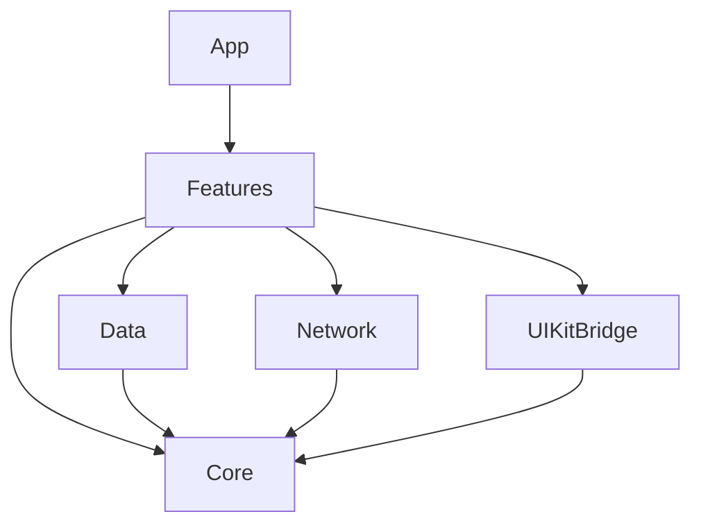
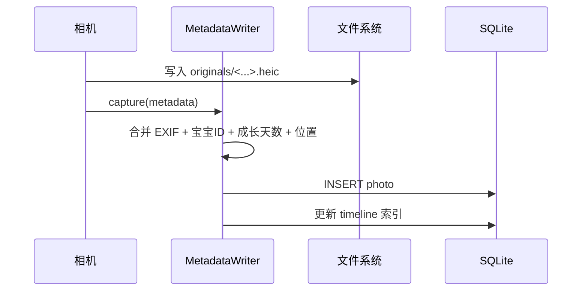
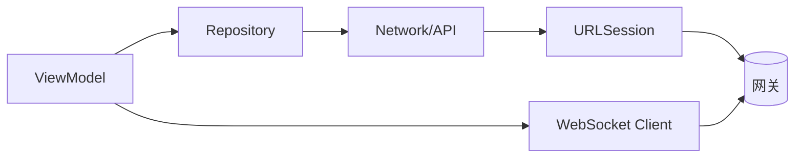
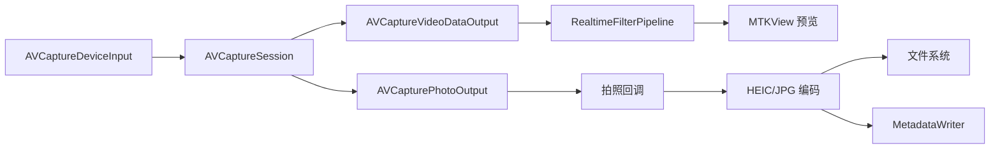
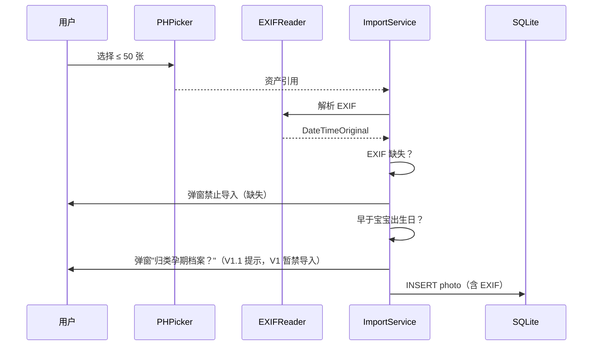
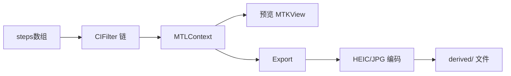
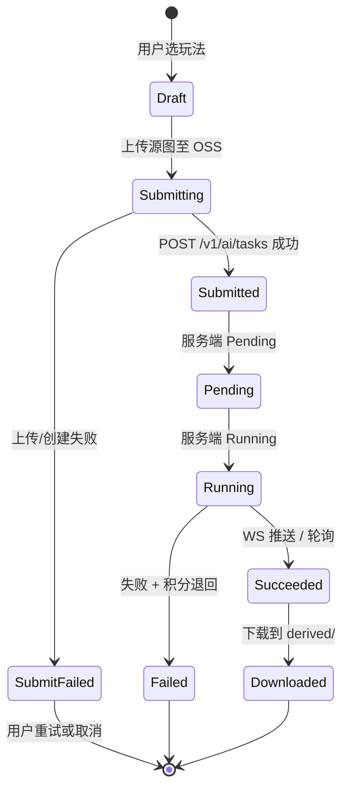
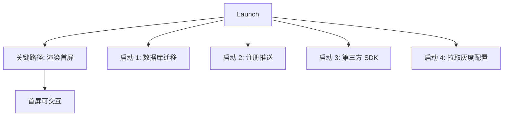

# 宝宝成长相机 详细设计：iOS 端侧

> 端侧（iOS 16+，V1.0 仅 iPhone）详设文档，聚焦工程结构、模块职责、数据层、相机/编辑/AI 关键管线与性能预算。

---

## 1. 文档信息

| 项目 | 内容 |
| --- | --- |
| 文档名称 | 宝宝成长相机 · 详细设计 · iOS 端 |
| 文档版本 | v0.1 |
| 目标版本 | V1.0 |
| 最近更新 | 2026-06-05 |
| 关联文档 | [PRD.md](./PRD.md)、[PRD-决策记录.md](./PRD-%E5%86%B3%E7%AD%96%E8%AE%B0%E5%BD%95.md)、[design.md](./design.md)、[design-backend.md](./design-backend.md)、[design-api.md](./design-api.md) |

### 1.1 与 PRD / 决策记录映射

| 本文章节 | 对应 PRD | 对应决策 |
| --- | --- | --- |
| §3 工程结构 | §7.1 | - |
| §4 Feature 模块 | §4 全章、§8 | D1、D2、D6 |
| §5 数据层 | §4.13、§9 | D2、D3 |
| §6 网络层 | §7 | - |
| §7 相机管线 | §4.3 | - |
| §8 编辑器架构 | §4.4 | - |
| §9 AI 任务管线 | §4.5、§4.6 | D8 |
| §10 推送 | §4.12 | - |
| §11 小组件 | §4.14 | - |
| §12 备份适配器 | §4.13 | D2 |
| §13 安全 | §6、§7.1 | - |
| §14 性能预算 | §5 | - |
| §15 埋点 | §5 | - |

---

## 2. 总体技术选型

| 维度 | 选型 | 备注 |
| --- | --- | --- |
| 语言 | Swift 5.10+ | 严格并发模式启用（Strict Concurrency） |
| UI 主框架 | SwiftUI | 主流程；UIKit 兜底（相机、编辑器画布） |
| 最低系统 | iOS 16.0 | 与 PRD §7.1 对齐 |
| 数据持久化 | GRDB（SQLite） + 文件系统 | 端权威数据源 |
| 网络 | URLSession + async/await | WebSocket 走原生 `URLSessionWebSocketTask` |
| 媒体 | AVFoundation + Photos + CoreImage + Metal | 相机、滤镜实时预览 |
| 支付 | StoreKit 2 | IAP 充值 + 订阅 |
| 小组件 | WidgetKit | App Group 共享数据 |
| 通知 | UserNotifications + APNs | 远程 + 本地 |
| 包管理 | Swift Package Manager（SPM） | 主；CocoaPods 仅微信 / 广告 SDK 兜底 |
| 测试 | XCTest + Swift Testing | UI 自动化用 XCUITest |

---

## 3. 工程结构

### 3.1 顶层目录

```text
BabyCamera/
├── App/                      // @main + AppDelegate + SceneDelegate
│   ├── BabyCameraApp.swift
│   ├── AppCoordinator.swift
│   └── Bootstrap/            // 启动初始化、第三方注册、灰度配置
├── Features/                 // 业务 Feature（按模块）
│   ├── Account/
│   ├── Family/
│   ├── Baby/
│   ├── Camera/
│   ├── Editor/
│   ├── AIPlay/
│   ├── Timeline/
│   ├── Milestone/
│   ├── FamilyFeed/
│   ├── Share/
│   ├── Credit/
│   ├── Backup/
│   ├── Settings/
│   ├── Notification/
│   └── Onboarding/
├── Core/                     // 跨 Feature 复用
│   ├── DesignSystem/         // 颜色、字体、组件、动效
│   ├── Routing/              // 全局路由
│   ├── Permissions/          // 相机/相册/通知/位置授权
│   ├── Analytics/            // 埋点
│   ├── Logger/
│   ├── ImageKit/             // 编解码、缩略图、HEIC/JPG
│   ├── VideoKit/             // 视频缩略图、H.264 探测
│   └── Watermark/            // 水印渲染（品牌 + 深度合成）
├── Data/
│   ├── Database/             // GRDB schema + Migration
│   ├── Repositories/         // 业务仓储
│   ├── Models/               // 领域模型
│   └── DTO/                  // 网络 DTO
├── Network/
│   ├── API/                  // REST endpoints（按服务分文件）
│   ├── WS/                   // WebSocket 客户端
│   ├── Auth/                 // Token 管理 / Refresh / Keychain
│   └── Interceptors/
├── UIKitBridge/              // 相机预览 / 编辑器画布等
├── Widgets/                  // 桌面 + 锁屏小组件 Target
├── ShareExtension/           // 系统分享扩展（V1.1 评估）
└── Resources/
    ├── Assets.xcassets
    ├── Localizable.strings   // zh-Hans 默认；en V1.2
    └── Fonts/
```

### 3.2 Feature 模块统一骨架

```text
Features/<Feature>/
├── Views/                    // SwiftUI / UIKit 视图
├── ViewModels/               // @MainActor ObservableObject
├── Services/                 // 业务服务（可注入）
├── Models/                   // Feature 私有模型
└── Tests/                    // 单测
```

### 3.3 依赖方向



约束：

- Feature 之间禁止互相 import；跨 Feature 调用走 Core 抽象（Service / Repository / Routing）。
- Core 是最底层，不依赖 Features。
- 单测覆盖 Repository 与关键 ViewModel；编辑器 / 相机走 UI 测试。

---

## 4. Feature 模块

> 列出 V1.0 全部 Feature 的"职责、核心类/视图、依赖、关键交互"。每模块的对外 API 走 `Services/` 内的协议，便于注入与单测。

### 4.1 Account（账号）

- **职责**：Apple ID 登录、手机号 + 短信验证码登录、Token 管理、注销、用户基本信息。
- **核心类**：
  - `AuthService`：登录、刷新、注销；持有 `TokenStore`
  - `TokenStore`：Keychain 读写、Token Rotation
  - `AccountRepository`：用户信息、儿童信息同意状态
  - `LoginView` / `LoginViewModel`
- **依赖**：Network/Auth、Core/Permissions
- **关键交互**：首次登录后强制跳转 Onboarding 引导填写昵称与关系称谓。

### 4.2 Family（家庭组）

- **职责**：家庭组创建、加入、邀请码生成、成员管理、转让、失联接管。
- **核心类**：
  - `FamilyService`：CRUD、邀请、转让、接管投票
  - `InvitationCodeService`：二维码生成、剪贴板写入
  - `FamilyRepository`：本地缓存家庭与成员
  - `FamilyMembersView` / `InviteSheet` / `TransferAdminFlow`
- **依赖**：Account
- **关键交互**：邀请码二维码扫描后跳转加入流程；管理员转让 / 接管走二次确认 + 推送通知。

### 4.3 Baby（宝宝档案）

- **职责**：多宝宝档案 CRUD、宝宝切换器、成长时间体系展示。
- **核心类**：
  - `BabyService`：CRUD、上传头像（仅上传到家庭头像区，不走原图通道）
  - `BabyRepository`：本地缓存
  - `BabyAgeFormatter`：按 PRD §4.2.3 的展示规则计算"出生第 N 天 / N 个月 N 天 / N 岁"
  - `BabySwitcherView`：顶部 Avatar 横向滚动
- **关键交互**：切换宝宝后通过全局 `CurrentBabyEnvironment` 触发 Timeline / FamilyFeed 重新过滤。

### 4.4 Camera（相机）

- **职责**：取景框、拍摄、Live Photo、连拍、闪光灯、滤镜实时预览、信息浮层。
- **核心类**：
  - `CameraSession`：基于 `AVCaptureSession` 的会话生命周期
  - `LivePhotoCapturer`：Live Photo 配置
  - `RealtimeFilterPipeline`：CIContext + Metal 滤镜链
  - `OverlayView`：宝宝小名 + 当前成长天数浮层
  - `CameraView`（UIViewControllerRepresentable 包装）
- **依赖**：Baby、Permissions
- **关键交互**：取景框顶部信息只作元数据保留，默认不烧入像素；用户可在设置改为"烧入水印"。
- **详见** §7。

### 4.5 Editor（本地编辑）

- **职责**：滤镜、调色、裁剪、旋转、贴纸、文字、马赛克、涂鸦、模板。
- **核心类**：
  - `EditorState`：当前画布状态 + 步骤历史
  - `EditStep` 协议族（FilterStep / AdjustStep / CropStep / StickerStep / TextStep / MosaicStep / DoodleStep / TemplateStep）
  - `EditorRenderer`：Metal 离屏渲染，输出最终图
  - `EditorPersistence`：步骤 JSON 序列化（类似 PSD），关联 derived 记录
  - `EditorView`（UIKit 画布 + SwiftUI 工具栏）
- **关键交互**：「重新编辑」基于 `EditStep` 数组重放；模板内只允许使用本地资源 + 远端预设参数（不下发可执行代码，符合 PRD §6.5）。
- **详见** §8。

### 4.6 AIPlay（AI 编辑 / 视频）

- **职责**：玩法卡片浏览、任务提交、本地任务状态机、积分预扣同步、深度合成标识渲染。
- **核心类**：
  - `AIPlayService`：组装请求、对接 `AIDispatchAPI`
  - `AITaskCoordinator`：本地任务状态机 + WebSocket 订阅 + 离线轮询兜底
  - `AITaskLocalStore`：进行中 / 已完成任务的本地副本
  - `PlayCatalogService`：远端配置 + 区域白名单过滤
  - `WatermarkRenderer`：分享前合成品牌水印 + 不可关闭的深度合成角标
  - `AIPlayGridView` / `AIPlayDetailView` / `AITaskProgressView`
- **关键交互**：玩法名展示给用户、模型名不暴露；提交前显示扣减积分确认弹窗。
- **详见** §9。

### 4.7 Timeline（成长时间线）

- **职责**：日 / 月 / 年 / 地图 / 全部 五视图。
- **核心类**：
  - `TimelineRepository`：基于本地 SQLite 的聚合查询
  - `TimelineViewModel`：按视图维度分页
  - `DayStoryView`：单日 Story 式滑动浏览
  - `MonthGridView`：日历网格
  - `YearWaterfallView`：年度瀑布流 + 里程碑标
  - `MapView`：基于 MapKit；POI 聚合
- **关键交互**：全部视图都使用虚拟列表（`LazyVStack` + Cell 复用）；缩略图按 256px / 1024px / 原图 三档缓存。

### 4.8 Milestone（里程碑）

- **职责**：内置 + 自定义里程碑、触发推送、关联模板。
- **核心类**：
  - `MilestoneCatalog`：内置 10+ 节点配置
  - `MilestoneScheduler`：基于宝宝出生日预约本地通知（远程通知由后端补发，避免本地通知丢失）
  - `MilestoneRepository`：自定义里程碑 CRUD
- **关键交互**：里程碑当天进入相机自动推荐对应玩法卡片置顶。

### 4.9 FamilyFeed（家庭动态圈）

- **职责**：发布作品、Feed 浏览、点赞、评论、离线缓存最近 100 条。
- **核心类**：
  - `PostService`：发布、撤回；负责 OSS 直传 + `/v1/posts` 落库
  - `FeedRepository`：本地缓存 + 增量同步
  - `FeedViewModel`：分页 + WebSocket 增量
  - `PostComposerView`：图文混排（≤ 9 图 + 1 视频 + 文案）
  - `FeedListView` / `PostDetailView`
- **关键交互**：发布即上云；取消发布服务端删除、本地保留副本。

### 4.10 Share（第三方分享）

- **职责**：微信 OpenSDK 朋友圈 / 好友、系统分享、智能文案、剪贴板写入。
- **核心类**：
  - `ShareCoordinator`：分享入口统一调度
  - `WechatShareAdapter`：微信 OpenSDK 封装
  - `SystemShareAdapter`：`UIActivityViewController`
  - `CaptionService`：调用 `/v1/caption/generate`
  - `ClipboardWriter`：写入"智能文案 + 话题词"
- **关键交互**：分享前必须经过 `WatermarkRenderer` 处理；AI 生成内容强制带角标。

### 4.11 Credit（积分 / 订阅 / 广告）

- **职责**：积分余额、签到、激励视频、IAP 充值、订阅管理、广告位调度。
- **核心类**：
  - `CreditService`：余额、流水、签到、激励回调
  - `IAPService`：StoreKit 2 购买、收据上送、订阅状态查询
  - `AdManager`：开屏 / 插页 / 激励视频统一调度（穿山甲 / 优量汇 / AdMob 适配）
  - `SubscriptionStore`：订阅状态机
  - `BalanceView` / `RechargeSheet` / `SubscriptionView` / `RewardedAdEntry`
- **关键交互**：积分变动统一走 `CreditService` 单一事实源；UI 通过 `@Published balance` 订阅。

### 4.12 Backup（备份）

- **职责**：iCloud / 系统相册 / 百度网盘三套备份目标，统一抽象。
- **核心类**：
  - `BackupProvider` 协议（list / upload / download / quota）
  - `ICloudProvider`：基于 `FileProvider` / `CloudKit`
  - `PhotosProvider`：基于 `Photos` 框架双写
  - `BaiduPanProvider`：OAuth + 官方 OpenAPI
  - `BackupOrchestrator`：增量、限速、Wi-Fi + 充电触发
  - `BackupQueue`：本地任务队列 + 失败重试
- **关键交互**：卸载前弹窗提示先备份；连续 3 次失败弹窗提示用户。
- **详见** §12。

### 4.13 Widget（桌面 / 锁屏小组件）

- **职责**：小 / 中 / 大三尺寸桌面组件 + 锁屏小角标。
- **核心类**：
  - `BabyWidget`（独立 Target）
  - `WidgetTimelineProvider`：基于 App Group 共享数据
  - `WidgetDataSnapshotter`：主 App 写入快照（最近 7 天的代表图 + 当前成长天数）
- **关键交互**：主 App 在拍照 / 发布后通过 `WidgetCenter.reloadTimelines` 触发刷新。
- **详见** §11。

### 4.14 Settings / Notification / Onboarding

- Settings：账号、家庭、隐私、数据、通知、关于、客服反馈。
- Notification：本地通知中心、推送分类开关、清除红点。
- Onboarding：首启动引导（昵称、宝宝档案、监护人同意、备份引导）。

---

## 5. 数据层

### 5.1 本地目录

```text
Library/BabyCameraStore/
├── originals/<babyId>/<yyyy>/<mm>/<photoId>.heic
├── derived/<babyId>/<yyyy>/<mm>/<derivedId>.heic
├── videos/<babyId>/<yyyy>/<mm>/<derivedId>.mp4
├── thumbnails/<photoId>_{256|1024}.heic
└── meta/
    ├── babycamera.sqlite
    ├── edit_steps/<derivedId>.json
    └── feed_cache.json
```

- Data Protection 等级 `CompleteUnlessOpen`：相机拍摄写入不被锁屏阻塞，普通访问需解锁。
- 缩略图按需生成 + 7 天 LRU 清理；上限 1 GB。

### 5.2 SQLite Schema（关键表，GRDB）

| 表 | 关键字段 | 主键 / 索引 |
| --- | --- | --- |
| `baby` | id, familyId, name, gender, birthDate, birthTime?, avatarPath | PK(id), IDX(familyId) |
| `photo` | id, babyIds(JSON), userId, takenAt, lat?, lng?, sha256, exif(JSON), filePath, localOnly | PK(id), IDX(takenAt), IDX(sha256) |
| `derived` | id, sourcePhotoId, type(local/aiImage/aiVideo), filePath, spec(JSON ref to edit_steps), createdAt | PK(id), IDX(sourcePhotoId) |
| `ai_task_local` | id(=server taskId), state, model?, style, costCredits, sourceUrl, resultUrl?, createdAt | PK(id), IDX(state) |
| `post_cache` | id, familyId, ownerUserId, items(JSON), caption, createdAt, syncedAt | PK(id), IDX(familyId, createdAt) |
| `comment_cache` | id, postId, userId, text, createdAt | PK(id), IDX(postId) |
| `like_cache` | postId, userId, likedAt | PK(postId, userId) |
| `membership` | userId, familyId, role, nickname, joinAt | PK(userId, familyId) |
| `credit_txn_cache` | id, type, amount, ref, createdAt | PK(id), IDX(createdAt) |
| `milestone` | id, babyId, name, date, kind(builtin/custom), reminded | PK(id), IDX(babyId, date) |
| `setting` | key, value | PK(key) |

- Migration：基于 GRDB `DatabaseMigrator`，按 `v1_initial`、`v1_1_xxx` 顺序，禁止编辑历史 migration。
- 写入策略：相机模块写 `photo` 表前先校验 EXIF `DateTimeOriginal`；导入流程缺失 EXIF 直接拒绝。

### 5.3 Repository 模式

- 每个 Feature 暴露一个 Repository 协议，实现层依赖 GRDB + Network。
- 离线优先策略：所有读操作先走本地，再后台 sync；同步过程通过 `Combine` / `AsyncStream` 推到 UI。
- 冲突处理：本地以 `updatedAt` 为准；服务端权威数据（积分、订阅）以服务端为准，本地仅缓存。

### 5.4 元数据写入流程



---

## 6. 网络层

### 6.1 分层



### 6.2 关键设计

- 统一基础 URL 由 `RegionResolver` 决定（中国 / 海外）。
- 请求构造：`Endpoint` 协议封装 path / method / body / 鉴权策略。
- 拦截器：
  - `AuthInterceptor`：自动附加 `Authorization`，401 触发 Refresh
  - `RegionInterceptor`：附加 `X-Region`、`X-App-Version`、`X-Device-Id`
  - `LoggingInterceptor`：脱敏后落 logger（不打印 token / 手机号）
- 错误统一：`APIError(code, message, requestId)`，与 [design-api.md §10 错误码](./design-api.md) 一致；UI 通过 `code` 决定文案与跳转。
- 重试退避：默认指数退避（1s, 2s, 4s, 上限 8s），最多 3 次；POST 写操作默认不重试除非接口幂等。
- WebSocket：`URLSessionWebSocketTask`；心跳 30s；断线后立即重连 + 退避重连；订阅 AI 任务通过 `taskId` 集合。

### 6.3 Token 管理

- Access Token 1h，Refresh Token 30d 单次 Rotation。
- Keychain 存 Refresh Token；Access Token 内存常驻 + Refresh 时持久化。
- App 进入前台 / 网络恢复 / 401 三种场景触发 Refresh。
- 注销时主动调用 `/v1/account/logout` 撤销服务端会话。

---

## 7. 相机与媒体管线

### 7.1 会话拓扑



### 7.2 关键点

- 会话预设：默认 `.photo`；连拍切到 `.high`。
- HEIC 默认编码；用户在设置可改为 JPG，质量参数 0.92。
- Live Photo：使用 `AVCapturePhotoSettings.livePhotoMovieFileURL`。
- 滤镜实时预览：CIContext 复用，纹理缓存在 Metal；预览 30fps，拍摄瞬间使用全分辨率重新渲染。
- 浮层（宝宝小名 + 当前成长天数）通过 `OverlayView` 渲染在预览之上，不写入像素；可选"烧入水印"在 `PhotoOut` 回调后由 `Watermark` 模块合成。
- 性能预算：相机启动 ≤ 800ms（详见 §14）。

### 7.3 导入相册流程



---

## 8. 编辑器架构

### 8.1 命令模式 + 步骤 JSON

- `EditStep` 是协议：`apply(to image: CIImage) -> CIImage` + `Codable`。
- 子类型：`FilterStep`、`AdjustStep`、`CropStep`、`RotateStep`、`StickerStep`、`TextStep`、`MosaicStep`、`DoodleStep`、`TemplateStep`。
- `EditorState.steps: [EditStep]` 是单一事实源；UI 通过订阅 `steps` 触发重渲染。
- 撤销 / 重做基于 `steps` 数组的快照栈。
- 持久化：保存时把 `steps` 序列化到 `meta/edit_steps/<derivedId>.json`，渲染结果落 `derived/`。
- "重新编辑"：读 JSON → 反序列化 → 重新进入编辑器。

### 8.2 模板

- 模板是预设的 `[EditStep]` 数组 + 占位符（人脸位置、文案、日期）。
- 模板资源（贴纸 / 字体 / 背景）打包在 APP，远端只下发模板 manifest（JSON）。
- AI 玩法卡片复用 `TemplateStep` 占位符机制，把 AI 输出作为"风格化背景"插入模板。

### 8.3 渲染管线



- 预览：低分辨率（视图大小 × scale），实时；
- 导出：原分辨率（≤ 8000×8000）；分块渲染避免内存峰值。

---

## 9. AI 任务管线

### 9.1 本地状态机



### 9.2 关键设计

- 提交前调用 `CreditService.previewCost(style)` 显示扣减预览，用户确认后提交。
- 服务端预扣积分，端侧通过 `CreditTxnCache` 立即反映余额（乐观）；失败回滚后强制刷新余额。
- WebSocket 订阅 `taskId`；连续断线超过 60s 切换轮询（`GET /v1/ai/tasks/{id}` 每 5s 一次）。
- 完成后下载结果到 `derived/`，写 `ai_task_local` + `derived` 表。
- 失败 / 拒绝：UI 显示原因 + 申诉入口（PRD §4.5.4）；积分自动退回，通过 WS 或下次启动同步。
- 深度合成标识：服务端在出参合成显式角标 + 隐式元数据；端侧分享时再叠加品牌水印（订阅可关）。

### 9.3 视频任务差异

- 时长档位 5s / 10s（PRD §4.6 待最终确认）。
- 超时 5 分钟；下载完成后保留封面缩略图供 Timeline / FamilyFeed 使用。
- 输出 MP4 / H.264，端侧通过 `AVAssetExportSession` 二次压制可选（家庭圈预览版）。

---

## 10. 推送与通知中心

### 10.1 远程推送

- APNs 注册 Token 上送 `/v1/notifications/devices`，绑定 userId + region。
- Category 设计：
  - `MILESTONE`：里程碑触发，含 action「立即拍照」
  - `FAMILY_ACTIVITY`：家人发布 / 点赞 / 评论
  - `AI_DONE`：AI 任务完成（含静默推送，触发后台下载）
  - `CREDIT`：积分到账 / 退还
  - `SYSTEM`：系统活动 / 营销（默认关闭）

### 10.2 本地通知

- `MilestoneScheduler` 在宝宝出生日基础上预约未来 365 天内的里程碑本地通知；后端补发兜底防止本地通知被系统清理。
- 每日拍照提醒为本地通知，用户可设定时间。

### 10.3 通知中心

- "我的 → 消息中心"统一聚合远程 + 本地通知。
- 红点：未读条数；进入消息中心清空。

---

## 11. 桌面 / 锁屏小组件

### 11.1 数据通道

- App Group `group.app.babycamera`：主 App 写入 `widget_snapshot.json`（含宝宝当前成长天数、最近 7 天代表图缩略图路径）。
- WidgetKit `WidgetCenter.shared.reloadTimelines(ofKind:)` 在如下场景触发：拍照、发布、宝宝档案修改、用户切换宝宝。

### 11.2 尺寸

| 尺寸 | 内容 |
| --- | --- |
| 小 (systemSmall) | 宝宝头像 + 当前成长天数 |
| 中 (systemMedium) | 当日代表图 + 文字 |
| 大 (systemLarge) | 当周拍摄 4 宫格 |
| 锁屏 (accessoryCircular) | 当前成长天数小角标 |

### 11.3 性能

- 缩略图在主 App 端生成 200×200 / 600×600 两档预压缩到 App Group 目录。
- Widget Target 不引入大依赖，编译产物 ≤ 5 MB。

---

## 12. 备份适配器

### 12.1 抽象

```text
protocol BackupProvider {
    var kind: BackupKind { get }            // iCloud / Photos / BaiduPan
    func authorize() async throws
    func quota() async throws -> Quota
    func upload(_ item: BackupItem) async throws -> BackupReceipt
    func list(after cursor: String?) async throws -> BackupPage
    func revoke() async throws
}
```

### 12.2 编排

- `BackupOrchestrator`：
  - 触发条件：Wi-Fi + 电量 > 30% + 充电中（用户可关）。
  - 增量：按 `photo.sha256` 去重；按 `updatedAt` 顺序。
  - 限速：单任务并发 ≤ 2，整体带宽自适应。
  - 失败：指数退避；连续 3 次失败弹窗提示。
- 卸载前提示：通过"设置 → 数据 → 卸载提醒"维持引导。

### 12.3 各 Provider 要点

| Provider | 关键约束 |
| --- | --- |
| ICloudProvider | 走 FileProvider（沙盒外）或 CloudKit Private DB；不占用 iCloud Drive 用户可见目录 |
| PhotosProvider | 仅写入相册库；需要 `addOnly` 权限，不读取用户相册 |
| BaiduPanProvider | OAuth 2.0，Token 存 Keychain；端到端走百度 OpenAPI 分片上传 |

---

## 13. 安全

| 类别 | 措施 |
| --- | --- |
| Token 存储 | Keychain，Access 控制 `kSecAttrAccessibleAfterFirstUnlockThisDeviceOnly` |
| 数据保护 | `NSFileProtectionCompleteUnlessOpen` |
| 网络 | ATS 强制；证书绑定（Cert Pinning）|
| 防截屏 | 涉及账号 / 监护人同意 / IAP 页面可选开启 `UITextField.isSecureTextEntry` 风格遮罩 |
| 反调试 | App Attest（订阅校验 + IAP 校验时附 Attestation） |
| 日志脱敏 | Token / 手机号 / Apple Sub / 邮件全部 mask 后再写入 logger |
| 第三方 SDK 隔离 | 广告 SDK 不在登录 / 监护人同意 / 儿童照片相关上下文加载 |
| 儿童信息同意 | 首次拍摄 / 导入儿童照片前弹监护人同意书，端 + 后端双记录；未同意状态下相机功能受限 |

---

## 14. 性能预算与冷启动

| 维度 | 目标 | 关键措施 |
| --- | --- | --- |
| 冷启动至首屏 | ≤ 1.8s（iPhone 12） | 启动期只做必要初始化；第三方 SDK 异步注册；首屏不阻塞数据库迁移 |
| 相机启动 | ≤ 800ms | Session 预创建（App 进入前台预热）；首次预览帧立即上屏 |
| 编辑器打开 | ≤ 500ms | 资源懒加载；模板 manifest 启动时预拉 |
| AI 提交 | ≤ 1s 内出现 Loading | 上传与 POST 并发；OSS 直传走分片 |
| Feed 拉取 | ≤ 500ms（缓存命中） | 离线缓存最近 100 条；增量同步 |
| 内存常驻 | ≤ 200 MB | 缩略图分级缓存；大图分块解码；Metal 纹理及时释放 |
| 安装包 | ≤ 80 MB | On-Demand Resources 加载贴纸 / 字体 |
| 崩溃率 | ≤ 0.2% | Sentry + Bugly 双采集；关键路径 100% 上报 |

冷启动并发：



---

## 15. 埋点（核心事件清单 ≥ 60 项）

### 15.1 分类

| 分类 | 数量 | 示例事件 |
| --- | :---: | --- |
| 启动 / 生命周期 | 6 | `app_launch`, `app_active`, `app_background`, `app_first_open`, `app_crash`, `app_kill` |
| 账号 | 5 | `login_attempt`, `login_success`, `login_failure`, `account_delete`, `consent_child_data` |
| 家庭 | 6 | `family_create`, `family_invite_generate`, `family_join`, `family_transfer`, `family_takeover_vote`, `family_member_remove` |
| 宝宝 | 3 | `baby_create`, `baby_update`, `baby_switch` |
| 相机 | 7 | `camera_open`, `camera_capture`, `camera_burst`, `camera_filter_apply`, `camera_live_photo`, `camera_import`, `camera_permission_denied` |
| 编辑 | 6 | `editor_open`, `editor_apply_filter`, `editor_apply_sticker`, `editor_apply_text`, `editor_save_derived`, `editor_reopen` |
| AI | 8 | `ai_play_view`, `ai_submit`, `ai_credit_preview`, `ai_running`, `ai_success`, `ai_failure`, `ai_reject`, `ai_refund` |
| 时间线 | 4 | `timeline_view_day`, `timeline_view_month`, `timeline_view_year`, `timeline_view_map` |
| 里程碑 | 3 | `milestone_push_received`, `milestone_template_open`, `milestone_custom_create` |
| 家庭圈 | 6 | `post_compose_open`, `post_publish`, `post_like`, `post_comment`, `post_delete`, `feed_open` |
| 分享 | 4 | `share_open`, `share_caption_generate`, `share_to_wechat`, `share_to_system` |
| 积分 / 订阅 / 广告 | 7 | `credit_balance_view`, `credit_signin`, `credit_iap_start`, `credit_iap_success`, `subscription_purchase`, `ad_impression`, `ad_reward_grant` |
| 备份 | 4 | `backup_authorize`, `backup_run`, `backup_failure`, `backup_revoke` |
| 通知 | 2 | `push_token_register`, `push_notification_open` |

### 15.2 上报规则

- 端侧批量打包，每 30s 或 50 条触发上送；后台模式立即上送一次。
- 携带公共字段：`region`, `userId(hash)`, `babyId(hash)`, `appVersion`, `osVersion`, `deviceModel`, `sessionId`。
- 不上传任何照片 / 文案原文；只上事件类型与必要数值。

---

## 16. 可访问性与国际化

- 系统大字号：所有文本走 `Font.system(.body)` 与 `Dynamic Type`，禁止硬编码字号（图标除外）。
- VoiceOver：相机、编辑器、AI 提交、发布、点赞主流程必须 `accessibilityLabel` 完整。
- 颜色对比度 ≥ AA 级；深色模式跟随系统。
- i18n key 规约：`feature.module.element.state`（例 `camera.toolbar.shutter.disabled`）。
- 文本占位用占位符插值：`"baby.age.day_n" = "出生第 %lld 天"`；避免拼接。

---

## 17. 测试策略

| 层级 | 范围 | 工具 |
| --- | --- | --- |
| 单测 | Repository、Service、Formatter、State Reducer | XCTest / Swift Testing |
| 组件测试 | ViewModel + Repository | XCTest + 内存 SQLite |
| UI 自动化 | 登录、拍照、编辑、AI 提交、发布、IAP（沙盒） | XCUITest |
| 性能基准 | 冷启动、相机启动、Feed 滚动 | XCTest Performance |
| 回归 | 关键路径 Smoke | TestFlight 自动化脚本 |

---

> 端侧实现需要遵循的接口契约见 [design-api.md](./design-api.md)；后端配合点见 [design-backend.md](./design-backend.md)。
