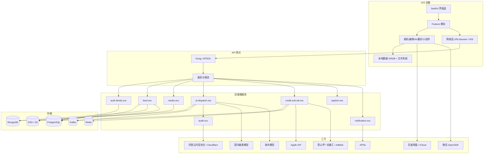
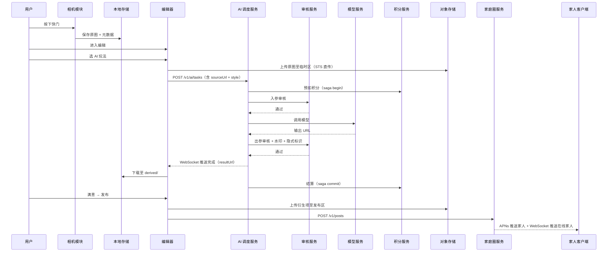
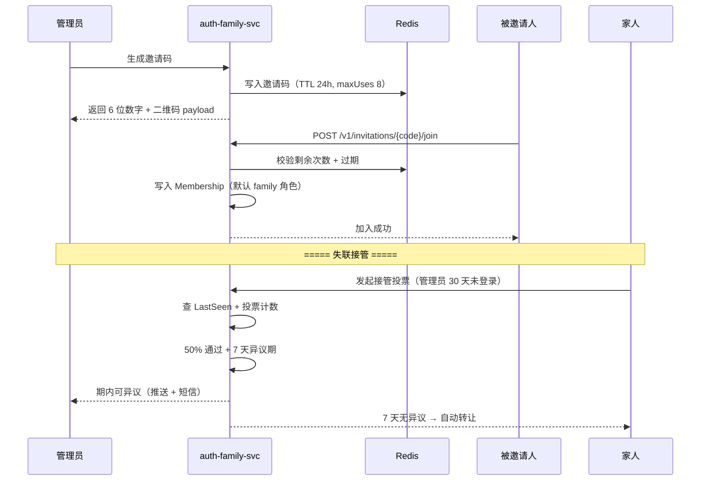
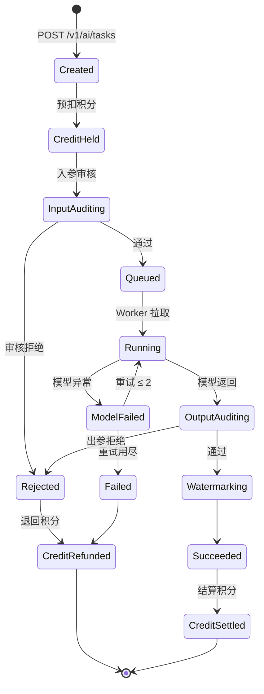
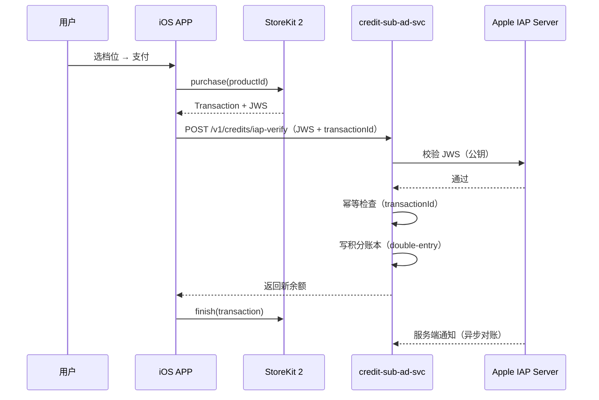
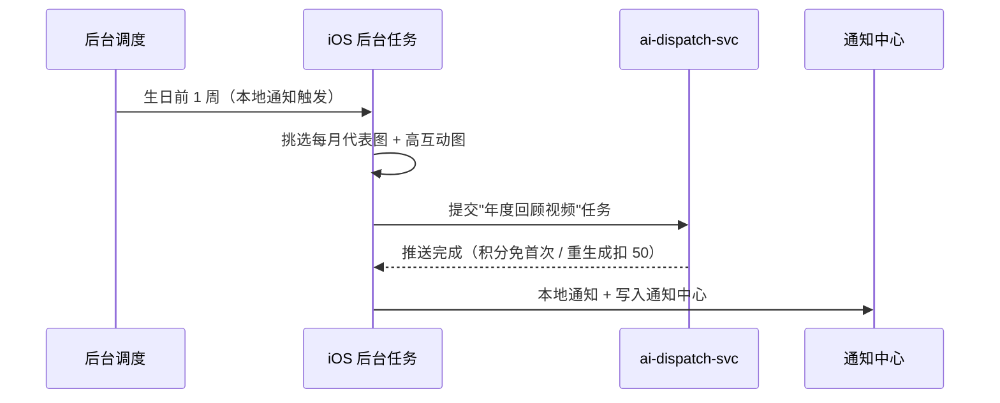
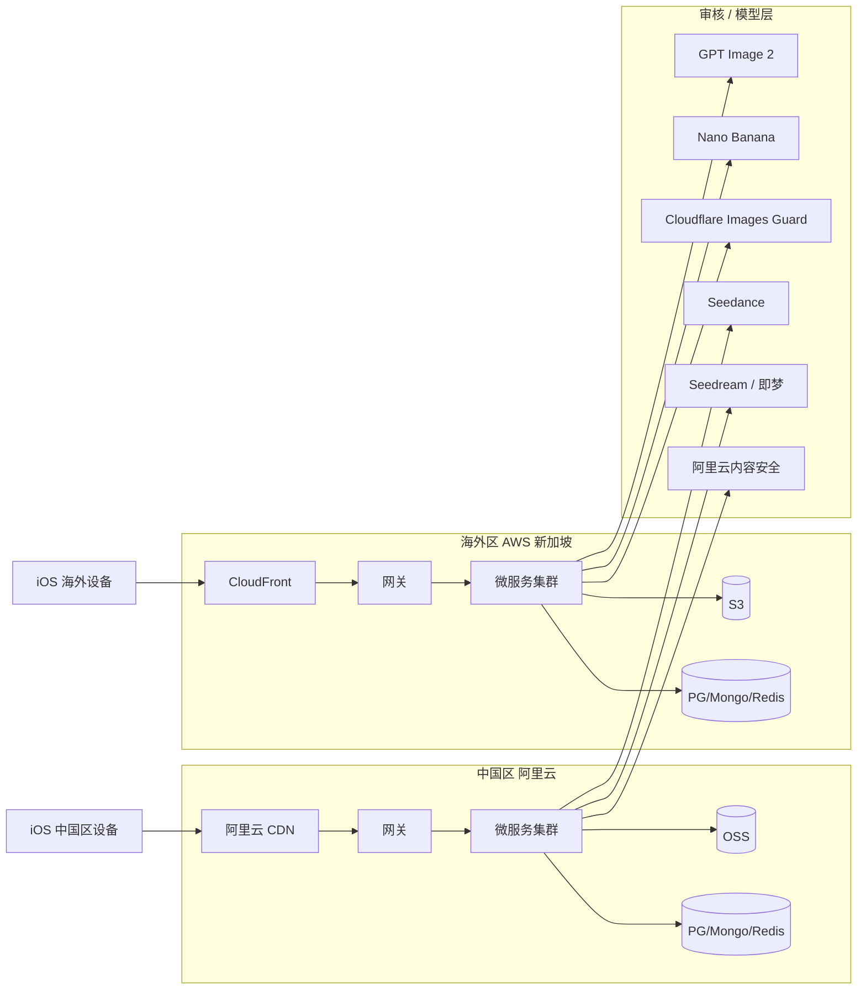

# 宝宝成长相机 详细设计：总览与架构

> 面向 V1.0 的工程详细设计总览文档。本文不重复 PRD 中的产品描述，仅聚焦"系统怎么做"。

---

## 1. 文档信息

| 项目 | 内容 |
| --- | --- |
| 文档名称 | 宝宝成长相机 · 详细设计 · 总览 |
| 文档版本 | v0.1 |
| 文档状态 | 草稿，待评审 |
| 目标版本 | V1.0（iOS 16+，iPhone） |
| 最近更新 | 2026-06-05 |
| 关联文档 | [PRD.md](./PRD.md)、[PRD-决策记录.md](./PRD-%E5%86%B3%E7%AD%96%E8%AE%B0%E5%BD%95.md)、[design-ios.md](./design-ios.md)、[design-backend.md](./design-backend.md)、[design-api.md](./design-api.md) |

### 1.1 变更记录

| 版本 | 日期 | 变更摘要 | 作者 |
| --- | --- | --- | --- |
| v0.1 | 2026-06-05 | 首版草稿，含整体架构、模块全景、核心流程时序、部署拓扑 | - |

### 1.2 文档分册

| 文档 | 主题 | 主要读者 |
| --- | --- | --- |
| [design.md](./design.md)（本文） | 总览、架构、跨端流程、模块全景 | 全员（评审入口） |
| [design-ios.md](./design-ios.md) | iOS 端工程结构、模块、数据层、性能 | iOS 团队 |
| [design-backend.md](./design-backend.md) | 后端微服务、数据库、AI 调度、合规 | 后端 / AI / 运维 |
| [design-api.md](./design-api.md) | 端后端契约、错误码、关键示例 | iOS + 后端 + 测试 |

### 1.3 与 PRD / 决策记录映射

| 本文章节 | 对应 PRD | 对应决策 |
| --- | --- | --- |
| §2 设计目标与约束 | §2.3、§5、§6 | - |
| §3 整体架构 | §7 | D2、D3、D8 |
| §4 模块全景 | §4 全章、§8 | D1、D4、D5 |
| §5 核心业务流程 | §4.3、§4.5、§4.9、§4.11 | D2、D3、D8、D9 |
| §6 数据流与存储边界 | §4.13、§9 | D2、D3 |
| §7 部署拓扑 | §7.2 | D8 |
| §8 横切关注点 | §5、§6 | D8、D9 |
| §9 风险与决策回溯 | §12 | D1–D9 |

---

## 2. 设计目标与约束

### 2.1 设计目标

1. **隐私优先**：原图在端侧主存储，服务端只承载"已发布作品"，端到端可审计。
2. **AI 共创可扩展**：模型可插拔，按区域 / 玩法 / 成本动态路由，迭代不影响端版本发布。
3. **家庭体系收敛**：账号、家庭、宝宝、发布、积分、订阅、广告共用一套统一权限模型。
4. **合规可交付**：算法备案、深度合成标识、儿童信息保护、内容审核四条主线在 V1.0 全链路落地。
5. **性能可预算**：相机启动 ≤ 800ms、AI 图像 P50 ≤ 15s、崩溃率 ≤ 0.2%（详见 PRD §5）。

### 2.2 强约束

| 约束 | 说明 | 来源 |
| --- | --- | --- |
| 原图不上服务端 | 服务端仅持有已发布作品及其元数据 | 决策 D2 / D3 |
| AI 算力独立计费 | 订阅不包含 AI，AI 走积分按量结算 | 决策 D9 |
| 国内/海外模型双区域 | 中国区只能走备案模型，海外区走头部模型 | 决策 D8 |
| 深度合成强制标识 | 显式角标 + 隐式元数据，订阅可关品牌水印但不能关合成标识 | PRD §6.2 |
| 儿童信息单独同意 | 首次收集儿童照片前监护人同意书 | PRD §6.3 |
| 远端代码受限 | AI 玩法模板需走 Apple 审核认可的下发方式 | PRD §6.5 |

### 2.3 非目标（V1.0 不做）

- iPad / Apple Watch 适配
- 视频拍摄、Apple ProRAW
- 多图融合 AI、海外区视频生成（Runway / Veo）
- 自建 WebDAV、阿里云盘、坚果云备份
- 孕期模式（PRD §12.1 待定，当前归入 V1.1）

---

## 3. 整体架构

### 3.1 端 + 后端 + 三方分层

### 3.2 端 ↔ 后端通信形态

| 通道 | 用途 | 协议 |
| --- | --- | --- |
| HTTPS REST | 业务请求主通道 | HTTP/2 + TLS 1.3 |
| WebSocket | AI 任务完成推送、家庭圈实时点赞评论 | WSS（带 JWT） |
| APNs | 离线推送（里程碑、家人动态、AI 完成、积分到账） | Apple |
| OSS 直传 | 发布作品上传，端侧拿临时 STS 直传 | HTTPS PUT |

> 设计要点：原图永远不走"端 → 后端"主通道；AI 任务的输入图通过 OSS 临时区直传，后端只收 URL 引用，详见 [design-backend.md §4 AI 调度](./design-backend.md)。

### 3.3 区域与租户

- 端侧根据 Apple ID 注册地 / SIM 卡 / 当前网络判定区域（中国 / 海外），首次启动写入本地配置。
- 区域决定网关 BaseURL、可见的 AI 玩法白名单、可用的备份目标、第三方 SDK 集合（如海外不接入微信 OpenSDK）。
- 后端按 region 字段做数据库行级隔离 + OSS 分桶隔离，海外用户数据不进入国内集群。

---

## 4. 模块全景

### 4.1 模块矩阵（端侧 ↔ 后端 ↔ 三方）

| 业务域 | 端侧模块 | 后端服务 | 主要三方 |
| --- | --- | --- | --- |
| 账号 | Account | auth-family-svc | Apple ID、阿里云短信、微信 OpenSDK（V1.1） |
| 家庭 | Family | auth-family-svc | - |
| 宝宝档案 | Baby | auth-family-svc | - |
| 相机 | Camera | -（本地） | AVFoundation、Photos |
| 本地编辑 | Editor | -（本地） | CoreImage、Metal |
| AI 编辑 / 视频 | AIPlay | ai-dispatch-svc + audit-svc | 国内/海外模型、内容安全 |
| 时间线 | Timeline | -（本地） + media-svc（仅元数据查询） | MapKit |
| 里程碑 | Milestone | -（本地配置） + notification-svc | APNs |
| 家庭圈 | FamilyFeed | feed-svc + media-svc | OSS |
| 分享 | Share | caption-svc | 微信 OpenSDK、UIActivityViewController |
| 积分 / 订阅 / 广告 | Credit | credit-sub-ad-svc | StoreKit 2、Apple IAP、广告联盟 |
| 备份 | Backup | -（凭据托管在 auth-family-svc） | iCloud、百度网盘、Photos |
| 小组件 | Widget | -（本地共享数据） | WidgetKit |
| 通知 | Notification | notification-svc | APNs |
| 设置 / 反馈 | Settings | auth-family-svc | - |

### 4.2 模块依赖收敛原则

- 端侧 Feature 之间通过 Core 抽象（Repository / Service）调用，不直接互相 import。
- 后端微服务通过网关聚合，跨服务调用走 gRPC（内网）或事件总线（Kafka）。
- AI 调度服务是 ai 业务的"瓶颈点"，所有模型调用必须通过它，避免端侧或其他服务直连模型。
- 积分扣费走 saga 模式，避免分布式事务（详见 §5.3）。

---

## 5. 核心业务流程

### 5.1 拍照 → 本地编辑 → AI → 发布

关键点：

- 积分先预扣，模型失败或审核拒绝时回滚（saga compensation），详见 [design-backend.md §5 积分](./design-backend.md)。
- AI 调度服务对 OSS 临时区文件设 24 小时生命周期，超时自动清除。
- 端侧本地保留"原图 → 衍生项 → 发布作品"的关联关系，便于"重新编辑"。

### 5.2 家庭邀请 / 加入 / 管理员转让 / 失联接管

### 5.3 AI 任务全链路（含审核与积分回滚）

### 5.4 IAP 充值 → 积分入账

### 5.5 年度回顾自动生成

---

## 6. 数据流与存储边界

### 6.1 数据所有权矩阵

| 数据种类 | 端侧 | 服务端 | 备份目标 |
| --- | :---: | :---: | :---: |
| 原图（拍摄/导入） | ✓ 主存 | ✗ | ✓ 可选 |
| 编辑步骤 JSON | ✓ 主存 | ✗ | ✓ 可选 |
| AI 输入图（临时） | ✓ 主存 | ✓ 临时区 24h | ✗ |
| AI 输出图/视频 | ✓ 主存 | ✓ 仅在被发布时长期保存 | ✓ 可选 |
| 已发布作品文件 | ✓ 本地副本 | ✓ 主存 | ✓ 可选 |
| 账号 / 家庭 / 宝宝档案 | ✓ 缓存 | ✓ 主存 | - |
| 积分 / 订阅 / 任务记录 | ✓ 缓存 | ✓ 主存 | - |

### 6.2 端侧本地存储概览

- 沙盒 `Library/BabyCameraStore/`：`originals/`、`derived/`、`videos/`、`meta/`（SQLite + JSON）
- Data Protection 等级 `CompleteUnlessOpen`，相机后台拍摄期间可写。
- 本地 SQLite 是端侧权威数据源，可离线全功能浏览，详见 [design-ios.md §5 数据层](./design-ios.md)。

### 6.3 服务端存储概览

- PostgreSQL：账号、家庭、成员、宝宝档案、邀请码、订阅、IAP 凭据、积分账本、Post 元数据、Comment、Like。
- MongoDB：AiTask（含输入/输出引用、审核结果、成本明细）。
- Redis：Token 黑名单、邀请码 TTL、签到、限流、Feed 缓存、AI 任务幂等键。
- OSS：发布作品文件、AI 临时输入区（TTL 24h）、智能文案缓存。

详见 [design-backend.md §3 数据存储](./design-backend.md)。

---

## 7. 部署拓扑

### 7.1 双区域拓扑

### 7.2 环境与命名

| 环境 | 用途 | 数据 |
| --- | --- | --- |
| dev | 研发自测 | 合成数据 |
| staging | 内部联调 + 灰度 | 合成 + 内测真实账号 |
| prod-cn | 中国区生产 | 真实用户数据 |
| prod-os | 海外区生产 | 真实用户数据 |

域名规则示意：

- `api-cn.babygrowth.app` / `ws-cn.babygrowth.app` / `cdn-cn.babygrowth.app`
- `api-os.babygrowth.app` / `ws-os.babygrowth.app` / `cdn-os.babygrowth.app`

### 7.3 发布与回滚

- 后端：蓝绿发布 + 流量灰度（5% → 25% → 100%）。
- 端：TestFlight 内测 → App Store 渐进发布（Phased Release）。
- AI 玩法模板与配置走"远端配置 + 端侧白名单"，无需发版即可下架问题玩法（但模板内 JS/远端代码必须经 Apple 审核认可方式下发，详见 PRD §6.5）。

---

## 8. 横切关注点

### 8.1 合规

| 主题 | 实现 | 责任域 |
| --- | --- | --- |
| 算法备案 | 国内每个模型独立备案号，启动时拉取最新备案信息展示 | 后端 + 法务 |
| 深度合成显式标识 | 出参审核后在右下角合成不可关闭角标 | ai-dispatch-svc |
| 深度合成隐式标识 | C2PA 风格元数据写入 EXIF / XMP | ai-dispatch-svc |
| 儿童信息单独同意 | 首次进入相机 / 导入弹窗"监护人同意"，本地与后端双记录 | 端 + auth-family-svc |
| UGC 审核 | 家庭圈文字 + 媒体过 audit-svc | feed-svc |
| 数据导出 / 注销 | 端侧导出 zip + 服务端清账 | 端 + auth-family-svc |

### 8.2 可观测性

- 关键指标：相机启动耗时、AI 任务成功率 / P50 / P95、IAP 校验成功率、Feed 拉取耗时、崩溃率。
- 端侧埋点 ≥ 60 项（[design-ios.md §15 埋点](./design-ios.md)），通过自建网关进入 ClickHouse。
- 后端 Prometheus + Grafana 看板按服务划分；Sentry 收集前后端异常。
- 审计日志：账号注销、家庭转让 / 接管、积分对账差异、AI 审核拒绝必须落审计表保留 180 天。

### 8.3 安全

| 维度 | 措施 |
| --- | --- |
| 传输 | TLS 1.3，ATS 强制开启 |
| 鉴权 | JWT（短期 1h）+ Refresh Token（长期 30d），Refresh 走 Rotation |
| 端侧存储 | Keychain 存 Token；Data Protection `CompleteUnlessOpen` |
| 限流 | 网关层针对登录 / 邀请 / IAP / AI 提交分别限流 |
| 防爬 | 微信分享/邀请码二维码加签名，避免被仿冒 |
| 反作弊 | 广告激励回调签名 + 设备指纹 + 频次窗口 |

### 8.4 国际化

- 端侧文案集中在 `Localizable.strings`，i18n key 命名规约 `feature.module.element.state`。
- 后端错误码同时返回 i18n key，端侧根据当前语言映射展示，避免后端硬编码中文。
- 时区跟随设备，时间体系（成长天数）计算固定使用宝宝出生日所在时区，避免跨时区拍摄漂移。

---

## 9. 风险与决策回溯

### 9.1 主要技术风险

| 风险 | 等级 | 缓解 | 关联决策 |
| --- | :---: | --- | --- |
| 算法备案周期长 ≥ 60 天 | 高 | 立项即启动；每个国内模型独立报备，按上线计划分批 | D8 |
| 海外区跨境数据合规 | 高 | V1 先只服务中国区 + 国内模型；海外灰度 | D8 |
| 原图本地存储丢失 | 高 | 强引导用户至少配置一种备份；卸载前弹窗 | D2 |
| AI 模型成本失控 | 中 | 积分按量 + 后端定期对账动态调价 | D9 |
| Feed 高并发场景突增 | 中 | Redis Feed 缓存 + CDN 前置 + 客户端离线缓存 100 条 | - |
| 微信 OpenSDK 政策变动 | 中 | 系统分享兜底 | D5 |
| 苹果 IAP 校验失败/重复 | 中 | 幂等 transactionId + 服务端通知双重对账 | D9 |
| 端侧编辑器内存峰值 | 中 | 大图分块渲染 + Metal 离屏纹理上限控制 | - |

### 9.2 决策回溯索引

| 决策 | 对设计的影响 |
| --- | --- |
| D1 完整家庭模式 | 引入 Membership 三级角色，发布 / 邀请 / 转让贯穿四个服务 |
| D2 本地优先 + 用户云盘 | 端侧主存储 + BackupProvider 抽象 + 服务端不持原图 |
| D3 仅"已发布作品"上云 | 家庭圈成为家庭共享唯一入口；media-svc 只服务发布场景 |
| D4 一次性完整交付 | V1.0 后端必须全量上线 + 算法备案并行启动 |
| D5 微信深度对接 | iOS 集成 OpenSDK；其他平台系统分享 + 智能文案 |
| D6 EXIF 时间锚定 | 导入流程必须解析 EXIF，缺失即禁止 |
| D7 中式里程碑 | 内置 10+ 节点 + 每节点推送 + 模板 + 推荐玩法 |
| D8 后端双区域调度 | ai-dispatch-svc 抽象 ModelAdapter + 区域路由 |
| D9 积分 + 订阅 + 广告 | credit-sub-ad-svc 独立；订阅与 AI 算力解耦 |

---

## 10. 附：术语表

| 术语 | 含义 |
| --- | --- |
| 衍生项 (Derived) | 由原图通过本地编辑或 AI 编辑生成的作品，关联原图 |
| 发布作品 (Post) | 发布到家庭圈的内容（≤ 9 张图 + 1 视频 + 文案） |
| 玩法 (Style/Play) | 用户视角的 AI 入口名称，后端映射到具体模型 |
| 模型适配器 (ModelAdapter) | 后端抽象层，统一不同厂商模型的输入输出与错误语义 |
| 家庭组 (Family) | 多用户 + 多宝宝的共享空间，含三级角色 |
| 深度合成标识 | AI 生成内容必须显式 + 隐式打标，强制不可关闭 |
| Saga | 跨服务的补偿事务模式，用于积分预扣 / 回滚 / 结算 |

---

> 本文为详细设计入口；具体到端侧实现请见 [design-ios.md](./design-ios.md)，后端服务请见 [design-backend.md](./design-backend.md)，端后端接口请见 [design-api.md](./design-api.md)。
