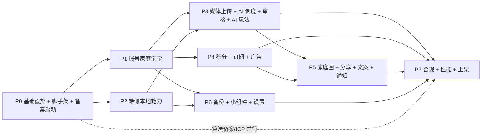
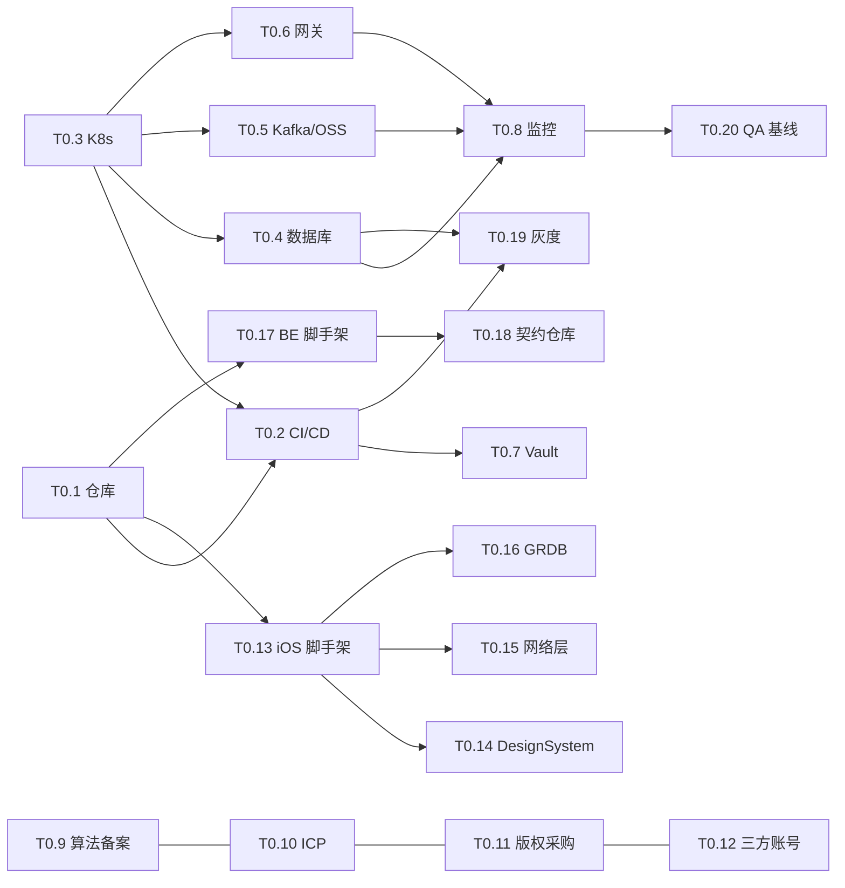
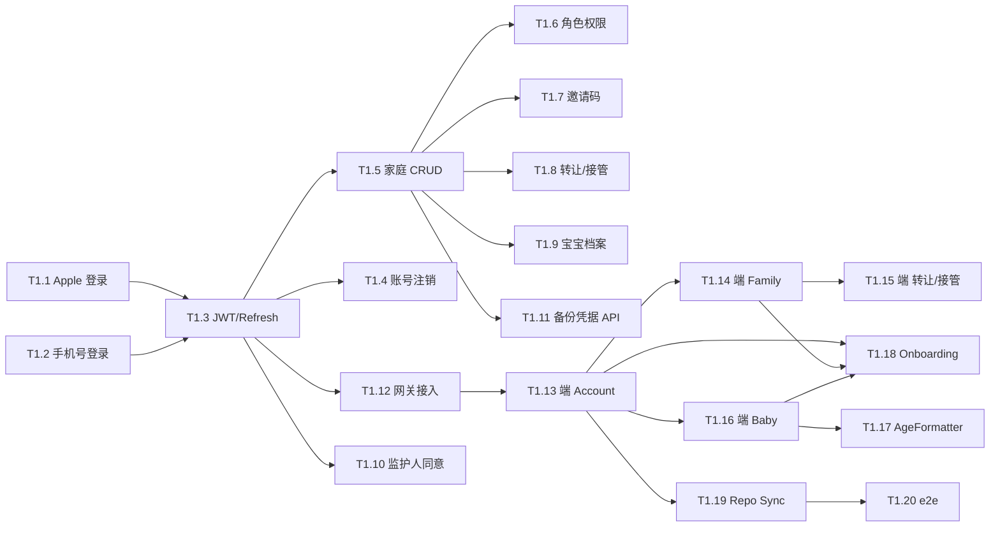
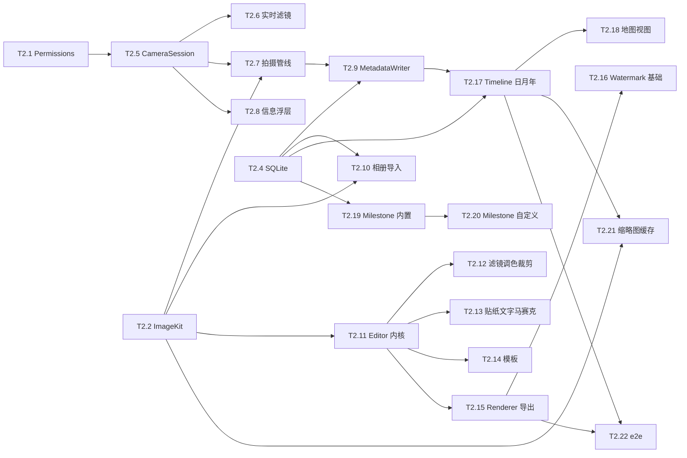
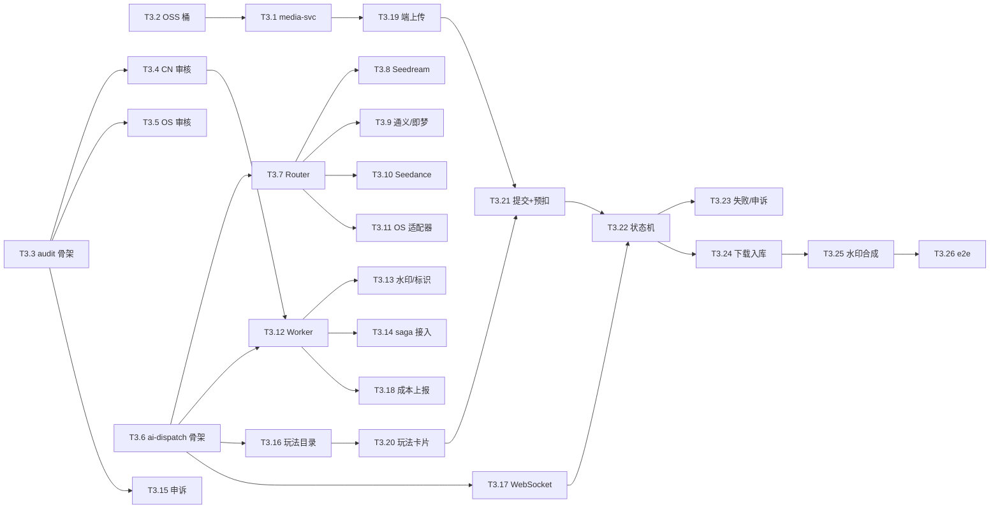
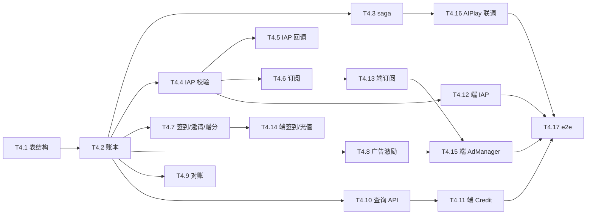
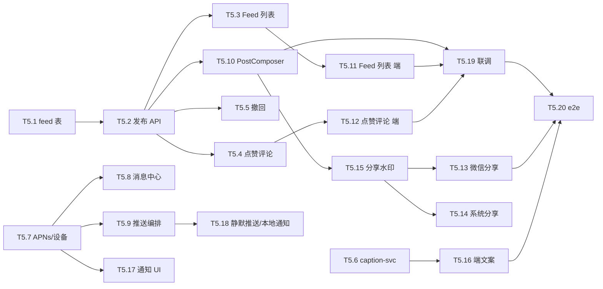
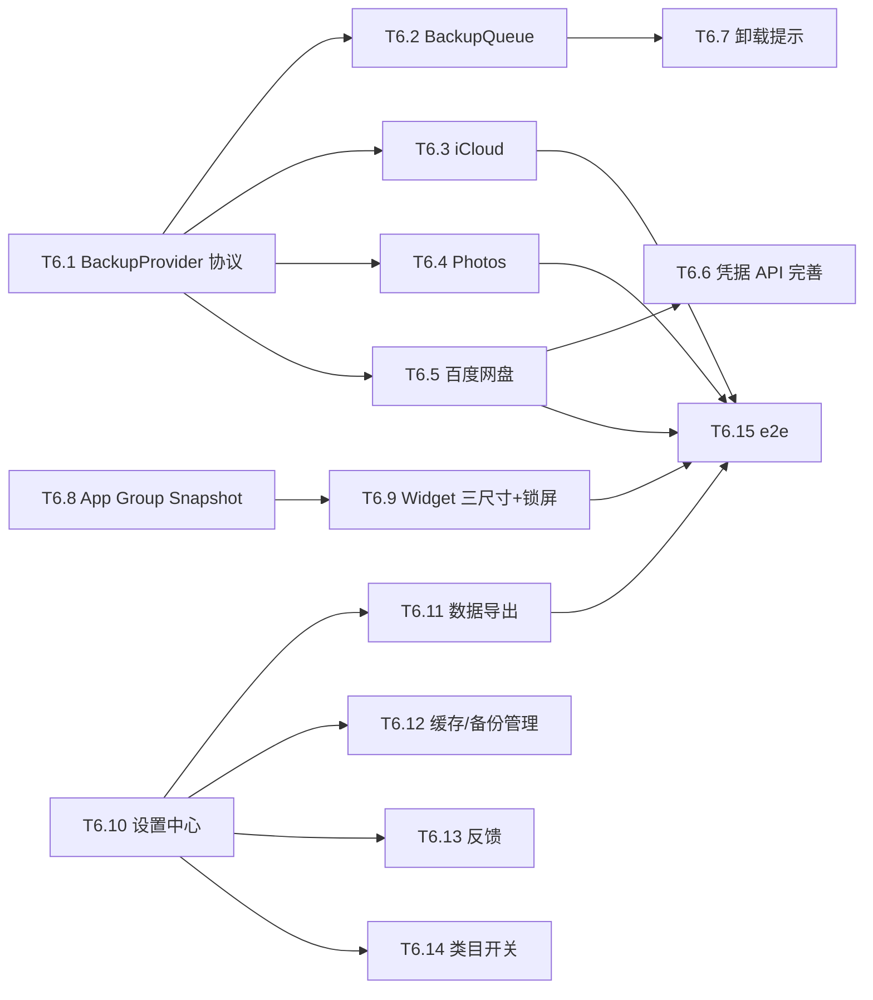
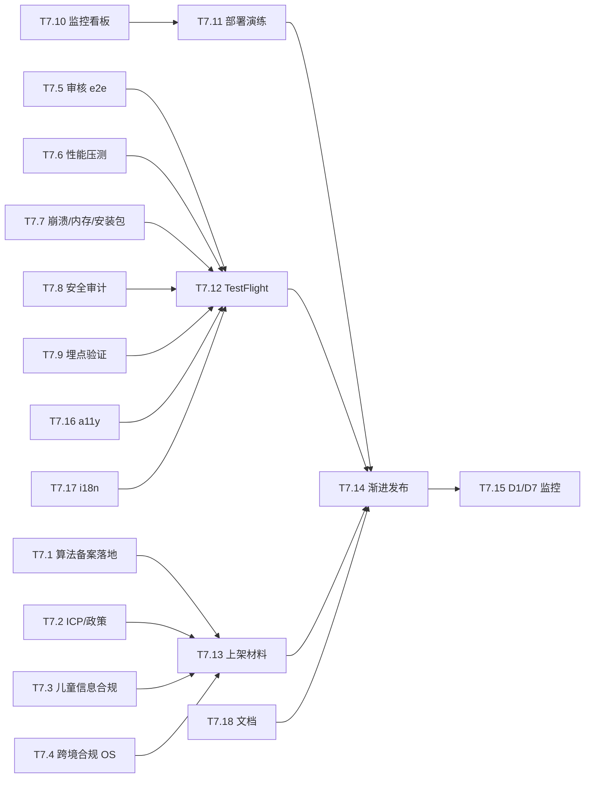

# 宝宝成长相机 V1.0 开发实施计划

> 基于 [PRD.md](./PRD.md)、[design.md](./design.md)、[design-ios.md](./design-ios.md)、[design-backend.md](./design-backend.md)、[design-api.md](./design-api.md)、[PRD-决策记录.md](./PRD-%E5%86%B3%E7%AD%96%E8%AE%B0%E5%BD%95.md) 制定。

---

## 1. 文档信息

| 项目 | 内容 |
| --- | --- |
| 文档名称 | 宝宝成长相机 V1.0 开发实施计划 |
| 文档版本 | v0.1 |
| 文档状态 | 实施完成（2026-06-06 全任务 done） |
| 目标版本 | V1.0（iOS 16+，iPhone，4 个月工期） |
| 最近更新 | 2026-06-06 |
| 适用对象 | iOS 端、后端、AI、运维、合规、QA、产品 |

### 1.1 计划目标

1. 把 V1.0 范围拆分为 **8 个阶段** + **约 130 个可独立交付的子任务**，每个子任务都有明确的产出物与验收标准。
2. 标识 **阶段间依赖** 与 **任务间依赖**，从而支持「按阶段串行 + 阶段内 5 并行度并行」的多 agent 协同。
3. 把 **算法备案 / ICP 备案 / 字体素材采购** 等长周期事项前置，避免阻塞上架。
4. 与 PRD §11 与 design §2 强约束保持一致：原图不上服务端、AI 算力按积分按量、深度合成强制标识、儿童信息单独同意。

### 1.2 任务编号约定

- `T<阶段>.<序号>`，例如 `T3.5` 表示阶段 3 的第 5 个子任务。
- `BE/iOS/INFRA/COMP/QA` 后缀表示主要负责领域：后端 / iOS 端 / 基础设施与 DevOps / 合规法务 / 测试。
- 状态标记：`pending` / `in-progress` / `blocked` / `done`（在执行时由各 agent 维护）。
- 验收标准统一覆盖：**功能用例**、**单测/契约测试**、**联调验证**、**回归点**、**风险检查（合规/性能/安全）**。

### 1.3 并行度与角色

- 每批最多 **5 个子任务并行**，分配给独立的实施 agent；批次完成后做集成检查再开下一批。
- 角色与服务的主担当：

| 领域 | 主担当 | 关联模块/服务 |
| --- | --- | --- |
| iOS 端 | iOS-A、iOS-B（最多 3 个 agent 并行） | Features/* + Core/* + Network |
| 后端业务 | BE-A、BE-B、BE-C（最多 3 个 agent 并行） | auth-family / feed / media / ai-dispatch / audit / credit-sub-ad / caption / notification / config / iap-callback |
| 基础设施 | INFRA | K8s、网关、DB、Kafka、OSS、监控、CI/CD |
| 合规法务 | COMP | 算法备案、ICP、隐私政策、内容审核策略、深度合成标识 |
| QA / 集成 | QA | 集成测试、联调、性能、安全、上架材料 |

---

## 2. 阶段总览与依赖

### 2.1 阶段清单

| 阶段 | 名称 | 主目标 | 估算工期 | 并行 agent 数上限 |
| :---: | --- | --- | :---: | :---: |
| P0 | 项目初始化与基础设施 | 备案启动、CI/CD、K8s、DB、监控、脚手架 | W0–W2（2 周） | 5 |
| P1 | 账号 / 家庭 / 宝宝 骨架 | auth-family-svc 完整 + 端侧账号家庭骨架 | W2–W5（3 周） | 5 |
| P2 | 端侧本地能力 | 相机 / 编辑 / Timeline / Milestone 全部本地 | W3–W7（4 周，与 P1 部分并行） | 5 |
| P3 | 媒体上传 + AI 调度 + 审核 + 端 AI 玩法 | 核心差异化能力跑通 | W5–W10（5 周） | 5 |
| P4 | 积分 + 订阅 + 广告 | credit-sub-ad-svc + 端侧 IAP/订阅/广告 | W7–W10（3 周） | 5 |
| P5 | 家庭圈 + 分享 + 文案 + 通知 | 发布闭环 + 推送 + 智能文案 | W9–W12（3 周） | 5 |
| P6 | 备份 + 小组件 + 设置 | iCloud / 百度网盘 / Photos + Widget + 设置中心 | W10–W13（3 周） | 5 |
| P7 | 合规 + 性能 + 上架 | 备案完成、性能/安全压测、TestFlight、提审、灰度 | W12–W16（4 周，含与 COMP 并行） | 5 |

> 说明：上述工期为理想估算，假设 5 个并行 agent 满载且无重大返工；实际排期需结合各 agent 实际产能与备案审批进度滚动调整。

### 2.2 阶段依赖图



阶段间硬依赖关键说明：

- **P1 的 auth/网关/JWT 是后续所有后端服务的前置**：P3/P4/P5/P6 在前后端联调前都依赖 P1 完成的 JWT 校验、家庭权限校验、网关路由。
- **P2 端侧本地能力可与 P1 并行**：P2 的相机/编辑/本地存储不依赖后端，但「拍照后入库时关联宝宝 ID」依赖 P1 的端侧 Baby Feature。
- **P3 必须等 P1 完成**：AI 任务需要鉴权与家庭权限；P3 还依赖 P0 的 OSS/Kafka/Mongo/审核厂商账号。
- **P4 与 P3 强耦合于 saga 接口**：积分 hold/commit/release 必须先于 P3 的 AI 联调跑通（可在 P3 中后段同步联调）。
- **P5 依赖 P3 的水印渲染、P4 的订阅权益（去广告 + 关品牌水印）**。
- **P6 的备份凭据 API 复用 auth-family-svc**，依赖 P1。
- **P7 是收尾阶段**，与 P0 启动的算法备案/ICP 备案在 W12 前后汇合；备案号必须在 App Store 提审前回填。

### 2.3 验收标准的统一格式

每个子任务必须满足以下五项中适用项（不适用项标 N/A）：

1. **功能用例**：列出最小可演示用例（含异常路径），可被另一个 agent 5 分钟内复现。
2. **单元/契约测试**：单测覆盖核心分支；后端契约测试对照 `design-api.md`，端侧 ViewModel/Repository 单测可在内存 SQLite 中执行。
3. **联调验证**：与上下游 agent 跑通 happy path + 至少 1 个失败路径（积分回滚、审核拒绝、网络异常等）。
4. **性能/安全/合规检查**：相机启动 ≤ 800ms、AI P95 ≤ 60s、ATS、Token 在 Keychain、Token 不落日志、儿童同意书校验等按设计文档对应章节验证。
5. **文档与回归点**：在任务说明中追加「使用说明、回滚步骤、监控指标、关联埋点」。

---

## 2.4 任务执行状态（滚动更新）

> 由编排 agent 在每批 3 并行任务完成后同步更新。状态：`pending` / `in-progress` / `blocked` / `done`

| 批次 | 任务 | 状态 | 完成时间 | 备注 |
| :---: | --- | :---: | --- | --- |
| P0-1 | T0.1 | done | 2026-06-06 | monorepo/CODEOWNERS/CI 骨架 |
| P0-1 | T0.3 | done | 2026-06-06 | K8s Helm/ArgoCD 模板 |
| P0-1 | T0.9 | done | 2026-06-06 | 算法/深度合成备案跟踪 |
| P0-1 | T0.10 | done | 2026-06-06 | ICP 备案跟踪 |
| P0-1 | T0.12 | done | 2026-06-06 | Vault/第三方账号清单 |
| P0-2 | T0.2 | done | 2026-06-06 | GitLab CI + ArgoCD + fastlane |
| P0-2 | T0.4 | done | 2026-06-06 | PG/Mongo/Redis 双区模板 |
| P0-2 | T0.5 | done | 2026-06-06 | Kafka/OSS/S3 topic+生命周期 |
| P0-2 | T0.6 | done | 2026-06-06 | APISIX 网关 chart |
| P0-2 | T0.13 | done | 2026-06-06 | iOS 脚手架（需 Xcode 验证 build） |
| P0-3 | T0.7 | done | 2026-06-06 | Vault Helm/Injector/轮换 SOP |
| P0-3 | T0.17 | done | 2026-06-06 | Go/Python 服务模板 + hello |
| P0-3 | T0.8 | done | 2026-06-06 | Prometheus/Grafana/Loki/Tempo |
| P0-3 | T0.11 | done | 2026-06-06 | 字体/贴纸/模板资源包 |
| P0-3 | T0.14 | done | 2026-06-06 | DesignSystem + Catalog |
| P0-4 | T0.15 | done | 2026-06-06 | Network 包 + Mock + 单测 |
| P0-4 | T0.16 | done | 2026-06-06 | GRDB migration + Repository 骨架 |
| P0-4 | T0.18 | done | 2026-06-06 | OpenAPI/protobuf + CI lint |
| P0-4 | T0.19 | done | 2026-06-06 | config-svc + Feature Flag |
| P0-4 | T0.20 | done | 2026-06-06 | QA mocks + 冒烟脚本 |
| P0-4 | P0-SMOKE | done | 2026-06-06 | p0-smoke 35/35；M1 待 Docker/Xcode |
| P1-1 | T1.1 | done | 2026-06-06 | Apple 登录 + users 表 |
| P1-1 | T1.2 | done | 2026-06-06 | 手机号验证码 + 限流 |
| P1-1 | T1.5 | done | 2026-06-06 | 家庭 CRUD + 上限 |
| P1-1 | T1.10 | done | 2026-06-06 | child_consents + RequireChildConsent |
| P1-1 | T1.12 | done | 2026-06-06 | APISIX forward-auth + 限流 |
| P1-2 | T1.3 | done | 2026-06-06 | JWT/Refresh/Logout + Redis 黑名单 |
| P1-2 | T1.6 | done | 2026-06-06 | RequireFamilyRole 中间件 |
| P1-2 | T1.7 | done | 2026-06-06 | 邀请码生成/作废/加入 + HMAC QR |
| P1-2 | T1.9 | done | 2026-06-06 | babies CRUD + avatar stub |
| P1-3 | T1.4 | done | 2026-06-06 | 账号软删/撤销/导出入口 |
| P1-3 | T1.8 | done | 2026-06-06 | 转让 + 失联接管 + scheduler |
| P1-3 | T1.11 | done | 2026-06-06 | backup providers/status API 占位 |
| P1-3 | T1.13 | done | 2026-06-06 | BabyCameraAccount + Keychain TokenStore |
| P2-1 | T2.3 | done | 2026-06-06 | BabyCameraVideoKit |
| P2-1 | T2.11 | done | 2026-06-06 | BabyCameraEditor 撤销/重做内核 |
| P1P2-1 | T1.14 | done | 2026-06-06 | BabyCameraFamily CRUD/邀请/扫码加入 |
| P1P2-1 | T1.16 | done | 2026-06-06 | BabyCameraBaby CRUD/切换器/头像 stub |
| P1P2-1 | T2.1 | done | 2026-06-06 | BabyCameraPermissions 四权限+引导+单测 |
| P1P2-2 | T1.15 | done | 2026-06-06 | TransferAdminFlow 转让/接管 UI |
| P1P2-2 | T1.19 | done | 2026-06-06 | SyncCoordinator + BackgroundSyncService |
| P1P2-2 | T2.5 | done | 2026-06-06 | BabyCameraCamera CameraSession/VC |
| P1P2-3 | T1.17 | done | 2026-06-06 | BabyAgeFormatter 边界单测 |
| P1P2-3 | T1.18 | done | 2026-06-06 | BabyCameraOnboarding 5 步流程 |
| P1P2-3 | T2.2 | done | 2026-06-06 | BabyCameraImageKit 编解码+缩略图 |
| P1P2-3 | T2.4 | done | 2026-06-06 | Database v1_initial migration |
| P2-2 | T2.6 | done | 2026-06-06 | RealtimeFilterPipeline 8 款滤镜 |
| P2-2 | T2.7 | done | 2026-06-06 | PhotoCapturePipeline/LivePhoto/Burst |
| P2-2 | T2.12 | done | 2026-06-06 | Editor FilterCatalog 13 款+调色 |
| P2-3 | T2.8 | done | 2026-06-06 | OverlayView 浮层+烧录 toggle |
| P2-3 | T2.9 | done | 2026-06-06 | MetadataWriter + photo 入库 |
| P2-3 | T2.13 | done | 2026-06-06 | 贴纸/字体/马赛克/涂鸦 manifest |
| P2-3 | T2.10 | done | 2026-06-06 | ImportService PHPicker+EXIF+出生日校验 |
| P2-3 | T2.14 | done | 2026-06-06 | TemplateCatalog 12套+远端manifest |
| P2-3 | T2.15 | done | 2026-06-06 | EditorRenderer分块导出+步骤持久化 |
| P2-4 | T2.16 | done | 2026-06-06 | BabyCameraWatermark 品牌水印+订阅策略 |
| P2-4 | T2.17 | done | 2026-06-06 | BabyCameraTimeline 日月年全部视图 |
| P2-4 | T2.19 | done | 2026-06-06 | BabyCameraMilestone 13节点+365天调度 |
| P2-4 | T2.18 | done | 2026-06-06 | TimelineMapView POI聚合+地图切换 |
| P2-5 | T2.20 | done | 2026-06-06 | 自定义里程碑CRUD+日历联动 |
| P2-4 | T2.21 | done | 2026-06-06 | DiskLRUThumbnailCache 7天/1GB |
| P2-5 | T2.22 | done | 2026-06-06 | P2 XCUITest 5次回归+harness |
| P1-4 | T1.20 | done | 2026-06-06 | P1 e2e.sh+Postman+XCUITest |
| P3-1 | T3.1 | done | 2026-06-06 | media-svc init/complete 16 tests |
| P3-1 | T3.2 | done | 2026-06-06 | OSS lifecycle+对账Cron 21/21 |
| P3-1 | T3.3 | done | 2026-06-06 | audit-svc 骨架 18 tests |
| P3-1 | T3.6 | done | 2026-06-06 | ai-dispatch 状态机 37 tests |
| P3-1 | T3.17 | done | 2026-06-06 | /v1/ws/ai 心跳+订阅 44 tests |
| P3-2 | T3.4 | done | 2026-06-06 | 阿里云内容安全 stub 47 tests |
| P3-2 | T3.5 | done | 2026-06-06 | OS 三厂商 stub+双区路由 |
| P3-2 | T3.7 | done | 2026-06-06 | ModelRouter 区域隔离+滑窗 |
| P3-2 | T3.16 | done | 2026-06-06 | GET /v1/ai/plays 82 tests |
| P3-2 | T3.19 | done | 2026-06-06 | iOS UploadService 分片直传 |
| P3-3 | T3.8 | done | 2026-06-06 | SeedreamAdapter 112 tests |
| P3-3 | T3.9 | done | 2026-06-06 | 通义/即梦 image-edit 183 tests |
| P3-3 | T3.10 | done | 2026-06-06 | SeedanceAdapter video 5s/10s |
| P3-3 | T3.11 | done | 2026-06-06 | NanoBanana+GptImage2 OS 35 tests |
| P3-3 | T3.20 | done | 2026-06-06 | BabyCameraAIPlay 卡片+5min缓存 |
| P3-4 | T3.12 | done | 2026-06-06 | Worker池+Kafka 226 tests |
| P3P4-1 | T3.13 | done | 2026-06-06 | watermark 显式+隐式+manifest 246 tests |
| P3P4-1 | T3.15 | done | 2026-06-06 | POST appeal rejected→appealed 235+49 tests |
| P3P4-1 | T4.1 | done | 2026-06-06 | credit-sub-ad-svc 7表骨架 8 tests |
| P3P4-2 | T3.14 | done | 2026-06-06 | creditclient saga+幂等 251 tests |
| P3P4-2 | T4.2 | done | 2026-06-06 | double-entry 账本 26 tests |
| P3P4-2 | T3.21 | done | 2026-06-06 | AIPlayDetailView 提交+预览+确认弹窗 |
| P3P4-3 | T4.3 | done | 2026-06-06 | saga gRPC+Redis幂等 45+260 tests |
| P3P4-3 | T4.4 | done | 2026-06-06 | IAP JWS verify 43 tests |
| P3P4-3 | T3.18 | done | 2026-06-06 | cost_metering+周对账 260 tests |
| P3P4-4 | T4.10 | done | 2026-06-06 | 4个查询API 91 tests |
| P3P4-4 | T4.6 | done | 2026-06-06 | 订阅状态机+cron 91 tests |
| P3P4-4 | T3.22 | done | 2026-06-06 | AITaskCoordinator WS+轮询 |
| P3P4-5 | T4.5 | done | 2026-06-06 | iap-callback-svc+Kafka 581 tests |
| P3P4-5 | T4.7 | done | 2026-06-06 | 签到+赠分 110 tests |
| P3P4-5 | T3.23 | done | 2026-06-06 | 失败/申诉/退还 UI+单测 |
| P3P4-6 | T4.8 | done | 2026-06-06 | 广告激励双通道 126 tests |
| P3P4-6 | T4.9 | done | 2026-06-06 | 对账cron+告警 126 tests |
| P3P4-6 | T3.24 | done | 2026-06-06 | derived下载+GRDB入库 |
| P3P4-7 | T3.25 | done | 2026-06-06 | 深度合成角标+品牌水印+视频封面 |
| P3P4-7 | T4.11 | done | 2026-06-06 | BabyCameraCredit 包 11 tests |
| P3P4-7 | T4.12 | done | 2026-06-06 | IAPService StoreKit2 8 tests |
| P3P4-8 | T4.13 | done | 2026-06-06 | SubscriptionStore 状态机+权益缓存 |
| P3P4-8 | T4.14 | done | 2026-06-06 | SignInView+Invite+RechargeSheet 集成 |
| P3P4-8 | T4.15 | done | 2026-06-06 | AdManager stub+频次+激励入账 13 tests |
| P3P4-9 | T3.26 | done | 2026-06-06 | P3 AI e2e 7场景 shell+Postman 40+33断言 |
| P3P4-9 | T4.16 | done | 2026-06-06 | AIPlayCreditIntegration+previewCost+WS余额 |
| P5-1 | T5.1 | done | 2026-06-06 | feed-svc 5表DDL+骨架 go test 7 packages |
| P3P4-10 | T4.17 | done | 2026-06-06 | P4 e2e 54断言 IAP/签到/订阅/grace |
| P5-1 | T5.6 | done | 2026-06-06 | caption-svc FastAPI pytest 12 passed |
| P5-1 | T5.7 | done | 2026-06-06 | notification-svc device_tokens go test 19 |
| P5-2 | T5.2 | done | 2026-06-06 | POST /v1/posts 限流+审核 stub |
| P5-2 | T5.10 | done | 2026-06-06 | BabyCameraFamilyFeed PostComposer |
| P5-2 | T5.17 | done | 2026-06-06 | BabyCameraNotification APNs+消息中心 |
| P5-3 | T5.3 | done | 2026-06-06 | GET /v1/feeds/family 缓存60s go test 38 |
| P5-3 | T5.8 | done | 2026-06-06 | notifications 表+分页+已读 go test 32 |
| P5-3 | T5.16 | done | 2026-06-06 | CaptionService+PickerView 11单测 |
| P5-4 | T5.4 | done | 2026-06-06 | 点赞评论+WS stub go test 67 |
| P5-4 | T5.5 | done | 2026-06-06 | DELETE撤回+OSS清理stub |
| P5-4 | T5.11 | done | 2026-06-06 | FeedListView+post_cache 100条 |
| P5-5 | T5.9 | done | 2026-06-06 | Kafka推送编排+静默AI go test 42 |
| P5-5 | T5.12 | done | 2026-06-06 | 双击点赞+评论+WS+离线队列 |
| P5-5 | T5.15 | done | 2026-06-06 | ShareGate+SharePreparer 水印校验 |
| P5-6 | T5.13 | done | 2026-06-06 | WechatShareAdapter stub 10单测 |
| P5-6 | T5.14 | done | 2026-06-06 | SystemShareAdapter+剪贴板 10单测 |
| P5-6 | T5.18 | done | 2026-06-06 | 本地通知+静默BG下载 |
| P5-7 | T5.19 | done | 2026-06-06 | FeedCoordinator 联调层 |
| P5-7 | T5.20 | done | 2026-06-06 | P5 e2e 66断言全通过 |
| P6-1 | T6.1 | done | 2026-06-06 | BabyCameraBackup 协议+编排 20单测 |
| P6-2 | T6.2 | done | 2026-06-06 | BackupQueue 退避+3次失败弹窗 |
| P6-1 | T6.6 | done | 2026-06-06 | 备份凭据API AES-GCM go test 129 |
| P6-1 | T6.8 | done | 2026-06-06 | Widget AppGroup+Snapshotter 12单测 |
| P6-2 | T6.3 | done | 2026-06-06 | ICloudProvider CloudKit Private 10单测 |
| P6-2 | T6.4 | done | 2026-06-06 | PhotosProvider addOnly 15单测 |
| P6-1 | T6.10 | done | 2026-06-06 | BabyCameraSettings 6分区 18单测 |
| P6-2 | T6.9 | done | 2026-06-06 | WidgetExtension 4尺寸+Timeline 5单测 |
| P6-2 | T6.11 | done | 2026-06-06 | 数据导出zip+BGTask 8组单测 |
| P6-3 | T6.5 | done | 2026-06-06 | BaiduPanProvider+BackupAPI iOS |
| P6-3a | T6.7 | done | 2026-06-06 | UninstallReminderCoordinator+数据页Toggle |
| P6-3a | T6.12 | done | 2026-06-06 | CacheCleanup+BackupTargetsManagement 11单测 |
| P6-3a | T6.13 | done | 2026-06-06 | FeedbackForm+脱敏日志+邮件通道 13单测 |
| P6-3b | T6.14 | done | 2026-06-06 | PATCH subscriptions契约修复+App接线 |
| P6-3b | T6.15 | done | 2026-06-06 | p6-e2e 76断言+XCUITest harness |
| P7-1 | T7.1 | done | 2026-06-06 | filings.yaml+Router拒绝+plays过滤 277 tests |
| P7-1 | T7.2 | done | 2026-06-06 | 5份政策MD+config flags+About版本展示 |
| P7-1 | T7.3 | done | 2026-06-06 | child_consent_v1+GET状态+ConsentVersionChecker+p7-e2e |
| P7-1 | T7.4 | done | 2026-06-06 | OS端点+no-training header+osconfig 31 tests |
| P7-2 | T7.5 | done | 2026-06-06 | p7-audit-e2e 109断言+报告模板 |
| P7-2 | T7.6 | done | 2026-06-06 | performance benchmarks+双机型报告模板 |
| P7-2 | T7.7 | done | 2026-06-06 | BabyCameraDiagnostics+IPA脚本+ODR占位 |
| P7-2 | T7.8 | done | 2026-06-06 | security-checklist 21项PASS+CertPinning stub |
| P7-2 | T7.9 | done | 2026-06-06 | 73项埋点catalog+verify脚本PASS |
| P7-2 | T7.10 | done | 2026-06-06 | Grafana看板+Prometheus告警14条 |
| P7-3 | T7.11 | done | 2026-06-06 | 部署演练SOP+rollback/traffic-shift脚本 |
| P7-3 | T7.13 | done | 2026-06-06 | App Store提审四件套+4.5.4/4.7自查 |
| P7-3 | T7.16 | done | 2026-06-06 | a11y报告模板+20处label+smoke测试 |
| P7-3 | T7.17 | done | 2026-06-06 | 241 i18n keys+verify脚本 scope 0违规 |
| P7-3 | T7.18 | done | 2026-06-06 | 文档站+generate-api-docs+RUNBOOK |
| P7-4 | T7.12 | done | 2026-06-06 | TestFlight计划+smoke 41断言+beta lane |
| P7-5 | T7.14 | done | 2026-06-06 | Phased Release方案+rollout flags+kill-switch+iOS |
| P7-5 | T7.15 | done | 2026-06-06 | Incident Playbook+D1/D7检查表+metrics快照 |

---

## 3. 阶段 P0：项目初始化与基础设施

### 3.1 子任务清单

| 编号 | 角色 | 任务 | 主要产出 | 验收标准（节选） |
| --- | --- | --- | --- | --- |
| T0.1 | INFRA | 代码仓库与分支策略（monorepo + 服务子目录 + 端 iOS 子目录），CODEOWNERS、PR 模板、Conventional Commits | git 仓库就绪，分支保护 | main 分支保护、必过 CI、PR 模板包含「关联设计章节」字段 |
| T0.2 | INFRA | CI/CD：GitLab CI（lint/test/build/image push）+ ArgoCD（K8s 部署）；端侧 Xcode Cloud 或 fastlane | `.gitlab-ci.yml` + `argocd/` + iOS fastlane | 任意服务 push 触发镜像构建；iOS PR 触发单测；蓝绿模板就绪 |
| T0.3 | INFRA | K8s 双集群（阿里云 ACK 中国 + AWS EKS 新加坡），命名空间 `dev/staging/prod-cn/prod-os` | 两个集群、Helm chart 模板 | `kubectl get ns` 正确；可部署 hello 服务通过网关访问 |
| T0.4 | INFRA | 数据库部署：PostgreSQL 15 主备 + MongoDB 6 + Redis 7（双区独立） | 集群、备份策略、慢日志 | 端到端连通性自测；备份每日；慢查询监控接入 |
| T0.5 | INFRA | 消息队列与对象存储：Kafka 3 broker、阿里云 OSS（CN）+ AWS S3（OS）+ CDN | topic 列表（`ai.events`、`iap.events`、`feed.events`、`credit.events`）、OSS 桶策略（`ai-tmp 24h`、`ai-out 30d`、`family 长期`） | topic 可发可收；桶生命周期策略生效 |
| T0.6 | INFRA | 网关部署：Kong 或 APISIX，TLS 终止、域名解析（`api-cn`/`api-os`/`ws-cn`/`ws-os`） | 网关配置 + 双区证书 | 健康检查 200；TLS 1.3 强制；HTTP/2 启用 |
| T0.7 | INFRA | Secret 管理：HashiCorp Vault；CI/CD 集成；服务账号最小权限 | Vault 命名空间 + 策略 + Sealed Secret | 任意服务从 Vault 取 DB 密码、模型 API Key；密钥轮换 SOP |
| T0.8 | INFRA | 监控基线：Prometheus + Grafana + Loki + Sentry + Jaeger/Tempo | 模板看板（API RPS / P95、5xx、节点资源） | 任意服务接入即可在看板看到指标；Sentry 收到示例异常 |
| T0.9 | COMP | 启动「生成式人工智能服务备案」+「深度合成服务算法备案」（按 V1 接入的国内模型分批申报） | 备案受理回执 | 已提交 Seedream/通义万相/即梦/Seedance 至少 4 个模型的备案受理；建立周状态跟踪表 |
| T0.10 | COMP | 启动 ICP 备案（公司主体或购买现成主体），App 名称与备案号一致 | 备案受理回执 | 已确认主体可用；管局受理；上架材料预填入备案号占位 |
| T0.11 | COMP | 字体（≥ 6 款商用授权）+ 贴纸（≥ 60）+ 模板（≥ 12）版权采购与设计 | 授权证书 + 资源包 | 法务存档授权 PDF；资源包按目录交付到设计仓库 |
| T0.12 | INFRA | 第三方账号开通：Apple Developer、微信开放平台、阿里云短信 / 内容安全、穿山甲 / 优量汇 / AdMob、模型厂商（字节 / 阿里 / OpenAI / Google）、百度网盘 OpenAPI、Bugly、Sentry | 账号清单 + 凭据入 Vault | 全部账号可登录；测试 Key 可调通；产线 Key 走 Vault |
| T0.13 | iOS | iOS 工程脚手架：Xcode 项目、SPM 包结构（App / Core / Data / Network / Features / UIKitBridge / Widgets / Resources）、最低 iOS 16、SPM lockfile | 可编译运行的空壳 App | `xcodebuild -showBuildSettings` 通过；目录与 design-ios §3 一致 |
| T0.14 | iOS | DesignSystem：颜色 / 字体 / 间距 / 主要组件（按钮、卡片、列表、空态、Loading）+ Dynamic Type | DesignSystem SPM 包 | Storybook 风格演示页可看；颜色对比度 ≥ AA；深色模式跟随系统 |
| T0.15 | iOS | 网络层：URLSession + async/await、Endpoint、Interceptor（Auth / Region / Logging）、APIError 统一映射 design-api §12 | Network 包 + Mock Server | 端到端 mock 跑通登录；401 自动刷新；脱敏日志验证 |
| T0.16 | iOS | GRDB 接入 + DatabaseMigrator 框架；初始 schema 占位（baby/photo/derived 表暂留 stub） | Database 包 | 初始 migration 可执行；Repository 协议骨架就绪 |
| T0.17 | BE | Go 服务脚手架（go.mod 模板、protobuf 工具链、gRPC server 模板、健康检查、Tracing）+ Python 模板（caption-svc 用） | `services/_template/`、protobuf 仓库 | 任意新服务 5 分钟内 fork 模板可启动 |
| T0.18 | BE | OpenAPI（REST）+ protobuf（gRPC）契约仓库，CI 中做 breaking change 检查；与 `design-api.md` 对齐 | `contracts/` 仓 | OpenAPI lint / breaking change 拦截；端侧可用 Swagger Codegen 生成 DTO 参考 |
| T0.19 | INFRA | 灰度配置 + Feature Flag 平台（自建或选型 Unleash / OpenFeature） | config-svc 雏形 + SDK | 可在端 / 后端按 region/userIdHash 分流 |
| T0.20 | QA | 测试基础设施：staging 环境、测试账号池、Mock 三方（IAP/微信/广告/审核/AI）、性能基线机型清单 | `tests/` 仓 + 测试机文档 | 跑通登录 + 拍照（mock）+ 发布（mock）冒烟流程 |

### 3.2 P0 任务依赖



### 3.3 P0 并行批次（每批 ≤ 5）

- **批 P0-1**（先决）：T0.1、T0.3、T0.9、T0.10、T0.12
- **批 P0-2**：T0.2、T0.4、T0.5、T0.6、T0.13
- **批 P0-3**：T0.7、T0.8、T0.11、T0.14、T0.17
- **批 P0-4**：T0.15、T0.16、T0.18、T0.19、T0.20

> P0 完成判定：批 P0-4 全部完成且端到端冒烟（端侧空壳调通 mock 登录）通过。

---

## 4. 阶段 P1：账号 / 家庭 / 宝宝 骨架

> 对应 PRD §4.1、§4.2，design-backend §3、§4.1.1，design-ios §4.1–§4.3，design-api §3、§4。

### 4.1 子任务清单

| 编号 | 角色 | 任务 | 主要产出 | 验收标准（节选） |
| --- | --- | --- | --- | --- |
| T1.1 | BE | auth-family-svc：`users` 表、Apple ID 登录（`POST /v1/auth/apple`，identityToken 校验）、首次注册落库 + 监护人同意状态 | 服务可启动，登录闭环 | 真机 Apple 登录可拿到 JWT；新老用户区分；users 唯一约束生效 |
| T1.2 | BE | auth-family-svc：手机号 + 短信验证码（`POST /v1/auth/phone/code` / `/login`），阿里云短信对接、限流（60s/3 次） | 短信链路 + 限流 | 限流测试达预期；验证码 5min TTL；同手机号重发 60s 冷却 |
| T1.3 | BE | auth-family-svc：JWT 签发 + Refresh Rotation + 黑名单（Redis），`POST /v1/auth/refresh` / `/logout` | Token 全链路 | Refresh 老 token 立即失效；登出后 Access 入黑名单 |
| T1.4 | BE | auth-family-svc：账号注销 `DELETE /v1/account`（软删 + 7 天可撤销）+ 数据导出请求入口 | 注销流程 | 7 天内可撤销；调度器按期执行硬删；联动 feed/credit 清账 |
| T1.5 | BE | auth-family-svc：家庭 CRUD（`/v1/families`）+ 家庭上限校验（家庭 ≤ 2 创建 / ≤ 3 加入） | 家庭表 + 接口 | 创建/查询/详情/更名/解散；上限错误码 `FAMILY_*` 正确返回 |
| T1.6 | BE | auth-family-svc：成员 / 角色 / 权限中间件 `RequireRole(role)` + JWT `families` claim | gRPC/REST 中间件 | 访客发布被拒；非 admin 转让被拒；行级隔离正确 |
| T1.7 | BE | auth-family-svc：邀请码生成（6 位数字 + 二维码 payload，TTL 24h，maxUses 8）+ 加入接口 | 邀请闭环 | 过期/用尽错误码正确；二维码可扫；签名防伪 |
| T1.8 | BE | auth-family-svc：管理员主动转让（`/transfer`）+ 失联接管投票（30 天 lastSeen + 50% + 7 天异议） | 转让/接管表 + cron | 投票全流程可演练；异议期内可被原管理员撤销 |
| T1.9 | BE | auth-family-svc：宝宝档案 CRUD（`/v1/families/{id}/babies`、`/v1/babies/{id}`）+ 头像上传（`avatar/`） | babies 表 + 头像 | 多宝宝；时区取宝宝出生地或设备时区；软删 |
| T1.10 | BE | auth-family-svc：监护人同意 `/v1/account/consents/child-data` + `child_consents` 表 | 同意书 API | 端 + 后端双记录；版本号管理；缺同意时关键写接口返回 `ACCOUNT_CONSENT_REQUIRED` |
| T1.11 | BE | auth-family-svc：备份凭据托管 API（占位）`/v1/backup/providers`（实际 Provider 在 P6 实现） | API 雏形 | 仅持久化 OAuth Token + 元数据；不存原图 |
| T1.12 | BE | 网关：接入 JWT 校验 / Refresh 路由 / 限流（按 design-api §2.7） | 网关配置 | 模拟 401 自动 refresh；限流准确 |
| T1.13 | iOS | Account：Apple ID 登录 + 手机号登录 + 注销 UI；TokenStore（Keychain `kSecAttrAccessibleAfterFirstUnlockThisDeviceOnly`） | LoginView/Coordinator | 真机登录拿到 JWT；杀进程后自动复用 Refresh |
| T1.14 | iOS | Family：家庭 CRUD + 邀请码生成 / 二维码扫码 / 加入流程（关系称谓选择） | FamilyMembersView / InviteSheet | 邀请-加入闭环；扫码可识别本 App 二维码 |
| T1.15 | iOS | Family：成员管理 + 转让 + 接管 UI（含推送通知文案） | TransferAdminFlow | 二次确认 + 推送通知埋点；UI 状态机覆盖 4 种状态 |
| T1.16 | iOS | Baby：CRUD + 必填/选填字段表单 + 头像上传 | BabyEditView | 表单校验完整；多宝宝切换器（顶部 Avatar 横滚） |
| T1.17 | iOS | BabyAgeFormatter：按 PRD §4.2.3 分阶段展示规则（出生第 N 天 / N 个月 N 天 / N 岁 N 个月 / N 岁） | Formatter + 单测 | 单测覆盖跨阶段边界（第 99/100 天、第 364/365 天等） |
| T1.18 | iOS | Onboarding：首启动昵称 + 关系 + 创建/加入家庭 + 创建第一个宝宝 + 监护人同意 + 备份引导 | Onboarding 流程 | 完整走过 5 步；同意书未勾选时关键功能受限 |
| T1.19 | iOS | Repository + Sync：Family / Member / Baby 本地缓存 + 后台增量同步 | Repositories + 单测 | 离线可看；网络恢复后自动同步；冲突按 `updatedAt` |
| T1.20 | QA | 端到端用例：登录 → 创建家庭 → 邀请家人 → 创建宝宝 → 注销 | XCUITest + Postman 集合 | 用例库纳入 staging 回归 |

### 4.2 P1 任务依赖



### 4.3 P1 并行批次

- **批 P1-1**：T1.1、T1.2、T1.5、T1.10、T1.12
- **批 P1-2**：T1.3、T1.6、T1.7、T1.9、T1.13
- **批 P1-3**：T1.4、T1.8、T1.11、T1.14、T1.16
- **批 P1-4**：T1.15、T1.17、T1.18、T1.19、T1.20

> P1 完成判定：批 P1-4 全部通过；T1.20 端到端用例在 staging 上稳定通过 3 次。

---

## 5. 阶段 P2：端侧本地能力（相机 / 编辑 / Timeline / Milestone）

> 对应 PRD §4.3、§4.4、§4.7、§4.8，design-ios §4.4–§4.8、§5、§7、§8。
> 该阶段不依赖后端，因此可与 P1 部分并行（在端侧团队具备 P0 工程脚手架后即可启动），仅最终落库写 `photo` 表时需要 `babyId`，依赖 P1 端侧 Baby Feature。

### 5.1 子任务清单

| 编号 | 角色 | 任务 | 主要产出 | 验收标准（节选） |
| --- | --- | --- | --- | --- |
| T2.1 | iOS | Permissions 模块：相机 / 相册 / 通知 / 位置授权统一封装 | `Core/Permissions` | 拒绝/未决/已授权三态；用户引导跳系统设置 |
| T2.2 | iOS | ImageKit：HEIC/JPG 编解码、缩略图（256/1024）、HEIC 兼容降级 | `Core/ImageKit` | 单测覆盖；常见图片格式互转无损 |
| T2.3 | iOS | VideoKit：MP4/H.264 探测、缩略图抽帧、AVAssetExportSession 包装 | `Core/VideoKit` | 抽帧准确；导出参数与 PRD §4.6 一致 |
| T2.4 | iOS | 完整 SQLite Schema 与 Migration（`baby/photo/derived/ai_task_local/post_cache/comment_cache/like_cache/membership/credit_txn_cache/milestone/setting`）| `Data/Database` v1_initial migration | migration 可在测试库回放；冷启动迁移 ≤ 200ms |
| T2.5 | iOS | Camera：`CameraSession` 生命周期 + 前后摄切换 + 闪光灯 + 网格线 / 水平仪 + 倒计时 | UIKit `CameraViewController` | 启动 ≤ 800ms（性能基准） |
| T2.6 | iOS | Camera：`RealtimeFilterPipeline`（CIContext + Metal）+ ≥ 6 款实时滤镜 | 滤镜库 | 30fps；滤镜切换无卡顿 |
| T2.7 | iOS | Camera：拍摄管线（PhotoOut + HEIC/JPG）+ Live Photo + 连拍（`.high` 预设） | 拍摄回调 + 写文件 | 拍摄延迟 ≤ 200ms；连拍 10 帧/秒 |
| T2.8 | iOS | Camera：`OverlayView` 信息浮层（宝宝小名 + 当前成长天数）+ 设置中可选「烧入水印」 | OverlayView + Watermark hook | 默认元数据；烧入选项有 toggle |
| T2.9 | iOS | Camera：MetadataWriter（合并 EXIF + 宝宝 ID + 成长天数 + 位置）+ `photo` 表插入 | MetadataWriter + Repo | 多宝宝合照支持；EXIF 缺失拒绝；离线可写 |
| T2.10 | iOS | 系统相册导入：PHPicker + EXIFReader + 缺失/早于出生日的弹窗策略 | ImportService | EXIF 缺失提示禁导；早于出生日按 V1 暂禁 |
| T2.11 | iOS | Editor：`EditorState` + `EditStep` 协议族 + 撤销 / 重做（快照栈） | Editor 内核 | 单测：连续 100 步操作无内存泄漏 |
| T2.12 | iOS | Editor：滤镜 ≥ 12 + 调色（亮度 / 对比 / 饱和 / 色温 / 阴影 / 高光 / 锐化）+ 裁剪 / 旋转 | FilterStep / AdjustStep / CropStep | UI 拖拽 60fps；滤镜分类正确 |
| T2.13 | iOS | Editor：贴纸（≥ 60）+ 文字（≥ 6 字体）+ 马赛克 + 涂鸦 | StickerStep / TextStep / MosaicStep / DoodleStep | 字体授权清单与 T0.11 对齐 |
| T2.14 | iOS | Editor：模板（≥ 12 套，「成长卡片 / 百天卡 / 周岁卡」）+ 模板 manifest（远端配置） | TemplateStep + manifest 加载器 | 模板可走 config-svc 远端下发；不下发可执行代码 |
| T2.15 | iOS | Editor：`EditorRenderer` Metal 离屏渲染 + 分块（≤ 8000×8000）+ 导出 HEIC/JPG + 步骤 JSON 落 `meta/edit_steps/` | Renderer + Persistence | 大图导出内存峰值 ≤ 200MB；「重新编辑」可恢复 |
| T2.16 | iOS | Watermark Renderer 基础：品牌水印（左下小尺寸） | `Core/Watermark` | 与订阅状态联动开关（订阅可关品牌水印） |
| T2.17 | iOS | Timeline：日 / 月 / 年 / 全部 视图（虚拟列表 + 缩略图缓存）| TimelineView 组 | 1 万张照片月视图滚动 60fps |
| T2.18 | iOS | Timeline：地图视图（MapKit）+ POI 聚合 + 中外地图切换 | MapView | 含地理位置照片显示在地图上 |
| T2.19 | iOS | Milestone：内置 10+ 节点目录 + `MilestoneScheduler`（本地通知预约 365 天）| Milestone Catalog + Scheduler | 通知到达；点击通知打开对应模板 |
| T2.20 | iOS | Milestone：自定义里程碑 CRUD + 同日推荐 AI 玩法置顶 | Milestone 自定义页 | 列表与日历视图标记联动 |
| T2.21 | iOS | 缩略图缓存（256/1024）+ 7 天 LRU + 上限 1GB | `Core/ImageKit/Cache` | 缓存策略生效；命中率埋点 |
| T2.22 | QA | 端到端：拍照 → 编辑 → 保存 → Timeline 显示 → 重新编辑 5 次回归 | XCUITest 用例 | 离线可全过程；崩溃率 0 |

### 5.2 P2 任务依赖



### 5.3 P2 并行批次

- **批 P2-1**：T2.1、T2.2、T2.3、T2.4、T2.11
- **批 P2-2**：T2.5、T2.6、T2.7、T2.12、T2.13
- **批 P2-3**：T2.8、T2.9、T2.10、T2.14、T2.15
- **批 P2-4**：T2.16、T2.17、T2.18、T2.19、T2.21
- **批 P2-5**：T2.20、T2.22（+ 余量任务/性能调优）

> P2 完成判定：相机启动 ≤ 800ms / 编辑器打开 ≤ 500ms 性能基准达标；T2.22 用例 3 次稳定通过。

---

## 6. 阶段 P3：媒体上传 + AI 调度 + 内容审核 + 端 AI 玩法

> 对应 PRD §4.5、§4.6、§6.6，design.md §5.1、§5.3，design-backend §5、§7，design-ios §9，design-api §5、§6。
> 该阶段是核心差异化与最重的合规链路，必须在 P1 完成后进入；可与 P4 在中后段并行联调（积分 saga 接口）。

### 6.1 子任务清单

| 编号 | 角色 | 任务 | 主要产出 | 验收标准（节选） |
| --- | --- | --- | --- | --- |
| T3.1 | BE | media-svc：`POST /v1/uploads/init` STS 凭据 + `POST /v1/uploads/complete`；purpose=`ai-input`/`post-item` | media-svc | 端可拿凭据直传 OSS；签名 10 分钟过期；完成回调写元数据 |
| T3.2 | INFRA | OSS 桶生命周期与目录策略：`ai-tmp/` 24h 清理、`ai-out/` 30d、`family/` 长期；监听对象删除事件用于对账 | OSS 配置 + cron | 生命周期生效；对账日志可见 |
| T3.3 | BE | audit-svc：服务骨架 + `audit_jobs`/`appeals` 表 + 三类管线（input/output/ugc）+ Kafka 消费/同步 RPC | audit-svc | 状态机覆盖 pending/passed/rejected；申诉单可写入 |
| T3.4 | BE | audit-svc：CN 厂商接入（阿里云内容安全：图像 / 文字 / 视频抽帧） | CN Adapter | 入参 ≤ 3s；out ≤ 5s；命中违规返回 reasons |
| T3.5 | BE | audit-svc：OS 厂商接入（AWS Rekognition + Cloudflare Images Guard + OpenAI Moderation） | OS Adapter | 双区独立部署；不跨区调用 |
| T3.6 | BE | ai-dispatch-svc：服务骨架 + Mongo `ai_tasks` schema + 状态机 + Kafka topic（`ai.image` / `ai.video`） | ai-dispatch | 状态转移完整覆盖 design-backend §5.4 |
| T3.7 | BE | ai-dispatch-svc：`ModelAdapter` 抽象 + `ModelRouter`（区域 / 玩法 / 负载 / 成功率 5min 滑窗 / 备案有效性） | Router 单测 | 单测覆盖各分支；CN 用户绝不路由到 OS |
| T3.8 | BE | ai-dispatch-svc：CN 适配器 SeedreamAdapter（image-gen） | Adapter + 集成测试 | 入参翻译 + 错误归一化 + 重试白名单 |
| T3.9 | BE | ai-dispatch-svc：CN 适配器 TongyiWanxiang / Jimeng（image-edit） | Adapter | 同上 |
| T3.10 | BE | ai-dispatch-svc：CN 适配器 SeedanceAdapter（video-gen，5s/10s） | Adapter | 视频超时 5min；输出 MP4/H.264 |
| T3.11 | BE | ai-dispatch-svc：OS 适配器 NanoBanana / GptImage2（image-edit / image-gen） | Adapter | 通过海外代理；不参与训练协议端点 |
| T3.12 | BE | ai-dispatch-svc：Worker 池 + Kafka 消费 + 模型重试 ≤ 2 + 超时（图 60s / 视频 300s） | Worker | 故意 mock 失败可触发重试与退积分 |
| T3.13 | BE | ai-dispatch-svc：水印合成（PNG 角标，后端合成避免端伪造）+ 隐式标识（XMP/EXIF/MP4 udta）+ `deepSynth.manifest` | 出参管线 | 输出文件含显式 + 隐式标识 |
| T3.14 | BE | ai-dispatch-svc：积分 hold/commit/release 接入（gRPC 调 credit-sub-ad-svc，P4 提供桩 mock 先行） | saga 集成 | 失败回滚走通；幂等键校验 |
| T3.15 | BE | ai-dispatch-svc：申诉接口 `/v1/ai/tasks/{id}/appeal` + audit-svc 联动 | 申诉闭环 | 状态机 rejected → appealed |
| T3.16 | BE | ai-dispatch-svc：玩法目录 `GET /v1/ai/plays`（含区域白名单、积分、时长档位）+ 灰度 | API + config | 玩法卡片可远端下架；端侧白名单同步 |
| T3.17 | BE | WebSocket 服务 `/v1/ws/ai`（心跳 30s + 鉴权 + taskIds 订阅 + event 推送 + 断线重连） | WS 服务 | 1k 并发连接稳定 |
| T3.18 | BE | ai-dispatch-svc：cost_metering 上报 + 周对账报表 | 报表 | 单图 / 单视频成本可追踪 |
| T3.19 | iOS | 上传：根据 STS 凭据分片直传 OSS（含进度回调 + 失败重试） | UploadService | 200MB 大图 ≤ 30s 上传（Wi-Fi）；网络异常自动续传 |
| T3.20 | iOS | AIPlay：玩法卡片浏览 + 区域过滤 + 远端配置缓存 | AIPlayGridView | 区域不可用玩法不展示；配置 5 分钟刷新 |
| T3.21 | iOS | AIPlay：任务提交 + 积分预扣预览（`POST /v1/credits/preview` 或本地计算）+ 二次确认弹窗 | AIPlayDetailView | 积分不足跳充值；签到提示 |
| T3.22 | iOS | AIPlay：本地状态机 + WebSocket 订阅 + 断线 60s 切轮询（`GET /v1/ai/tasks/{id}` 5s）+ 后台静默推送补偿 | AITaskCoordinator | 切后台 → 回前台仍能拿到结果 |
| T3.23 | iOS | AIPlay：失败 / 拒绝处理 + 申诉入口 + 自动退还积分提示 | UI 状态 | 用例覆盖 ModelFailed / Rejected / Refunded |
| T3.24 | iOS | AIPlay：结果下载到 `derived/` + 写 `ai_task_local` + `derived` 表关联原图 | LocalStore | 多任务并发下载；下载失败重试 |
| T3.25 | iOS | AIPlay：水印合成（深度合成强制角标 + 品牌水印订阅可关）+ 视频封面缩略图 | WatermarkRenderer 升级 | 角标位置/尺寸符合合规要求；订阅状态切换即时生效 |
| T3.26 | QA | e2e：图像玩法 happy / 失败 / 拒绝 / 申诉；视频玩法 5s/10s；离线/弱网/切后台 | 用例库 | 全链路 P95 ≤ 60s（图）/ 5min（视频） |

### 6.2 P3 任务依赖



### 6.3 P3 并行批次

- **批 P3-1**：T3.1、T3.2、T3.3、T3.6、T3.17
- **批 P3-2**：T3.4、T3.5、T3.7、T3.16、T3.19
- **批 P3-3**：T3.8、T3.9、T3.10、T3.11、T3.20
- **批 P3-4**：T3.12、T3.13、T3.14、T3.15、T3.21
- **批 P3-5**：T3.18、T3.22、T3.23、T3.24、T3.25
- **批 P3-6**：T3.26（+ P3 修缺）

> P3 完成判定：批 P3-6 通过；AI 任务成功率 ≥ 95%、P95 ≤ 60s（图）/ 5min（视频）；审核 e2e 含拒绝 + 申诉用例通过。

---

## 7. 阶段 P4：积分 / 订阅 / 广告

> 对应 PRD §4.11，design-backend §6，design-ios §4.11，design-api §8。
> 与 P3 在 T3.14 处共享 saga 接口；可在 P3 中后段并行启动。

### 7.1 子任务清单

| 编号 | 角色 | 任务 | 主要产出 | 验收标准（节选） |
| --- | --- | --- | --- | --- |
| T4.1 | BE | credit-sub-ad-svc：服务骨架 + `credit_balances` / `credit_ledger` / `credit_holds` / `iap_receipts` / `subscriptions` / `ad_rewards` / `sign_ins` 表 | DDL + 迁移 | 表与 design-backend §4.1.3 一致 |
| T4.2 | BE | credit-sub-ad-svc：double-entry 账本（追加写）+ 余额乐观锁 + 幂等（`ref_kind`+`ref_id` 唯一） | 账本核心 | 并发 50/秒余额准确；幂等键冲突返回原结果 |
| T4.3 | BE | credit-sub-ad-svc：hold/commit/release（saga）gRPC 接口 + Redis 幂等 | saga RPC | 故意失败 / 重复请求覆盖；与 ai-dispatch（T3.14）联调 |
| T4.4 | BE | credit-sub-ad-svc：IAP 校验 `POST /v1/credits/iap-verify`（StoreKit 2 JWS 本地验证 Apple 公钥）+ 幂等 | IAP API | sandbox 真机购买可入账；重复 transactionId 返回 duplicate |
| T4.5 | BE | iap-callback-svc：Apple Server Notifications v2 接入 + Kafka 投递 + REFUND/REVOKE 处理 | iap-callback-svc | 测试 sandbox 通知到达；积分冲销正确 |
| T4.6 | BE | credit-sub-ad-svc：订阅 `GET /v1/subscriptions/me` + `POST /v1/subscriptions/iap-verify` + 状态机（trial/active/grace/expired/refunded） + cron 兜底 | 订阅 API | 状态切换全覆盖；权益缓存 10 分钟 |
| T4.7 | BE | credit-sub-ad-svc：签到 `POST /v1/credits/sign-in`（连签递增 5–20）+ 邀请赠分 + 新用户注册 100 + 完善档案 20 | 渠道 API | 限流准确；同日重复返回 `CREDIT_SIGN_IN_DONE` |
| T4.8 | BE | credit-sub-ad-svc：广告激励 `/v1/credits/ad-reward`（联盟侧服务端回调签名 + 端侧上报双通道）+ 反作弊（IDFV + 频次 + 单日 ≤ 5） | 激励 API | mock 联盟回调可入账；伪造签名拒绝 |
| T4.9 | BE | credit-sub-ad-svc：积分对账定时任务（与模型成本对账 / IAP 对账 / 广告联盟对账）+ 差异告警 | cron + 报表 | 任意差异 → 告警；审计表保留 |
| T4.10 | BE | `GET /v1/credits/balance`、`GET /v1/credits/transactions`、`GET /v1/credits/rates`、`GET /v1/subscriptions/products` | 查询 API | 分页 + i18n key 错误码 |
| T4.11 | iOS | Credit Feature：`CreditService` 单一事实源 + `@Published balance`；流水分页页 | BalanceView + 单测 | 余额变动通过 RPC + WebSocket 双通道更新 |
| T4.12 | iOS | IAPService：StoreKit 2 购买 + 收据上送 + 失败重试 + finish(transaction) | RechargeSheet | sandbox 闭环；网络中断后下次启动续上送 |
| T4.13 | iOS | SubscriptionStore：订阅状态机 + 权益缓存 + 关品牌水印 / 去广告联动 | SubscriptionView | 状态切换实时反映到水印与广告位 |
| T4.14 | iOS | 签到 + 邀请赠分 UI + 充值档位（PRD §4.11.2） | 签到页 + 充值表 | 连签递增可视；档位与后端 rates 一致 |
| T4.15 | iOS | AdManager：穿山甲 / 优量汇 / AdMob 聚合 SDK + 开屏 / 插页 / 激励三类位 + 频次（开屏 1/天，插页 ≤3/天） | AdManager | 订阅用户自动去广告；激励观看完毕回调入账 |
| T4.16 | iOS | 接入 ai-dispatch 预扣联动：提交前调 `previewCost` 显示扣减；失败/拒绝自动退回积分；UI 反馈 | AIPlay 集成补丁 | 与 T3.21/T3.23 联调 |
| T4.17 | QA | 端到端：充值 → AI 消耗 → 失败退回 / 成功结算；签到 / 激励 / 邀请；订阅购买 → 关广告 / 关水印 → 退订 | 用例库 | 含负余额边界 / 续订 grace |

### 7.2 P4 任务依赖



### 7.3 P4 并行批次

- **批 P4-1**：T4.1、T4.4、T4.7、T4.10、T4.11
- **批 P4-2**：T4.2、T4.5、T4.6、T4.12、T4.14
- **批 P4-3**：T4.3、T4.8、T4.9、T4.13、T4.15
- **批 P4-4**：T4.16、T4.17（+ 性能/对账压测）

> P4 完成判定：IAP 校验成功率 ≥ 99.5%、对账定时任务连续 7 天 0 差异；订阅 → 去广告 / 关水印 实时生效。

---

## 8. 阶段 P5：家庭圈 + 分享 + 智能文案 + 通知

> 对应 PRD §4.9、§4.10、§4.12，design-backend §3.1（feed/caption/notification）、§7、§8，design-ios §4.9–§4.10、§10，design-api §7、§9、§10。
> 依赖 P3 的水印渲染（`T3.25`）与 P4 的订阅状态（关品牌水印）。

### 8.1 子任务清单

| 编号 | 角色 | 任务 | 主要产出 | 验收标准（节选） |
| --- | --- | --- | --- | --- |
| T5.1 | BE | feed-svc：`posts` / `post_items` / `comments` / `likes` / `feed_audit_logs` 表 + 软删 | DDL | 索引齐全（`(family_id, created_at DESC)` 等） |
| T5.2 | BE | feed-svc：`POST /v1/posts` 发布 + 文字 UGC 同步审核 + 媒体异步审核打标 + 限流 60s/5 次 | 发布 API | 文字命中 → 阻塞；媒体异步 → 状态 `audit/published/removed` |
| T5.3 | BE | feed-svc：Feed 列表 `GET /v1/feeds/family`（家庭维度 + Redis 缓存 60s）+ 游标分页 | Feed API | P95 ≤ 500ms（缓存命中）；权限按家庭隔离 |
| T5.4 | BE | feed-svc：点赞 / 取消点赞 / 评论 / 删评论 + WebSocket 增量推送 | API + WS | 实时 ≤ 1s；幂等点赞 |
| T5.5 | BE | feed-svc：撤回发布 → OSS 异步清理（与 media-svc 对账） | 撤回任务 | 24h 内 OSS 物理删除；对账无残留 |
| T5.6 | BE | caption-svc：`POST /v1/caption/generate`（轻量模型：通义千问 Turbo / GPT-4o-mini）+ 限额 50/账号/天 + Redis 缓存 | caption-svc | 三条候选；超限返回 `CAPTION_DAILY_LIMIT` |
| T5.7 | BE | notification-svc：APNs HTTP/2 接入 + 双区连接池 + 设备表 `device_tokens` + 注册/注销 API | notification-svc | 真机收到推送；token 失效自动清理 |
| T5.8 | BE | notification-svc：消息中心 `notifications` 表 + 分页 + 标记已读 + 类目订阅 | API | 50/页；未读计数准确 |
| T5.9 | BE | notification-svc：消费 `ai.events` / `feed.events` / `credit.events` Kafka，按类目 (`MILESTONE`/`FAMILY_ACTIVITY`/`AI_DONE`/`CREDIT`/`SYSTEM`) 推送，含静默推送（AI 完成触发后台下载） | 推送编排 | 各类目推送达成；静默推送触发端侧后台下载 |
| T5.10 | iOS | FamilyFeed：`PostComposerView` 发布编辑器（≤ 9 图 + 1 视频 + 文案 + 默认文案模板「{宝宝小名} · 第 {N} 天 · {AI 玩法名}」）+ 可见范围（家庭 / 仅自己） | 编辑器 | 与水印渲染（T3.25/T2.16）联动；超数量校验 |
| T5.11 | iOS | FamilyFeed：Feed 列表 + 分页 + 离线缓存最近 100 条（`post_cache`） | FeedListView | 离线可看；网络恢复增量同步 |
| T5.12 | iOS | FamilyFeed：双击点赞 + 长按评论 + @ 提及家人；WebSocket 实时增量；红点未读 | 交互 | 离线积压同步；@ 提及触发推送 |
| T5.13 | iOS | Share：微信 OpenSDK 朋友圈 / 好友（自动文案 + 缩略图适配） | WechatShareAdapter | 真机分享朋友圈成功；UA 校验通过 |
| T5.14 | iOS | Share：`UIActivityViewController` 系统分享 + 剪贴板写入智能文案；小红书 / 抖音入口走系统分享 | SystemShareAdapter | 文案话题词正确；剪贴板提示 |
| T5.15 | iOS | Share：分享前 `WatermarkRenderer` 校验（深度合成强制 + 品牌水印按订阅）；含视频分享 | 分享前置 | 角标位置/尺寸合规；视频压制可选 |
| T5.16 | iOS | CaptionService：调用 `/v1/caption/generate`，UI 三选一 + 超限提示 | UI + Service | 含降级（兜底默认文案） |
| T5.17 | iOS | Notification：APNs Token 注册 + 类目开关 + 消息中心 UI | NotificationCenter UI | 类目按 PRD §4.12；红点清除正确 |
| T5.18 | iOS | Notification：本地通知（每日拍照提醒、里程碑兜底）+ 静默推送 → 后台下载 AI 结果 | 本地通知调度 | 静默推送触发 BGAppRefreshTask |
| T5.19 | iOS | 端 ↔ feed-svc 联调：发布 → Feed → 点赞评论 → 撤回 全链路 | 联调 | 与 P3/P4 集成回归 |
| T5.20 | QA | e2e：发布 → 家人收到推送 → 浏览 → 点赞评论 → 撤回；分享微信朋友圈 / 好友 / 系统；智能文案；UGC 拒绝 + 申诉 | 用例库 | 全流程 + 异常路径稳定 |

### 8.2 P5 任务依赖



### 8.3 P5 并行批次

- **批 P5-1**：T5.1、T5.6、T5.7、T5.10、T5.17
- **批 P5-2**：T5.2、T5.8、T5.9、T5.11、T5.16
- **批 P5-3**：T5.3、T5.4、T5.5、T5.12、T5.18
- **批 P5-4**：T5.13、T5.14、T5.15、T5.19、T5.20

> P5 完成判定：发布闭环、推送送达率 ≥ 99%、Feed P95 ≤ 500ms（缓存命中）。

---

## 9. 阶段 P6：备份 + 小组件 + 设置中心

> 对应 PRD §4.13、§4.14、§4.15，design-ios §4.12–§4.14、§11、§12，design-api §11。
> 依赖 P1（备份凭据 API）、P2（端侧本地存储与缩略图）、P3（衍生项关联）。

### 9.1 子任务清单

| 编号 | 角色 | 任务 | 主要产出 | 验收标准（节选） |
| --- | --- | --- | --- | --- |
| T6.1 | iOS | Backup：`BackupProvider` 协议 + `BackupOrchestrator`（Wi-Fi + 充电 + 电量 > 30% 触发 / 手动）+ 增量去重（`photo.sha256`） | 抽象与编排 | 单测覆盖触发条件；增量准确 |
| T6.2 | iOS | Backup：`BackupQueue` 本地任务队列 + 失败指数退避 + 连续 3 次失败弹窗 | 队列 | 失败可恢复；离线后自动续 |
| T6.3 | iOS | Backup：`ICloudProvider`（CloudKit Private DB / FileProvider，沙盒外） | iCloud Provider | 不占用用户可见目录；同步可演示 |
| T6.4 | iOS | Backup：`PhotosProvider`（仅 `addOnly` 权限，相册库双写） | Photos Provider | 不读取用户相册；仅写入 |
| T6.5 | iOS | Backup：`BaiduPanProvider`（OAuth 2.0 + 百度 OpenAPI 分片上传 + Token 入 Keychain） | 百度网盘 Provider | 配额查询、增量上传、断点续传 |
| T6.6 | BE | auth-family-svc：备份凭据 API 完善（`POST /v1/backup/providers` / `GET` / `DELETE` / `GET /v1/backup/status` / `POST /v1/backup/status`） | API + Token 加密落库 | Token 仅托管不传文件；加密存储 |
| T6.7 | iOS | 卸载提示：在「设置 → 数据」常驻提示 + iOS 系统级删除前最后一次本地通知 | 卸载引导 | 引导清晰，含跳转备份 |
| T6.8 | iOS | Widget Extension：App Group `group.app.babycamera` 共享数据 + `WidgetDataSnapshotter`（写入 200×200 / 600×600 缩略图） | App Group + Snapshot | 拍照后 1s 内更新 |
| T6.9 | iOS | Widget：小（systemSmall）+ 中（systemMedium）+ 大（systemLarge）+ 锁屏（accessoryCircular），`WidgetTimelineProvider` | 4 个 Widget | 编译产物 ≤ 5MB；切换宝宝触发刷新 |
| T6.10 | iOS | Settings 中心：账号 / 家庭 / 隐私 / 数据 / 通知 / 关于（版本 / 用户协议 / 隐私政策 / 深度合成说明 / ICP / 算法备案号） | Settings 模块 | 备案号占位拉远端配置；隐私政策跳网页 |
| T6.11 | iOS | Settings：数据导出（zip：原图 + 元数据 JSON + 时间线 HTML 预览）+ 进度条 + 后台任务 | 导出器 | 导出 1 万张照片可成功；分享面板可发送 |
| T6.12 | iOS | Settings：清理缓存（缩略图 / WebSocket 缓存）+ 备份目标管理 | 清理工具 | 缓存归零；命中率统计准确 |
| T6.13 | iOS | Settings：客服反馈表 + 邮件通道（含日志附件，Token 脱敏） | 反馈表 | 反馈到达运营邮箱；日志已脱敏 |
| T6.14 | iOS | Settings：通知类目开关绑定 `PATCH /v1/notifications/subscriptions` | 类目开关 | 关键类目（AI 完成 / 年度回顾）禁用提示 |
| T6.15 | QA | e2e：iCloud / 百度网盘 / 系统相册 三套备份；Widget 三尺寸 + 锁屏；设置导出 / 注销 | 用例库 | 含失败重试；导出 zip 可在 Mac 解开 |

### 9.2 P6 任务依赖



### 9.3 P6 并行批次

- **批 P6-1**：T6.1、T6.6、T6.8、T6.10、T6.14
- **批 P6-2**：T6.2、T6.3、T6.4、T6.9、T6.11
- **批 P6-3**：T6.5、T6.7、T6.12、T6.13、T6.15

> P6 完成判定：三套备份 e2e 通过；Widget 编译产物 ≤ 5MB；导出 zip 可解析；设置中心覆盖 PRD §4.15 全部条目。

---

## 10. 阶段 P7：合规、性能、安全、上架

> 对应 PRD §5、§6，design.md §8、§9，design-backend §10、§11，design-ios §13、§14、§15。
> 该阶段是收尾，与 P0 启动的算法备案 / ICP 备案在 W12 前后汇合；任何前置阶段未达预算的指标都会回流为本阶段任务。

### 10.1 子任务清单

| 编号 | 角色 | 任务 | 主要产出 | 验收标准（节选） |
| --- | --- | --- | --- | --- |
| T7.1 | COMP | 算法备案落地：备案号回填到 ai-dispatch-svc + 启动时拉取展示 + 模型与备案号绑定校验 | 备案号配置 + 校验中间件 | 缺备案号 → ai-dispatch 拒绝路由该模型 |
| T7.2 | COMP | ICP 备案完成 + 隐私政策（CN 版 + OS 版）+ 用户协议 + 深度合成说明 + 第三方 SDK 清单 | 政策网页 + 法务终稿 | App Store 介绍页 + APP 内可访问；版本号管理 |
| T7.3 | COMP | 儿童信息合规：监护人同意书内容定稿 + 同意版本上线 + 端 + 后端双记录回归 | `compliance/policies/child-data-consent-v1.md` + `tests/e2e/p7-child-consent-e2e.sh` | 未同意 → 关键功能受限；同意版本变更触发再次同意 |
| T7.4 | COMP | 跨境合规（OS）：与 OpenAI / Google 「不参与训练」端点确认；个人信息出境标准合同；OS 版隐私政策对接 | 合同 + 端点配置 | 海外区调用走标准合同端点 |
| T7.5 | QA | 内容审核全链路 e2e：入参 / 出参 / UGC（图像 + 文字 + 视频）+ 申诉；CN/OS 双版 | 用例库 + 报告 | 拒绝率 / 误杀率符合阈值；申诉 24h SLA |
| T7.6 | QA | 性能压测：相机启动 ≤ 800ms / 编辑器 ≤ 500ms / Feed P95 ≤ 500ms（缓存命中） / AI P95 ≤ 60s（图）/ 5min（视频） | 基准报告 | 真机 iPhone 12 + iPhone 16 双机型；多机型矩阵 |
| T7.7 | QA | 端侧崩溃率压测 + 内存峰值（≤ 200MB） + 安装包（≤ 80MB） | 报告 | Bugly + Sentry 双采集；通过 ODR（On-Demand Resources）压缩 |
| T7.8 | QA | 安全审计：Token Keychain `kSecAttrAccessibleAfterFirstUnlockThisDeviceOnly`、ATS 强制、Cert Pinning、日志脱敏（Token / 手机号 / Apple Sub）、App Attest | 审计报告 | 渗透测试通过；逆向不可获取 Token |
| T7.9 | QA | 埋点 ≥ 60 项验证：按 design-ios §15 分类清单逐项校验；公共字段；上送策略 | 埋点报告 | 100% 触发并落 ClickHouse |
| T7.10 | INFRA | 监控看板上线：API RPS / P95 / 5xx、AI 任务成功率 / P95、IAP / 广告 / Feed / APNs / 积分对账差异；告警规则 + on-call | Grafana 看板 + 告警 | 全指标可见；告警钉钉 / 飞书 + 电话（P0） |
| T7.11 | INFRA | 双区域部署演练：蓝绿 + 流量灰度（5% → 25% → 100%）+ 回滚演练 | SOP | 单服务 5 分钟内可回滚 |
| T7.12 | iOS | TestFlight 内测 + Bug Bash + 关键路径冒烟自动化 | 内测报告 | 30 名内测用户 + 7 天观察；崩溃率 ≤ 0.2% |
| T7.13 | COMP | App Store 提审材料：算法备案号、深度合成说明、订阅价格 / 续费 / 取消、隐私问题问卷、内购清单、ATT 不申请说明 | 提审材料 | 通过 Apple 4.5.4 / 4.7 自查 |
| T7.14 | INFRA | App Store 渐进发布（Phased Release）+ 远端配置灰度（玩法 / 模型 / 定价） | 灰度方案 | 7 天分阶段放量；问题玩法可远端下架 |
| T7.15 | QA | 上线后 D1 / D7 监控 + 应急预案（AI 模型故障 / 审核厂商故障 / IAP 故障 / 推送故障 / 微信 SDK 故障） | 应急 SOP | 演练通过；on-call 表 |
| T7.16 | iOS | 可访问性回归：Dynamic Type、VoiceOver、对比度、深色模式 | a11y 报告 | 关键路径可达；大字号无截断 |
| T7.17 | iOS | 国际化（中文简体）回归：i18n key 完整 + 占位符化文案 | 报告 | 无硬编码中文 |
| T7.18 | QA | 文档：API 内部文档（基于 OpenAPI 自动生成）+ Runbook + 数据导出格式说明 | 文档站 | 首次访问 < 1s |

### 10.2 P7 任务依赖



### 10.3 P7 并行批次

- **批 P7-1**：T7.1、T7.2、T7.3、T7.4、T7.10
- **批 P7-2**：T7.5、T7.6、T7.7、T7.8、T7.9
- **批 P7-3**：T7.11、T7.13、T7.16、T7.17、T7.18
- **批 P7-4**：T7.12（+ T7.14）
- **批 P7-5**：T7.14、T7.15

> P7 完成判定：通过 App Store 审核；上线 D1 / D7 关键指标稳定；崩溃率 ≤ 0.2%、AI 成功率 ≥ 95%、IAP 校验成功率 ≥ 99.5%、Feed P95 ≤ 500ms。

---

## 11. 全局并行度调度（按 5 并行 / 批分发）

> 下表汇总每批 5 个可并行子任务的分发建议；前置依赖以「需 Tx.y 完成」标注。每批完成后做 15 分钟集成 Sync，再进入下一批。

### 11.1 批次总表

| 批 | 阶段 | 并行 5 任务 | 关键前置 |
| :---: | :---: | --- | --- |
| 1 | P0 | T0.1、T0.3、T0.9、T0.10、T0.12 | 无（先决） |
| 2 | P0 | T0.2、T0.4、T0.5、T0.6、T0.13 | 批 1 完成 |
| 3 | P0 | T0.7、T0.8、T0.11、T0.14、T0.17 | 批 2 完成 |
| 4 | P0 | T0.15、T0.16、T0.18、T0.19、T0.20 | 批 3 完成 |
| 5 | P1 | T1.1、T1.2、T1.5、T1.10、T1.12 | P0 完成 |
| 6 | P1 + P2 | T1.3、T1.6、T1.7、T2.1、T2.4 | 批 5 完成；P2 独立可启动 |
| 7 | P1 + P2 | T1.4、T1.8、T1.9、T2.2、T2.11 | 批 6 完成 |
| 8 | P1 + P2 | T1.13、T2.5、T2.6、T2.12、T2.13 | T1.3 完成 |
| 9 | P1 + P2 | T1.14、T1.16、T2.7、T2.8、T2.14 | T1.5、T2.5 完成 |
| 10 | P1 + P2 | T1.15、T1.17、T1.18、T2.9、T2.10 | T1.16 / T2.4 完成 |
| 11 | P1 + P2 | T1.11、T1.19、T2.15、T2.16、T2.17 | T1.13 / T2.11 完成 |
| 12 | P2 | T2.18、T2.19、T2.20、T2.21、T1.20 | 前批端侧基础完成 |
| 13 | P3 | T3.1、T3.2、T3.3、T3.6、T3.17 | P1 完成 |
| 14 | P3 | T3.4、T3.5、T3.7、T3.16、T3.19 | 批 13 完成 |
| 15 | P3 | T3.8、T3.9、T3.10、T3.11、T3.20 | T3.7 完成 |
| 16 | P3 + P4 | T3.12、T3.13、T4.1、T4.4、T4.7 | T3.7 完成 |
| 17 | P3 + P4 | T3.14、T3.15、T4.2、T4.5、T4.10 | T4.1 完成 |
| 18 | P3 + P4 | T3.18、T3.21、T4.3、T4.6、T4.11 | T4.2 完成 |
| 19 | P3 + P4 | T3.22、T3.23、T4.8、T4.9、T4.12 | T3.17 / T4.4 完成 |
| 20 | P3 + P4 | T3.24、T3.25、T4.13、T4.14、T4.15 | T3.21 完成 |
| 21 | P3 + P4 | T3.26、T4.16、T4.17 + 余量 | T3.25 / T4.13 完成 |
| 22 | P5 | T5.1、T5.6、T5.7、T5.10、T5.17 | P3、P4 完成 |
| 23 | P5 | T5.2、T5.8、T5.9、T5.11、T5.16 | 批 22 完成 |
| 24 | P5 | T5.3、T5.4、T5.5、T5.12、T5.18 | 批 23 完成 |
| 25 | P5 | T5.13、T5.14、T5.15、T5.19、T5.20 | 批 24 完成 |
| 26 | P6 | T6.1、T6.6、T6.8、T6.10、T6.14 | P3 完成（衍生项关联）+ P1（凭据 API 雏形） |
| 27 | P6 | T6.2、T6.3、T6.4、T6.9、T6.11 | 批 26 完成 |
| 28 | P6 | T6.5、T6.7、T6.12、T6.13、T6.15 | 批 27 完成 |
| 29 | P7 | T7.1、T7.2、T7.3、T7.4、T7.10 | 全功能联调通过 |
| 30 | P7 | T7.5、T7.6、T7.7、T7.8、T7.9 | 批 29 完成 |
| 31 | P7 | T7.11、T7.13、T7.16、T7.17、T7.18 | 批 30 完成 |
| 32 | P7 | T7.12 + T7.14 + T7.15（含放量分阶段） | 批 31 完成 |

### 11.2 5-Agent 同时分配模板

每个批次按下述模板下发给 5 个 agent：

```text
Batch: <批次号>
Phase: <阶段>
Tasks:
  - id: <Tx.y>
    role: <BE/iOS/INFRA/COMP/QA>
    deps: [<前置任务 id 列表>]
    deliverables: <主要产出（参考本文件 §<阶段>.1）>
    acceptance: <验收标准（参考本文件 §<阶段>.1>
    blocked_by: <若阻塞，列出原因>
  ... (共 5 个)
SyncCheck:
  - 集成检查清单（≤ 15 分钟）：契约 / 单测 / 联调 / 监控 / 文档
NextBatch: <下一批次号或 "wait until verified">
```

> 实施 agent 接到任务后必须：1) 仅在 deps 全部为 done 时启动；2) 完成时主动跑契约 / 单测；3) 在共享集成 channel 报告完成 + 关联 PR；4) 出现阻塞立刻把任务标 `blocked` 并写明阻塞点。

---

## 12. 关键里程碑与质量门

| 里程碑 | 预期周 | 退出标准（Quality Gate） |
| --- | :---: | --- |
| M1：基础设施就绪 | W2 末 | P0 批 1–4 完成；mock 登录冒烟通过 |
| M2：账号家庭闭环 | W5 末 | P1 批 5–11 完成；T1.20 e2e 稳定 |
| M3：端侧本地能力达标 | W7 末 | P2 全部完成；性能基准达标 |
| M4：AI 闭环 | W10 末 | P3 + P4 全部完成；AI 成功率 ≥ 95% |
| M5：发布闭环 | W12 末 | P5 完成；推送送达 ≥ 99% |
| M6：备份/小组件/设置完工 | W13 末 | P6 完成；备份 e2e 通过 |
| M7：合规与上架就绪 | W15 末 | P7 批 29–31 完成；TestFlight 通过 |
| M8：渐进发布 | W16 末 | T7.14 上线；D1 监控指标稳定 |

各 Quality Gate 失败必须回滚到对应阶段，重新跑该阶段的 e2e 用例。

---

## 13. 风险与应对（实施期视角）

| 风险 | 触发信号 | 应对 |
| --- | --- | --- |
| 算法备案延期 | W10 未拿到任一国内模型备案号 | 启用「玩法仅展示已备案模型」灰度；缩减 V1 玩法数；OS 区不受影响 |
| 海外 AI 跨境合规未签 | W8 仍在合同评审 | OS 版延后上架，专注 CN 上架 |
| AI 成本超预算 | T3.18 周对账显示单位成本 > 0.8 元 | 调高积分单价 / 暂时下架高成本玩法 |
| 性能不达标 | M3 性能压测失败 | 把 T7.6 拆解的优化项前置到对应 Feature；冷启动按设计 §14 重排 |
| 内容审核误杀率高 | T7.5 审核 e2e 误杀 > 5% | 调审核策略；扩充申诉人工容量；UI 增加申诉引导 |
| Apple 提审驳回 | T7.13 被驳 | 按驳回项分类回流到对应阶段；重点关注 4.5.4（订阅）/ 4.7（远端代码）/ 5.1.1（隐私） |
| 微信 OpenSDK 政策变动 | 微信审核驳回 | 系统分享兜底（T5.14 已就绪）+ 后续版本替换 SDK |
| 备份失败率高 | 用户卸载流失 | 强化卸载提示；增加备份引导；连续失败弹窗（T6.2）|
| 高并发 Feed 雪崩 | M5 后峰值 5xx > 1% | 启用 Redis Feed 缓存预热；端侧降级到离线缓存 |

---

## 14. 与文档的回溯映射

| 本文阶段 | 主要参照 |
| --- | --- |
| P0 | PRD §6（合规）、design-backend §2、design-ios §3、design.md §7 |
| P1 | PRD §4.1、§4.2，design-backend §4.1.1，design-ios §4.1–§4.3，design-api §3、§4 |
| P2 | PRD §4.3、§4.4、§4.7、§4.8，design-ios §4.4–§4.8、§5、§7、§8 |
| P3 | PRD §4.5、§4.6、§6.6，design-backend §5、§7，design-ios §9，design-api §5、§6 |
| P4 | PRD §4.11，design-backend §6，design-ios §4.11，design-api §8 |
| P5 | PRD §4.9、§4.10、§4.12，design-backend §3.1（feed/caption/notification）、§7、§8，design-ios §4.9–§4.10、§10，design-api §7、§9、§10 |
| P6 | PRD §4.13–§4.15，design-ios §4.12–§4.14、§11、§12，design-api §11 |
| P7 | PRD §5、§6，design.md §8、§9，design-backend §10、§11，design-ios §13–§15 |

---

## 15. 待二次确认事项（与 PRD §12.1 同步）

> **2026-06-07（OPT-05）**：已按 PRD 草案基线拍板并写入 [product-config.yaml](./product-config.yaml) · [PRD-决策记录.md §D10–D25](./PRD-决策记录.md)。下列条目保留追溯，实施以 product-config 为准。

下列事项不阻塞计划生效，但在对应阶段实施前必须由产品负责人书面确认：

1. 订阅价格 / 积分单价 / AI 单次扣减表（影响 P4 充值档位与 P3 玩法配置）
2. 视频时长档位（5s / 10s 是否新增 3s 试用，影响 T3.10 / T3.16）
3. 家庭组规模上限、宝宝数上限（影响 T1.5 / T1.7）
4. 邀请码规则（位数 / TTL / 次数，影响 T1.7）
5. 失联接管阈值（影响 T1.8）
6. 孕期模式归属（V1.0 不实施，留 V1.1；T2.10 已按禁导处理）
7. 桌面小组件 V1 提供尺寸（当前按全量四种实施 T6.9，可裁剪）
8. 字体/贴纸预算（P0 T0.11 已锁定）
9. 数据导出是否含 PDF（当前仅 zip，T6.11）
10. 海外区是否将原图脱敏后传 OpenAI / Google（影响 T7.4 / T3.11）
11. App 内是否显式说明微信仅支持朋友圈/好友（建议在 T7.2 隐私政策 + 设置中说明）
12. Apple Watch / iPad（V1.0 不实施，确认 V1.1+ 评估）

---

> 本计划随实施进度滚动更新；每完成一批触发集成检查并把结果回写到对应任务状态。任何对阶段范围或验收标准的实质性变更，必须新建版本号（v0.2 起）并保留旧版本可追溯。


