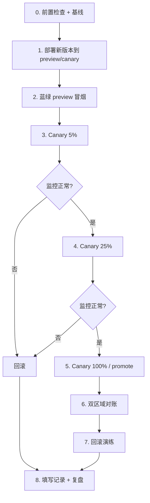

# 双区域部署演练 SOP（T7.11）

> 对应开发计划 T7.11：蓝绿 + 流量灰度（5% → 25% → 100%）+ 回滚演练。  
> 目标集群：**ack-cn**（中国）+ **eks-os**（新加坡），环境默认 **staging**。

---

## 1. 适用范围

| 项 | 说明 |
| --- | --- |
| 演练环境 | staging（ack-cn + eks-os 双集群同步演练） |
| 演练服务 | hello（模板服务）；生产扩展至 auth-family-svc / feed-svc 等 |
| 发布策略 | 蓝绿（preview 验证）+ Canary 灰度 5% → 25% → 100% |
| 回滚 SLA | **单服务 5 分钟内**完成回滚（`ROLLBACK_SLA=300`） |
| 关联脚本 | `scripts/ops/traffic-shift.sh`、`scripts/ops/rollback-service.sh` |
| 关联配置 | `infra/argocd/rollout/` |

---

## 2. 角色与审批

| 角色 | 职责 |
| --- | --- |
| 演练指挥（SRE） | 发起演练、切换流量、计时、记录 |
| 服务 Owner | 确认镜像版本、冒烟用例 |
| On-call 副手 | 监控 Grafana 看板、ACK 回滚 |
| 观察员 | 填写演练记录模板 |

**审批**：staging 演练需 SRE Lead 工单（CHG-____）；生产演练需双人审批（Owner + SRE）。

---

## 3. 前置条件

### 3.1 工具与权限

```bash
# 必需 CLI
kubectl version --client
argocd version --client          # 可选，GitOps 回滚路径
kubectl argo rollouts version    # Rollouts 路径

# 集群上下文
kubectl config get-contexts | grep -E 'ack-cn|eks-os'
```

- [ ] `ack-cn`、`eks-os` 上下文可用
- [ ] ArgoCD Application `hello-staging-ack-cn` / `hello-staging-eks-os` 已同步
- [ ] Argo Rollouts controller 已安装（路径 A）
- [ ] APISIX 网关 + ApisixRoute 已配置（路径 B 网关层灰度）
- [ ] Grafana 看板 [babycamera-v1-overview](../../infra/monitoring/grafana/dashboards/babycamera-v1-overview.json) 可访问
- [ ] On-call 值班表已更新（见 [ONCALL_ROSTER_TEMPLATE.md](./ONCALL_ROSTER_TEMPLATE.md)）

### 3.2 演练镜像

CI 构建并 push 新镜像，GitOps 更新 tag：

```bash
# 示例：将 staging values 中 image.tag 更新为演练 SHA
# infra/k8s/clusters/ack-cn/staging-hello-values.yaml
# infra/k8s/clusters/eks-os/staging-hello-values.yaml
image:
  tag: "drill-<CI_COMMIT_SHORT_SHA>"
```

### 3.3 基线快照

演练开始前记录：

| 指标 | 基线值 | 采集方式 |
| --- | --- | --- |
| API P95 | ___ ms | Grafana `babycamera_api_latency_p95` |
| 5xx 率 | ___ % | Prometheus `rate(http_requests_total{status=~"5.."}[5m])` |
| Pod Ready | ___ / ___ | `kubectl get pods -n staging -l app.kubernetes.io/name=hello` |
| 当前镜像 tag | ___ | `kubectl get rollout hello -n staging -o jsonpath='{.spec.template.spec.containers[0].image}'` |

---

## 4. 演练流程总览



**建议总时长**：60–90 分钟（含观察等待窗口）。

---

## 5. 详细步骤

### 步骤 0 — 发起演练（T-0）

```bash
# 创建变更单，通知 #baobao-oncall
export DRILL_ID="DRILL-$(date +%Y%m%d-%H%M)"
echo "演练编号: ${DRILL_ID}"

# 复制记录模板
cp docs/ops/DEPLOYMENT_DRILL_RECORD_TEMPLATE.md \
   docs/ops/records/${DRILL_ID}.md
```

- [ ] 变更单编号填写完毕
- [ ] 演练记录模板已复制
- [ ] On-call 已 ACK

---

### 步骤 1 — 同步新版本（蓝绿 preview）

**ack-cn 集群：**

```bash
# 1a. 应用 Rollout 资源（首次演练）
kubectl config use-context ack-cn
kubectl apply -f infra/argocd/rollout/rollout-hello.yaml -n staging

# 1b. ArgoCD 同步新镜像（GitOps）
argocd app sync hello-staging-ack-cn --prune
argocd app wait hello-staging-ack-cn --health --timeout 300

# 1c. 确认 preview Pod 就绪
kubectl argo rollouts status hello -n staging --timeout 300s
kubectl get pods -n staging -l app.kubernetes.io/name=hello
```

**eks-os 集群（并行）：**

```bash
kubectl config use-context eks-os
kubectl apply -f infra/argocd/rollout/rollout-hello.yaml -n staging
argocd app sync hello-staging-eks-os --prune
argocd app wait hello-staging-eks-os --health --timeout 300
```

- [ ] 两集群 preview Pod `READY 1/1`
- [ ] 镜像 tag = 演练版本

---

### 步骤 2 — 蓝绿 preview 冒烟

```bash
# preview Service 内部验证
kubectl port-forward -n staging svc/hello-preview 18080:80 &
curl -sS http://127.0.0.1:18080/ | head -5

# 网关健康检查
./infra/gateway/scripts/health-check.sh \
  --host staging-api-cn.example.com
```

| 检查项 | 预期 | 实际 |
| --- | --- | --- |
| preview HTTP 200 | ✓ | |
| 响应体含新版本标识 | ✓ | |
| 错误日志无 panic | ✓ | |

- [ ] preview 冒烟通过（**不 promote**，进入 Canary 阶段）

---

### 步骤 3 — Canary 5%（双区域）

```bash
# ack-cn
./scripts/ops/traffic-shift.sh \
  --service hello --cluster ack-cn --namespace staging --weight 5

# eks-os
./scripts/ops/traffic-shift.sh \
  --service hello --cluster eks-os --namespace staging --weight 5
```

**观察窗口：5 分钟**

| 指标 | 阈值 | ack-cn | eks-os |
| --- | --- | --- | --- |
| 5xx 率 | < 0.1% | | |
| P95 延迟 | < 基线 × 1.2 | | |
| Rollout 状态 | Paused at 5% | | |

```bash
kubectl argo rollouts get rollout hello -n staging
# 预期：status.canary.weights.canary.weight=5
```

- [ ] 5% 灰度稳定 ≥ 5min
- [ ] 无 P0 告警

---

### 步骤 4 — Canary 25%（双区域）

```bash
./scripts/ops/traffic-shift.sh --service hello --cluster ack-cn --weight 25
./scripts/ops/traffic-shift.sh --service hello --cluster eks-os --weight 25
```

**观察窗口：10 分钟**

- [ ] 25% 灰度稳定 ≥ 10min
- [ ] 积分 / Feed 等关联指标无异常（如已部署）

---

### 步骤 5 — Canary 100% / 蓝绿 promote（双区域）

```bash
# Canary 全量
./scripts/ops/traffic-shift.sh --service hello --cluster ack-cn --weight 100
./scripts/ops/traffic-shift.sh --service hello --cluster eks-os --weight 100

# 或蓝绿路径全量切换
./scripts/ops/traffic-shift.sh \
  --service hello --cluster ack-cn --weight 100 --strategy blue-green
```

```bash
kubectl argo rollouts promote hello -n staging   # 蓝绿路径
kubectl argo rollouts status hello -n staging --timeout 300s
```

- [ ] 100% 流量已切换
- [ ] stable 镜像 = 新版本
- [ ] 旧 ReplicaSet 开始缩容

---

### 步骤 6 — 双区域对账

| 检查项 | ack-cn | eks-os | 一致？ |
| --- | --- | --- | --- |
| 镜像 tag | | | |
| Rollout revision | | | |
| Pod 副本数 | | | |
| 网关 canary 权重 | 0%（全量后） | 0% | |

```bash
# 跨区域快速对比
for ctx in ack-cn eks-os; do
  echo "=== ${ctx} ==="
  kubectl --context="${ctx}" get rollout hello -n staging \
    -o jsonpath='{.status.currentPodHash}{" "}{.spec.template.spec.containers[0].image}{"\n"}'
done
```

- [ ] 双区域版本一致

---

### 步骤 7 — 回滚演练（验收核心）

> **验收标准：单服务 5 分钟内完成回滚。**

```bash
ROLLBACK_START=$(date +%s)

# ack-cn 回滚
./scripts/ops/rollback-service.sh \
  --service hello --cluster ack-cn --namespace staging --restore-gateway

# eks-os 回滚
./scripts/ops/rollback-service.sh \
  --service hello --cluster eks-os --namespace staging --restore-gateway

ROLLBACK_END=$(date +%s)
echo "回滚耗时: $(( ROLLBACK_END - ROLLBACK_START ))s"
```

**回滚后验证：**

```bash
kubectl argo rollouts get rollout hello -n staging
# 预期：stable 镜像回到上一 revision

./infra/gateway/scripts/health-check.sh --host staging-api-cn.example.com
```

| 验收项 | 标准 | 实际 |
| --- | --- | --- |
| 回滚耗时 | ≤ 300s | ___ s |
| stable 镜像 | 上一版本 | |
| 5xx 率 | 恢复基线 | |
| 网关 canary 权重 | 0% | |

- [ ] **回滚 ≤ 5 分钟** ✓
- [ ] 服务恢复正常

---

### 步骤 8 — 收尾与复盘

```bash
# 恢复 staging 到稳定版本（如回滚后需重新 sync）
argocd app sync hello-staging-ack-cn
argocd app sync hello-staging-eks-os

# 关闭变更单
```

- [ ] 填写 [DEPLOYMENT_DRILL_RECORD_TEMPLATE.md](./DEPLOYMENT_DRILL_RECORD_TEMPLATE.md)
- [ ] 演练结论：通过 / 有条件通过 / 未通过
- [ ] 改进项录入 backlog（如有）

---

## 6. 故障注入（可选）

在 25% 阶段可注入以下故障验证告警与回滚：

| 注入 | 命令 | 预期 |
| --- | --- | --- |
| 新版本 panic | 部署 `drill-broken` 镜像 tag | 5xx 上升 → 自动/手动回滚 |
| 高延迟 | `kubectl exec` 注入 sleep | P95 告警触发 |
| Pod 不可用 | `kubectl delete pod -l version=canary` | Rollout 自动重建 |

注入后**必须**执行步骤 7 回滚演练。

---

## 7. 快速参考

### 流量切换

```bash
./scripts/ops/traffic-shift.sh --service <svc> --cluster <ack-cn|eks-os> --weight <5|25|100>
```

### 一键回滚

```bash
./scripts/ops/rollback-service.sh --service <svc> --cluster <ack-cn|eks-os> --restore-gateway
```

### Helm values 覆盖

| 阶段 | values 文件 |
| --- | --- |
| 蓝绿 | `infra/argocd/rollout/values-blue-green.yaml` |
| Canary 5% | `infra/argocd/rollout/values-canary-5.yaml` |
| Canary 25% | `infra/argocd/rollout/values-canary-25.yaml` |
| Canary 100% | `infra/argocd/rollout/values-canary-100.yaml` |

### 监控看板

- Grafana：`Babycamera v1 Overview` — API RPS / P95 / 5xx
- Rollout：`kubectl argo rollouts dashboard`（本地 port-forward 3100）

---

## 8. 验收自检清单

| # | 项 | 检查方式 | 预期 |
| --- | --- | --- | --- |
| 1 | SOP 文档 | 本文件存在且步骤完整 | 8 步可执行 |
| 2 | Canary values | `infra/argocd/rollout/values-canary-{5,25,100}.yaml` | 权重字段正确 |
| 3 | 蓝绿 values | `infra/argocd/rollout/values-blue-green.yaml` | autoPromotion=false |
| 4 | 流量脚本 | `bash -n scripts/ops/traffic-shift.sh` | 语法通过 |
| 5 | 回滚脚本 | `bash -n scripts/ops/rollback-service.sh` | 语法通过 |
| 6 | 灰度路径 | 5% → 25% → 100% 演练记录 | 每步有观察窗口 |
| 7 | 回滚 SLA | 步骤 7 计时 | ≤ 300s |
| 8 | 双区域 | ack-cn + eks-os 均执行 | 版本对账一致 |
| 9 | 记录模板 | `DEPLOYMENT_DRILL_RECORD_TEMPLATE.md` | 字段齐全 |

---

## 9. 相关文档

- [infra/argocd/README.md](../../infra/argocd/README.md) — ApplicationSet / 蓝绿策略
- [infra/argocd/rollout/](../../infra/argocd/rollout/) — Rollout CRD + Helm values
- [PHASED_RELEASE_PLAN.md](./PHASED_RELEASE_PLAN.md) — T7.14 App Store 渐进发布 + config-svc 灰度（与 T7.11 并行）
- [infra/gateway/README.md](../../infra/gateway/README.md) — APISIX 网关灰度
- [ONCALL_ROSTER_TEMPLATE.md](./ONCALL_ROSTER_TEMPLATE.md) — 值班表
- [METRICS_CATALOG.md](./METRICS_CATALOG.md) — 监控指标目录
