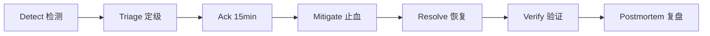

# BabyCamera Incident Response Playbook（T7.15）

> **与 [RUNBOOK.md](./RUNBOOK.md) 的分工**：RUNBOOK 侧重「怎么修」——诊断命令、止血操作、验证步骤；本文侧重 **incident 流程**——角色分工、时间线、沟通模板、升级路径、演练与复盘。  
> 指标定义见 [METRICS_CATALOG.md](./METRICS_CATALOG.md)；值班见 [ONCALL_ROSTER_TEMPLATE.md](./ONCALL_ROSTER_TEMPLATE.md)；D1/D7 检查见 [D1_D7_MONITORING_CHECKLIST.md](./D1_D7_MONITORING_CHECKLIST.md)。

---

## 1. Incident 生命周期



| 阶段 | SLA | 产出 |
| --- | --- | --- |
| Detect | 告警自动 / 用户反馈 | 告警名、影响面初判 |
| Triage | 5 分钟内 | P0/P1/P2、Incident ID |
| Ack | P0 **15 min** / P1 **30 min** | 钉钉/飞书 ACK + 主值班认领 |
| Mitigate | P0 **30 min** 内止血 | 降级 / 回滚 / 开关 |
| Resolve | 服务恢复至阈值内 | 指标截图、E2E 抽检通过 |
| Postmortem | P0 **24h** / P1 **72h** | 时间线、根因、Action Items |

**Incident ID 格式**：`INC-YYYYMMDD-NNN`（例：`INC-20260606-001`）

---

## 2. 角色与职责

| 角色 | 人员来源 | 职责 |
| --- | --- | --- |
| **Incident Commander (IC)** | 主值班 | 统一决策、分派任务、对外口径 |
| **Technical Lead** | 按 `team` 标签 | 诊断 + 执行 RUNBOOK 止血 |
| **Communications** | 副值班 | 群公告、客服同步、状态页（若有） |
| **Escalation** | 升级联系人 | 15 min 未 ACK 或 30 min 未止血 |
| **Compliance Liaison** | 法务 / COMP on-call | 审核 fail-open、数据泄露类 |

---

## 3. 定级标准

| 级别 | 条件 | 示例 |
| --- | --- | --- |
| **P0** | 核心路径不可用或大面积失败 | 5xx > 1%、AI 成功率 < 95%、IAP 校验失败 > 0.5%、对账差异 > 0、APNs 失败 > 1% |
| **P1** | 降级可用或单区域 / 单玩法 | Feed P95 > 800ms、AI P95 超时、单模型 adapter 故障 |
| **P2** | 非生产 / 可 workaround | 微信分享失败（系统分享可用）、staging 演练 |

P7 完成判定阈值（D1/D7 持续监控）：崩溃率 ≤ 0.2%、AI 成功率 ≥ 95%、IAP 校验成功率 ≥ 99.5%、Feed P95 ≤ 500ms。

---

## 4. 通用 Incident 流程（Checklist）

### 4.1 收到告警后（0–5 min）

- [ ] 在钉钉 / 飞书回复：`收到 INC-____，主值班 @___ 处理中`
- [ ] 打开 Grafana **BabyCamera v1 Overview**（uid: `babycamera-v1-overview`）
- [ ] 记录：告警名、`severity`、`team`、开始时间（UTC）
- [ ] 拉 Technical Lead（见 ONCALL 表 `team` 分工）

### 4.2 诊断与定级（5–15 min）

- [ ] 确认影响：CN / OS、服务名、用户可见症状
- [ ] 查最近变更：ArgoCD 发布、config-svc、feature flags（T7.14 灰度）
- [ ] 定级 P0/P1/P2，创建 incident 频道或置顶 thread
- [ ] P0：同步 Escalation + 电话 on-call

### 4.3 止血（15–30 min）

- [ ] 按本文 **§5 五类故障** 选择 playbook 场景
- [ ] 执行 [RUNBOOK.md](./RUNBOOK.md) 对应节止血表
- [ ] 需要回滚：`./scripts/ops/rollback-service.sh --service <svc> --cluster ack-cn`
- [ ] 每 15 min 群内状态更新（模板见 §6）

### 4.4 恢复验证（30–60 min）

- [ ] 关键 PromQL / Grafana 面板回到阈值内
- [ ] 运行对应 E2E 抽检（见 RUNBOOK 各节）
- [ ] 客服 / 运营确认无新增客诉洪峰
- [ ] 宣布 Resolved，记录结束时间

### 4.5 复盘

- [ ] 30 min 内：incident 摘要（时间线 + 止血动作）
- [ ] P0：24h 内 postmortem（模板见 §7）
- [ ] 开 ticket 跟踪长期修复项

---

## 5. 五类故障 Incident Playbook

> 技术细节（命令、PromQL、回滚）→ [RUNBOOK.md](./RUNBOOK.md) 对应章节。  
> 演练记录 → [records/INCIDENT_DRILL_RECORD_TEMPLATE.md](./records/INCIDENT_DRILL_RECORD_TEMPLATE.md)

### 5.1 AI 模型故障

| 项 | 内容 |
| --- | --- |
| **典型告警** | `BabyCameraAITaskLowSuccessRate`、`BabyCameraAIImageP95TooSlow`、`BabyCameraAIVideoP95TooSlow` |
| **IC 首问** | 影响哪些 `style` / `capability`？是否全区域？ |
| **默认 team** | `ai` |
| **15 min 内必须** | 远端下架故障玩法（config-svc）；通知运营暂停相关活动 |
| **30 min 内必须** | 切换备用 adapter 或回滚 `ai-dispatch-svc` |
| **不可做** | 未经确认关闭备案号校验 |
| **验证** | AI 10m 成功率 ≥ 95%；图片 P95 ≤ 60s；`tests/e2e/p3-e2e.sh` |
| **RUNBOOK** | [§1 AI 模型故障](./RUNBOOK.md#1-ai-模型故障) |

**演练注入**：staging 将 mock adapter 设为 100% 失败，验证告警 → ACK → 下架玩法 → 恢复。

---

### 5.2 内容审核厂商故障

| 项 | 内容 |
| --- | --- |
| **典型症状** | UGC 全拒/全过；`audit-svc` 5xx；AI 出参审核阻塞终态 |
| **IC 首问** | 入参 / 出参 / UGC 哪条链路？CN 阿里云还是 OS？ |
| **默认 team** | `ai` + **Compliance Liaison** |
| **15 min 内必须** | 确认非配置误发；评估是否暂停 UGC 发布入口 |
| **30 min 内必须** | 法务批准前 **禁止** fail-open；优先降并发 / 回滚 `audit-svc` |
| **合规红线** | `audit.degraded_mode=true` 仅 P0 + 法务书面 ACK |
| **验证** | `tests/e2e/p7-audit-e2e.sh`；拒绝率回基线 |
| **RUNBOOK** | [§2 内容审核厂商故障](./RUNBOOK.md#2-内容审核厂商故障) |

**演练注入**：mock 审核 API 超时，验证 IC 拉法务、UGC 入口关闭流程。

---

### 5.3 IAP / 内购故障

| 项 | 内容 |
| --- | --- |
| **典型告警** | `BabyCameraIAPVerifyHighFailureRate`、`BabyCameraCreditReconciliationDiscrepancy` |
| **IC 首问** | Apple 系统状态？新发布还是 Apple 侧故障？ |
| **默认 team** | `commerce` |
| **15 min 内必须** | 查 Apple System Status；暂停新 SKU 促销入口 |
| **30 min 内必须** | 对账差异 > 0 时冻结异常账户调账流程；双人复核补账 SOP |
| **客服口径** | 「正在修复，请稍后使用恢复购买；勿重复支付」 |
| **验证** | IAP 失败率 < 0.5%；`tests/e2e/p4-e2e.sh` |
| **RUNBOOK** | [§3 IAP / 内购故障](./RUNBOOK.md#3-iap--内购故障) |

**演练注入**：staging mock 收据校验 503，验证告警、促销关闭、客服模板。

---

### 5.4 APNs 推送故障

| 项 | 内容 |
| --- | --- |
| **典型告警** | `BabyCameraAPNsHighFailureRate` |
| **IC 首问** | 证书过期？`unregistered` 激增？Kafka 积压？ |
| **默认 team** | `backend` |
| **15 min 内必须** | 查 Vault `notification/apns`；区分权限关闭 vs 服务端故障 |
| **30 min 内必须** | 降频非关键推送类目；清理失效 token |
| **端侧说明** | 用户关通知 ≠ 故障，引导系统设置 |
| **验证** | 家庭圈互动 30s 内送达；失败率 < 1%；`tests/e2e/p5-e2e.sh` |
| **RUNBOOK** | [§4 APNs 推送故障](./RUNBOOK.md#4-apns-推送故障) |

**演练注入**：staging 使用过期 APNs key，验证告警与证书轮换 checklist。

---

### 5.5 微信 OpenSDK 故障

| 项 | 内容 |
| --- | --- |
| **典型症状** | 分享失败；Universal Link 无效；授权无回调（V1.1） |
| **IC 首问** | 端侧还是开放平台配置？是否仅微信未安装？ |
| **默认 team** | `backend` + iOS on-call |
| **15 min 内必须** | 确认系统分享兜底可用；远端隐藏微信入口（若大面积失败） |
| **30 min 内必须** | 核对 AppID / Universal Link / 缩略图规范 |
| **非 P0 条件** | 系统分享可用、核心路径不依赖微信登录 |
| **验证** | 真机分享 + 未安装微信 422；`tests/e2e/README-p5-feed.md` Scenario D |
| **RUNBOOK** | [§5 微信 OpenSDK 故障](./RUNBOOK.md#5-微信-opensdk-故障) |

**演练注入**：staging 错误 Universal Link，验证系统分享兜底与远端下线按钮。

---

## 6. 沟通模板

### 6.1 首次 ACK

```
[INC-YYYYMMDD-NNN] P0/P1 — {告警名}
主值班：{name} | 开始：{UTC}
影响：{CN/OS} {简述}
下一步：查 Grafana + RUNBOOK §{n}，15min 更新
```

### 6.2 进展更新（每 15 min）

```
[INC-YYYYMMDD-NNN] 更新 {HH:MM UTC}
状态：Investigating / Mitigating / Verifying
已做：{动作}
指标：{关键数值}
下一步：{计划}
```

### 6.3 Resolved

```
[INC-YYYYMMDD-NNN] Resolved {HH:MM UTC}
根因（初判）：{一句话}
止血：{摘要}
验证：{E2E / 指标}
Postmortem：{P0 24h 内链接}
```

---

## 7. Postmortem 要点（P0 必填）

| 章节 | 内容 |
| --- | --- |
| Summary | 影响时长、用户范围、业务损失估算 |
| Timeline | UTC 时间线（检测→ACK→止血→恢复） |
| Root Cause | 技术根因 + 为何未提前发现 |
| Mitigation | 已执行措施 |
| Action Items | Owner + Due Date |
| Lessons | 监控 / 演练 / 流程改进 |

---

## 8. 演练与 D1/D7 衔接

| 时机 | 动作 |
| --- | --- |
| 上线前 | 五类故障各 1 次 tabletop + staging 注入（见 drill template） |
| **D1** | 运行 `scripts/ops/d1-d7-metrics-snapshot.sh --day 1`，填 [D1_D7_MONITORING_CHECKLIST.md](./D1_D7_MONITORING_CHECKLIST.md) |
| **D7** | 同上 `--day 7`；对比 D1 基线；确认无 P0 未关闭 |
| 每季度 | 告警路由 + 主备切换演练（ONCALL 表） |

---

## 9. 相关文档

| 文档 | 用途 |
| --- | --- |
| [RUNBOOK.md](./RUNBOOK.md) | 技术诊断与止血 |
| [D1_D7_MONITORING_CHECKLIST.md](./D1_D7_MONITORING_CHECKLIST.md) | 上线后指标检查 |
| [ONCALL_ROSTER_TEMPLATE.md](./ONCALL_ROSTER_TEMPLATE.md) | 值班与升级 |
| [records/INCIDENT_DRILL_RECORD_TEMPLATE.md](./records/INCIDENT_DRILL_RECORD_TEMPLATE.md) | 演练记录 |
| [METRICS_CATALOG.md](./METRICS_CATALOG.md) | 指标契约 |
| [infra/monitoring/prometheus/alerts/babycamera-v1.yaml](../../infra/monitoring/prometheus/alerts/babycamera-v1.yaml) | 告警规则 |

---

*文档版本：T7.15 · 与 `docs/dev-plan.md` P7-5 批次对齐*
