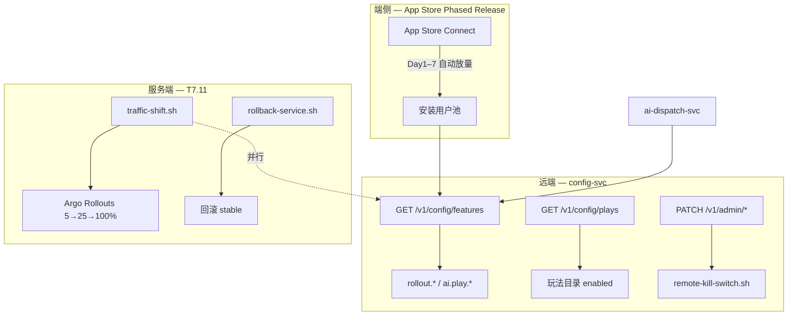
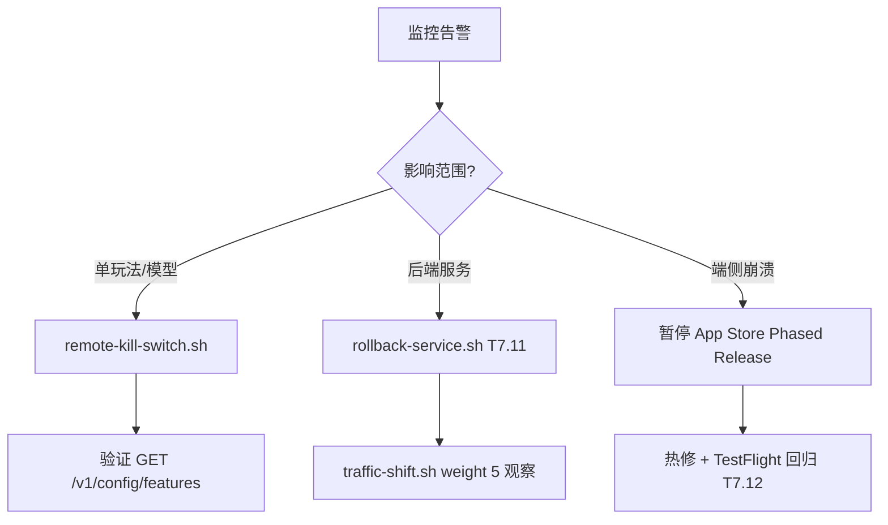

# App Store 渐进发布 + 远端配置灰度（T7.14）

> 对应开发计划 **T7.14**：App Store Phased Release（端侧 7 天自动放量）与 config-svc 远端灰度（玩法 / 模型 / 定价）联动。  
> 前置依赖：**T7.11** 服务端流量灰度、[DEPLOYMENT_DRILL_SOP.md](./DEPLOYMENT_DRILL_SOP.md)、[traffic-shift.sh](../../scripts/ops/traffic-shift.sh)。

## 1. 双层灰度架构



| 层级 | 机制 | 脚本 / 配置 | 粒度 |
| --- | --- | --- | --- |
| **App Store** | Phased Release（Apple 7 天） | App Store Connect → 版本发布 | 新安装用户 % |
| **远端配置** | config-svc feature flags | `rollout.ai_plays_percent`、`rollout.pricing_variant` | userIdHash 分桶 |
| **服务端** | Argo Rollouts + APISIX | [traffic-shift.sh](../../scripts/ops/traffic-shift.sh) | 集群流量 % |
| **紧急止血** | 玩法 / 模型远端下架 | [remote-kill-switch.sh](../../scripts/ops/remote-kill-switch.sh) | 单玩法 / 单 flag |

> **T7.11 交叉引用**：服务端 canary（5% → 25% → 100%）与 App Store Phased Release **并行但独立**。后端先通过 `traffic-shift.sh` 验证镜像；App Store 放量期间同步调高 `rollout.ai_plays_percent`。若服务端需回滚，执行 `rollback-service.sh`；若仅玩法有问题，优先 `remote-kill-switch.sh` 避免全量回滚。

---

## 2. App Store Phased Release 时间表（7 天）

在 App Store Connect → **App 版本** → **Phased Release** 启用后，Apple 按以下节奏向**自动更新 + 新安装**用户推送（不可自定义百分比，仅可暂停 / 加速）：

| 阶段 | 日历日 | Apple 累计覆盖* | config-svc `rollout.ai_plays_percent` | 运维动作 |
| --- | --- | --- | --- | --- |
| D0 | 提审通过当日 | 0%（待发布） | `0`（种子默认，仅 TestFlight） | 确认 T7.10 看板、on-call 就位 |
| D1 | 发布日 +0 | **1%** | `1` | 启用 Phased Release；监控崩溃率 / AI 成功率 |
| D2 | 发布日 +1 | **2%** | `2` | 核对 D1 指标；无异常保持 |
| D3 | 发布日 +2 | **5%** | `5` | 抽样 5% 用户玩法可用性 |
| D4 | 发布日 +3 | **10%** | `10` | 与 T7.11 canary 25% 窗口对齐检查 |
| D5 | 发布日 +4 | **20%** | `20` | 积分 / IAP 对账抽查 |
| D6 | 发布日 +5 | **50%** | `50` | 全链路压测余量评估 |
| D7 | 发布日 +6 | **100%** | `100` | 全量；关闭 Phased Release 观察模式 |

\* Apple 官方默认曲线；可在 Connect 中 **暂停** 或 **向所有用户发布**（跳过剩余天数）。

### 2.1 每日检查清单（D1–D7）

- [ ] Grafana：API P95、5xx、AI 任务成功率 ≥ 95%、崩溃率 ≤ 0.2%
- [ ] `rollout.ai_plays_percent` 已与当日 App Store 阶段对齐（见 §3.2）
- [ ] `GET /v1/config/features` 抽样：`userIdHash` 分桶与 `enabled` 一致
- [ ] 无 P0 告警；若有，按 §4 回滚触发条件执行

---

## 3. config-svc 灰度 Flags

种子定义见 `services/config-svc/internal/store/memory.go`。

### 3.1 Flag 说明

| Key | 类型 | 默认种子 | 用途 |
| --- | --- | --- | --- |
| `rollout.ai_plays_percent` | `rolloutPercent` + `variant` | `1`（D1） | AI 玩法总灰度百分比，与 App Store 阶段同步 |
| `rollout.pricing_variant` | `variant` + `rolloutPercent` | `control` @ 50% | 积分定价 A/B：`control` / `variant_a` / `variant_b` |

**响应示例**（`GET /v1/config/features`，`X-Region: cn`）：

```json
{
  "code": "OK",
  "data": {
    "version": "20250606001",
    "ttlSeconds": 300,
    "context": { "region": "cn", "userIdHash": 42 },
    "features": {
      "rollout.ai_plays_percent": {
        "enabled": true,
        "variant": "1",
        "rolloutPercent": 1
      },
      "rollout.pricing_variant": {
        "enabled": true,
        "variant": "control",
        "rolloutPercent": 50
      }
    }
  }
}
```

- `enabled`：当前用户是否命中灰度桶（`userIdHash < rolloutPercent`）。
- `rolloutPercent`：运维配置的**目标放量**（供 iOS / 运营读取，与分桶阈值一致）。
- `variant`：定价实验变体名或放量日标签。

### 3.2 按日更新 `rollout.ai_plays_percent`

**生产（Redis / 配置中心）**：更新后 `version` 递增，客户端 TTL 到期自动刷新。

**本地 / staging（memory store + Admin API）**：

```bash
# 将 AI 玩法灰度调至 D4 = 10%
curl -s -X PATCH "http://config-svc:8009/v1/admin/features/rollout.ai_plays_percent" \
  -H "X-Admin-Token: ${CONFIG_ADMIN_TOKEN}" \
  -H "Content-Type: application/json" \
  -d '{"rolloutPercent": 10, "variant": "10"}'
```

或使用封装脚本（仅改 percent，不下架）：

```bash
./scripts/ops/remote-kill-switch.sh --set-percent 10 --dry-run
```

### 3.3 玩法 / 模型 per-play flags

| Key | 玩法 |
| --- | --- |
| `ai.play.ghibli_kid` | 吉卜力宝宝 |
| `ai.play.gpt_portrait` | GPT 肖像（OS） |
| `ai.play.seedream_style` | Seedream 风格（CN） |
| `ai.play.photo_restore` | 老照片修复 |
| `ai.play.video_walk` | 学走路视频 |
| `ai.play.year_review_regen` | 年度回顾 |
| `ai.play.smart_caption` | 智能配文 |

`ai-dispatch-svc` 拉取 flags 后过滤玩法目录（见 `catalog.go`）。

---

## 4. 回滚触发条件

满足**任一**条件即触发对应动作（可组合）：

| 级别 | 指标 / 事件 | 阈值 | 首选动作 | 备选 |
| --- | --- | --- | --- | --- |
| **P0** | 崩溃率（端） | > 0.5%（15 min） | App Store **暂停** Phased Release | 热修版本 |
| **P0** | API 5xx | > 1%（5 min） | `rollback-service.sh`（T7.11） | `traffic-shift.sh --weight 5` 降权 |
| **P0** | AI 任务失败率 | > 10%（15 min） | `remote-kill-switch.sh --target model` | 降级默认模型 |
| **P1** | 单玩法投诉 / 审核风险 | ≥ 3 起 / 1h | `remote-kill-switch.sh --target play` | 仅下架该 `ai.play.*` |
| **P1** | IAP 校验失败率 | > 2% | 暂停定价实验 `rollout.pricing_variant` → `control` | StoreKit 回退 |
| **P2** | Feed P95 | > 800ms（30 min） | 服务端 canary 保持 25%，暂缓 App Store 加速 | 扩容 |
| **P2** | 积分对账差异 | > 0.1% | 冻结 `rollout.pricing_variant` 变更 | 财务核对 |

### 4.1 回滚决策树



### 4.2 App Store 侧操作

1. App Store Connect → 版本 → **暂停分阶段发布**
2. 或 **向所有用户发布**（确认指标已恢复后跳过等待）
3. 记录至 [DEPLOYMENT_DRILL_RECORD_TEMPLATE.md](./DEPLOYMENT_DRILL_RECORD_TEMPLATE.md) 变体「渐进发布事件」

---

## 5. 紧急下架（Kill Switch）

脚本：[scripts/ops/remote-kill-switch.sh](../../scripts/ops/remote-kill-switch.sh)

```bash
# 下架单个玩法（同时禁用 ai.play.* flag + plays 目录项）
export CONFIG_ADMIN_TOKEN="<from-vault>"
./scripts/ops/remote-kill-switch.sh \
  --base-url https://api.babycamera.app \
  --target play --id ghibli_kid

# 下架模型路由（禁用 ai.play.seedream_style）
./scripts/ops/remote-kill-switch.sh --target model --id seedream_style

# 仅禁用 feature flag
./scripts/ops/remote-kill-switch.sh --target feature --key ai.play.video_walk

# 预览 curl（不执行）
./scripts/ops/remote-kill-switch.sh --target play --id video_walk --dry-run
```

**生效时间**：Admin PATCH 即时生效；客户端最长 `ttlSeconds`（300s）缓存延迟。必要时在网关下发 `X-Config-Version` 强制刷新（P2 增强）。

**验证**：

```bash
curl -s -H 'X-Region: cn' "${BASE_URL}/v1/config/features" | jq '.data.features["ai.play.ghibli_kid"]'
# 期望: { "enabled": false }
```

---

## 6. iOS 端读取 Rollout

`FeatureFlagsAPI` 已扩展 `rolloutPercent` 字段；便捷访问：

```swift
let payload = try await FeatureFlagsAPI(client: client).fetchFeatures()
let percent = payload.aiPlaysRolloutPercent      // rollout.ai_plays_percent
let pricing = payload.pricingVariant             // rollout.pricing_variant
let inRollout = payload.isInAIPlaysRollout         // enabled 位
```

分桶算法与后端一致：`FeatureHash.userIDHash`（FNV-1a % 100），见 [openfeature-ios.md](../../infra/feature-flags/openfeature-ios.md)。

---

## 7. 验收标准（T7.14）

| # | 验收项 | 验证方式 |
| --- | --- | --- |
| 1 | 7 天 Phased Release 时间表 + 回滚条件 | 本文 §2、§4 |
| 2 | `rollout.ai_plays_percent`、`rollout.pricing_variant` 种子 + 文档 | `memory.go` + §3 |
| 3 | 问题玩法可远端下架 | `remote-kill-switch.sh` + Admin PATCH |
| 4 | 与 T7.11 交叉引用 | §1、`traffic-shift.sh` / `rollback-service.sh` |
| 5 | iOS 读取 rollout 百分比 | `FeatureFlagsAPI.swift` + 单测 |

---

## 8. 参考

- [DEPLOYMENT_DRILL_SOP.md](./DEPLOYMENT_DRILL_SOP.md) — T7.11 双区域演练
- [scripts/ops/traffic-shift.sh](../../scripts/ops/traffic-shift.sh) — 服务端 5/25/100 灰度
- [scripts/ops/rollback-service.sh](../../scripts/ops/rollback-service.sh) — 5 分钟回滚
- [infra/feature-flags/README.md](../../infra/feature-flags/README.md) — 分桶维度
- [services/config-svc/README.md](../../services/config-svc/README.md) — API 与 Admin 端点
- [TESTFLIGHT_BETA_PLAN.md](../qa/TESTFLIGHT_BETA_PLAN.md) — Phased Release 前置内测
