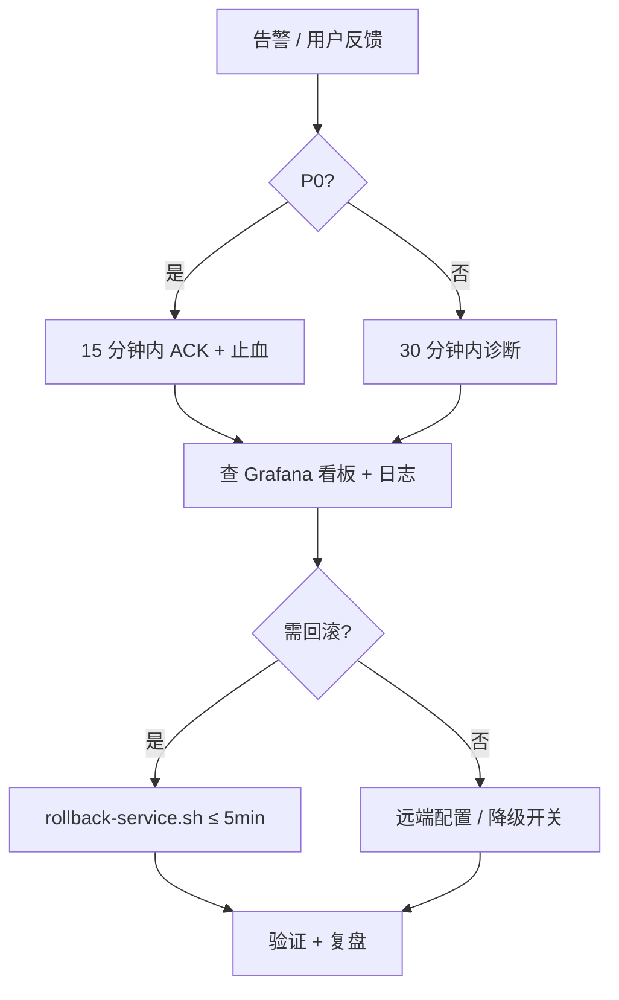

# BabyCamera 运维 Runbook（T7.18 / T7.15）

> 上线后常见故障处理手册（**技术止血**）。Incident 流程见 `docs/ops/INCIDENT_RESPONSE_PLAYBOOK.md`，D1/D7 检查见 `docs/ops/D1_D7_MONITORING_CHECKLIST.md`。  
> 告警规则见 `infra/monitoring/prometheus/alerts/babycamera-v1.yaml`，指标见 `docs/ops/METRICS_CATALOG.md`，值班表见 `docs/ops/ONCALL_ROSTER_TEMPLATE.md`。

## 通用流程



| 步骤 | 动作 | 参考 |
| --- | --- | --- |
| 1 | 确认告警 `severity`、影响面（CN/OS、服务名） | Grafana `babycamera-v1-overview` |
| 2 | 查最近发布 / 配置变更 | ArgoCD、config-svc、feature flags |
| 3 | 止血（降级、关流量、回滚） | 本文各节 + `scripts/ops/rollback-service.sh` |
| 4 | 通知 | 钉钉 / 飞书；P0 同步电话 on-call |
| 5 | 复盘 | 记录根因、临时措施、长期修复项 |

---

## 1. AI 模型故障

**典型告警**：`BabyCameraAITaskLowSuccessRate`、`BabyCameraAIImageP95TooSlow`、`BabyCameraAIVideoP95TooSlow`

**症状**：AI 任务大量 `failed` / `timeout`；用户端「生成失败」；WebSocket 长时间无终态。

### 诊断

```bash
# 成功率与队列（Grafana → AI 面板，或 PromQL）
# sum(rate(babycamera_ai_task_total{status="failed"}[10m])) / sum(rate(babycamera_ai_task_total[10m]))

# ai-dispatch 日志
kubectl logs -l app=ai-dispatch-svc -n production --tail=200 | rg -i "adapter|timeout|model"

# 备案号校验（T7.1）：缺备案号会拒绝路由
kubectl logs -l app=ai-dispatch-svc -n production --tail=50 | rg "filing|备案"
```

### 止血（按优先级）

| 措施 | 操作 | 预期效果 |
| --- | --- | --- |
| 远端下架玩法 | config-svc / feature flag 关闭故障 `style` 或模型 | 新任务不再路由到故障适配器 |
| 切换备用模型 | `ai-dispatch` adapter 配置切到同能力备用端点 | 成功率恢复 |
| 延长超时提示 | 仅缓解体验；配合「任务排队」文案 | 减少重复提交 |
| 服务回滚 | `./scripts/ops/rollback-service.sh --service ai-dispatch-svc --cluster ack-cn` | 配置错误时 5 分钟内恢复 |

### 根因分类

| 根因 | 处理 |
| --- | --- |
| 厂商 API 5xx / 限流 | 联系厂商；临时降并发；开备用 region 端点 |
| 备案号 / 模型绑定错误 | 修正 Vault 配置；重启 ai-dispatch |
| Kafka 积压 | 扩容 consumer；查 dead letter |
| 积分 hold 未释放 | 查 `credit-sub-ad-svc` hold 表；手动 release 异常单 |

### 验证

- `babycamera_ai_task_total{status="success"}` 10 分钟成功率 ≥ 95%
- 图片 P95 ≤ 60s，视频 P95 ≤ 300s
- 抽检 3 条 happy path E2E：`tests/e2e/p3-e2e.sh`

---

## 2. 内容审核厂商故障

**典型症状**：UGC 发布全拒 / 全过；`audit-svc` 5xx；AI 出参审核阻塞任务终态。

**服务**：`audit-svc`（:8005），CN 走阿里云内容安全，OS 可扩展海外厂商。

### 诊断

```bash
kubectl logs -l app=audit-svc -n production --tail=200 | rg -i "green|aliyun|reject|error"

# 同步审核探活
curl -sS -X POST "$AUDIT_BASE/v1/audit/sync" \
  -H "Content-Type: application/json" \
  -d '{"scene":"ugc-text","content":"healthcheck"}' | jq .
```

### 止血

| 措施 | 风险 | 操作 |
| --- | --- | --- |
| 审核降级（fail-open） | **合规风险高**，仅 P0 且法务 on-call 批准 | config flag `audit.degraded_mode=true`：文本走本地关键词，图像延迟复审 |
| 切换备用场景 / 区域 | 低 | 调整 `ALIYUN_GREEN_*_SCENE` 或减少并发 |
| 暂停 UGC 发布入口 | 中 | Feed 发布 feature flag 关闭，AI 仅本地预览 |
| 回滚 audit-svc | 低 | `rollback-service.sh --service audit-svc` |

### 申诉 SLA

- 用户申诉 24h 内人工复核（T7.5）
- 故障期间积压申诉：运营导出 `appeals` 表批量处理

### 验证

- `tests/e2e/p7-audit-e2e.sh` 或 `tests/e2e/README-p7-audit.md` 抽检
- 拒绝率 / 误杀率回到基线（见 QA 报告阈值）

---

## 3. IAP / 内购故障

**典型告警**：`BabyCameraIAPVerifyHighFailureRate`、`BabyCameraCreditReconciliationDiscrepancy`

**症状**：充值不到账；订阅状态不同步；Apple 收据校验失败。

### 诊断

```bash
# IAP 校验失败率
# sum(rate(babycamera_iap_verify_total{result="failed"}[5m])) / sum(rate(babycamera_iap_verify_total[5m]))

kubectl logs -l app=credit-sub-ad-svc -n production --tail=200 | rg -i "iap|receipt|verify"
kubectl logs -l app=iap-callback-svc -n production --tail=100
```

### 止血

| 措施 | 操作 |
| --- | --- |
| 确认 Apple 系统状态 | [Apple System Status](https://www.apple.com/support/systemstatus/) |
| 重试幂等校验 | 客户端「恢复购买」；服务端按 `transactionId` 去重 |
| 暂停新 SKU 促销 | config-svc 关闭积分包入口，避免新增失败单 |
| 手动补账 | 运营后台按审计表 `iap_transactions` + Apple 后台对账（需双人复核） |
| 回滚 | `credit-sub-ad-svc` / `iap-callback-svc` 仅当发布引入回归 |

### 积分对账差异（P0）

1. 查 `babycamera_credit_reconciliation_discrepancy_total` 的 `domain` 标签
2. 运行手动对账 job 或查 `credit_reconciliation_runs` 表
3. 冻结异常账户提现类操作（若有）
4. 修复后确认 `babycamera_credit_reconciliation_last_run_timestamp_seconds` 更新

### 验证

- `tests/e2e/p4-e2e.sh` 充值 + hold/commit 路径
- IAP 失败率 &lt; 0.5%

---

## 4. APNs 推送故障

**典型告警**：`BabyCameraAPNsHighFailureRate`

**症状**：家人收不到互动通知；`unregistered` 设备 token 激增。

### 诊断

```bash
kubectl logs -l app=notification-svc -n production --tail=200 | rg -i "apns|push|token"

# 失败率
# sum(rate(babycamera_apns_push_total{result=~"failed|unregistered"}[10m])) / sum(rate(babycamera_apns_push_total[10m]))
```

### 止血

| 措施 | 操作 |
| --- | --- |
| 检查 APNs 密钥 / 证书 | Vault `notification/apns`；确认 `kid` / `teamId` / bundleId |
| 清理失效 token | `unregistered` 自动标记；避免反复推送 |
| 降频非关键类目 | config 关闭营销类推送，保留「AI 完成」「年度回顾」 |
| Kafka 消费积压 | 扩容 `notification-svc` consumer |
| 回滚 | `rollback-service.sh --service notification-svc` |

### 端侧注意

- 用户关闭通知权限 → 非故障，引导系统设置
- 关键类目禁用时有端内提示（T6.14）

### 验证

- 发布一条家庭圈帖子 → 另一成员 30s 内收到推送（`tests/e2e/p5-e2e.sh`）
- APNs 失败率 &lt; 1%

---

## 5. 微信 OpenSDK 故障

**典型症状**：分享朋友圈 / 好友失败；登录（V1.1）授权无回调；非服务端告警，多为端侧 + 开放平台配置问题。

### 诊断

| 检查项 | 位置 |
| --- | --- |
| 微信是否安装 | 端侧 `WechatShareAdapter` 返回 `SHARE_WECHAT_NOT_INSTALLED` |
| Universal Link | 与开放平台登记一致；`WechatUniversalLinkValidator` |
| AppID / AppSecret | Vault `auth-family/wechat-open`；Secret 重置会立即失效 |
| 分享缩略图 | ≤ 32KB、最长边 ≤ 120px（`WechatThumbnailAdapter`） |

```bash
# staging mock 探活
curl -sS http://mock-wechat:18082/health
```

### 止血

| 措施 | 操作 |
| --- | --- |
| **系统分享兜底** | 引导用户使用 `UIActivityViewController`（T5.14 已内置） |
| 下线微信入口 | 远端配置隐藏微信分享按钮，保留系统分享 |
| 登录降级 | V1.1 前仅 Apple + 手机号；微信登录不可用时不阻断核心路径 |
| 开放平台工单 | 政策变动 / 封禁 → 联系腾讯开放平台 |

### 验证

- 真机分享朋友圈 / 好友（`tests/e2e/README-p5-feed.md` Scenario D）
- 微信未安装时返回 422 且系统分享可用

---

## 6. 快速命令索引

```bash
# 单服务回滚（≤ 5 分钟 SLA）
./scripts/ops/rollback-service.sh --service <svc> --cluster ack-cn

# 流量灰度
./scripts/ops/traffic-shift.sh --help

# 契约 / API 文档
./scripts/contract-lint.sh
./scripts/generate-api-docs.sh

# E2E 冒烟
tests/e2e/e2e.sh
tests/smoke/smoke.sh
```

## 7. 升级与沟通

| 级别 | 条件 | 升级 |
| --- | --- | --- |
| P0 | 5xx &gt; 1%、AI &lt; 95%、IAP 大面积失败、对账差异 | 15 分钟未止血 → Escalation 电话 |
| P1 | P95 超标、非核心功能降级 | 30 分钟 → 副值班 |
| 合规 | 审核 fail-open、数据泄露嫌疑 | 同步法务 + COMP |

---

*文档版本：T7.18 · 与 `docs/dev-plan.md` P7 批次对齐*
