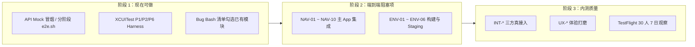

# 体验测试就绪状态与待办（todo）

> 目标：完成本文 **未支持功能 todo** 后，普通用户可在真机/TestFlight 上端到端体验测试 App（登录 → 拍照 → 编辑 → 发布 → Feed → AI → 设置，全链路可走通）。  
> 依据：`docs/dev-plan.md`（开发任务已全部 `done`）、代码现状（`ios/BabyCamera/App/BabyCameraApp.swift` 主 Shell 仍为占位）、2026-06-07 冒烟验证（`smoke-critical-path.sh` 33/33 通过）。

---

## 1. 当前结论（一句话）

| 维度 | 状态 |
| --- | --- |
| 模块代码 + 单测 + API Mock E2E | ✅ Ready |
| 主 App 端到端产品体验 | ❌ 未 Ready |
| Staging 真机联调 | ❌ 未 Ready |
| TestFlight 内测分发 | ⚠️ 条件 Ready（需证书 + 构建 + 环境） |

---

## 2. 已 Ready 的功能

### 2.1 后端与 API（Mock / 单测）

| 能力 | 验证方式 | 参考文档 |
| --- | --- | --- |
| 账号 / 家庭 / 宝宝 | `tests/e2e/e2e.sh` | `tests/e2e/README.md` |
| 媒体上传 init/complete | `tests/smoke/smoke.sh` | `tests/smoke/README.md` |
| AI 玩法 / 任务 / 申诉 | `tests/e2e/p3-e2e.sh` | `tests/e2e/README-p3-ai.md` |
| 积分 / 订阅 / IAP / 广告 | `tests/e2e/p4-e2e.sh` | `tests/e2e/README-p4-credit.md` |
| 家庭圈 Feed / 点赞 / 评论 | `tests/e2e/p5-e2e.sh` | `tests/e2e/README-p5-feed.md` |
| 备份凭据 / 导出 / Widget 元数据 | `tests/e2e/p6-e2e.sh` | `tests/e2e/README-p6-backup.md` |
| 审核 / 合规 / 儿童同意 | `tests/e2e/p7-audit-e2e.sh`、`p7-child-consent-e2e.sh` | `tests/e2e/README-p7-audit.md` |
| 关键路径串联冒烟 | `tests/e2e/smoke-critical-path.sh`（33 断言） | `docs/qa/TESTFLIGHT_BETA_PLAN.md` §5 |
| 各微服务单测 | `go test ./...`（9 服务全绿） | 各 `services/*/README.md` |

**Mock 启动：**

```bash
cd tests/mocks/api && python3 mock_server.py
# 或：cd tests/mocks && docker compose up -d mock-api
```

**测试账号（Mock 验证码 `123456`）：**

| 角色 | 手机号 |
| --- | --- |
| 管理员 | 13800138001 |
| 成员 | 13800138002 |

---

### 2.2 iOS 模块（SPM 包内已实现，单测 / 专用 Harness 可验）

| 模块 | SPM 包 | 自动化验证 |
| --- | --- | --- |
| 账号 / 登录 / 注销 | `BabyCameraAccount` | P1 XCUITest（`-UITesting`） |
| 新手引导 / 监护人同意 | `BabyCameraOnboarding` | P1 XCUITest |
| 家庭 / 邀请 / 宝宝 | `BabyCameraFamily`、`BabyCameraBaby` | P1 API E2E |
| 权限 | `BabyCameraPermissions` | 单测 |
| 相机 / 拍摄 | `BabyCameraCamera` | P2 Harness（`-P2E2E`） |
| 编辑器 / 滤镜 / 导出 | `BabyCameraEditor` | P2 XCUITest |
| Timeline / 地图 | `BabyCameraTimeline` | P2 XCUITest |
| 里程碑 | `BabyCameraMilestone` | 单测 |
| 水印 | `BabyCameraWatermark` | 单测 |
| AI 玩法 | `BabyCameraAIPlay` | 单测 + P3 API E2E |
| 积分 / IAP / 订阅 / 广告 | `BabyCameraCredit` 等 | P4 API E2E |
| 家庭圈 Feed / 分享 | `BabyCameraFamilyFeed` | P5 API E2E |
| 通知 | `BabyCameraNotification` | 单测 |
| 备份 / Widget | `BabyCameraBackup`、`Widgets` | P6 E2E + XCUITest（`-P6E2E`） |
| 设置中心 | `BabyCameraSettings` | 主 App「设置」入口可进 + P6 Harness |
| 网络层 / 本地库 | `BabyCameraNetwork`、`Database` | 单测 |

**分模块 iOS 体验（需 Mac + Xcode 16+）：**

| 场景 | Scheme 启动参数 |
| --- | --- |
| P2：拍照 → 编辑 → Timeline | `-UITesting` `-P2E2E` `-OfflineMode` |
| P6：Widget + 设置 + 导出 | `-UITesting` `-P6E2E` |
| P1：登录 → 引导 → 注销 | `-UITesting`（自动 Mock API） |

详见 `tests/e2e/ios/README.md`、`ios/README.md`。

---

### 2.3 主 App 已接线（正常启动可走）

| 功能 | 入口 | 说明 |
| --- | --- | --- |
| 登录 / 注销 | 启动 → 登录页 | 需真实或 Mock 后端 |
| 新手引导 | 首次启动 | 5 步流程（家庭 / 宝宝 / 同意书） |
| 设置中心 | 首页 → 设置 | 6 分区：账号 / 家庭 / 隐私 / 数据 / 通知 / 关于 |
| 账号设置 | 首页 → 账号设置 | 登出 / 注销 |
| Design System 演示 | 首页 → Catalog | 开发用，非产品路径 |

---

### 2.4 已有 QA / 内测文档（非用户手册）

| 文档 | 路径 | 用途 |
| --- | --- | --- |
| 测试总览 | `tests/README.md` | Mock 启动、冒烟 |
| Staging 拓扑 | `tests/staging/README.md` | 双区 API（占位域名） |
| TestFlight 计划 | `docs/qa/TESTFLIGHT_BETA_PLAN.md` | 内测招募与 7 日指标 |
| Bug Bash 清单 | `docs/qa/BUG_BASH_CHECKLIST.md` | 分模块体验检查项 |
| 内部文档站 | `docs/site/README.md` | API 文档生成与预览 |

---

## 3. 未支持功能 todo（达成端到端体验测试须完成）

> 优先级：**P0** 阻塞全链路体验 · **P1** 影响体验质量 · **P2** 可内测后迭代

### P0 — 主 App 导航集成（阻塞端到端体验）

当前 `MainShellView` 仅为占位首页，下列模块在 SPM 中已实现但未接入主导航。

| ID | 任务 | 产出 / 验收 | 依赖包 |
| --- | --- | --- | --- |
| NAV-01 | 设计并实现主 Tab 结构（建议：相机 / 成长 / 家庭圈 / AI / 我的） | 登录+引导完成后进入 Tab，非占位首页 | `BabyCameraApp.swift` |
| NAV-02 | **相机 Tab**：接入 `CameraViewController` + 拍摄回调写本地 `photo` 表 | 真机/模拟器可拍照入库 | `BabyCameraCamera` |
| NAV-03 | **编辑流**：拍照/选图后进入 `Editor` 流程并导出保存 | 保存后 Timeline 可见 | `BabyCameraEditor` |
| NAV-04 | **成长 Tab**：接入 `GrowthTimelineView`（日/月/年/地图） | 拍照保存后 Timeline 刷新 | `BabyCameraTimeline` |
| NAV-05 | **里程碑**：从成长 Tab 或独立入口进入里程碑列表/日历 | 本地通知预约可演示 | `BabyCameraMilestone` |
| NAV-06 | **家庭圈 Tab**：接入 `FeedListView` + `PostComposerView` | 发布 → 列表可见 → 点赞评论 | `BabyCameraFamilyFeed` |
| NAV-07 | **AI Tab**：接入 `AIPlayGridView` → `AIPlayDetailView` → 结果下载展示 | 提交任务 → WS/轮询 → 结果入库 | `BabyCameraAIPlay` |
| NAV-08 | **我的 Tab**：整合设置、积分余额、订阅、签到入口 | 与 `BabyCameraSettings` / `BabyCameraCredit` 联通 | 多包 |
| NAV-09 | 宝宝切换器：顶栏横滚切换当前宝宝，联动相机浮层/Timeline/Feed | 多宝宝场景可走通 | `BabyCameraBaby` |
| NAV-10 | 端到端 XCUITest：**主流程**（非 P2/P6 Harness）覆盖登录→拍照→发布→Feed | 新用例 `MainFlowE2ETests` 3 次稳定通过 | `BabyCameraUITests` |

**P0 完成判定：** 不依赖 `-P2E2E` / `-P6E2E` 启动参数，正常安装启动即可完成：登录 → 拍照 → 编辑保存 → Timeline 查看 → 发布家庭圈 → 浏览 Feed → 打开 AI 玩法列表。

---

### P0 — 环境与构建（阻塞真机 / TestFlight）

| ID | 任务 | 产出 / 验收 |
| --- | --- | --- |
| ENV-01 | 安装配置完整 **Xcode 16+**（非仅 Command Line Tools） | `xcodebuild -scheme BabyCamera build` 成功 |
| ENV-02 | Apple Developer 证书 + Provisioning Profile + `fastlane match` | `bundle exec fastlane beta` 产出 IPA |
| ENV-03 | **Staging 集群部署**：auth / media / feed / ai-dispatch / credit 等微服务 | `curl staging-api/health` 200 |
| ENV-04 | 替换占位域名，端侧可配置 API Base URL（Debug/Staging Scheme） | `RegionConfig` 或 xcconfig 支持 `localhost` / staging |
| ENV-05 | 激活 `tests/accounts/test-accounts.yaml` 测试账号（`status: active`） | 真机手机号登录可收码（或测试网关固定码） |
| ENV-06 | Staging outbound 指向 Mock 或沙盒三方（IAP/审核/AI） | `tests/staging/README.md` §5 注入完成 |

**P0 完成判定：** TestFlight 包安装后指向 Staging，测试账号可登录并完成 NAV 全链路。

---

### P1 — 三方与合规真接入（影响体验真实性）

| ID | 任务 | 说明 |
| --- | --- | --- |
| INT-01 | 短信验证码：阿里云短信 Staging 真实发码或测试号白名单 | 当前 Mock 固定 `123456` |
| INT-02 | Apple 登录真机闭环 | Sandbox / 生产 identityToken 校验 |
| INT-03 | StoreKit 2 沙盒购买 → 积分/订阅到账 | 替换 IAP stub |
| INT-04 | 广告 SDK（穿山甲/优量汇/AdMob）Staging 激励视频 | 当前 `AdManager` stub |
| INT-05 | 微信 OpenSDK 朋友圈/好友分享真机 | 当前 `WechatShareAdapter` stub |
| INT-06 | AI 模型真实调用（至少 1 个 CN 已备案玩法） | 当前 ai-dispatch 可切 stub/真厂商 |
| INT-07 | 内容审核真实链路（阿里云内容安全） | audit-svc stub → 真厂商 |
| INT-08 | APNs 真机推送（含静默 AI 完成下载） | notification-svc + 端注册 |
| COMP-01 | 算法备案号 / ICP 备案号正式回填 | `compliance/` 占位 → 正式值 |
| COMP-02 | 隐私政策 / 用户协议 / 深度合成说明 URL 上线 | 设置「关于」可访问正式页 |

---

### P1 — 体验打磨

| ID | 任务 | 说明 |
| --- | --- | --- |
| UX-01 | 主流程空态 / 错误态 / Loading 统一（DesignSystem） | 弱网、积分不足、审核拒绝 |
| UX-02 | 监护人同意书门禁与 NAV 各 Tab 一致 | `ConsentGatedContent` 覆盖写操作 |
| UX-03 | 离线可浏览 Timeline / Feed 缓存 | 已有 Repository，需在 UI 暴露 |
| UX-04 | 性能验收：相机启动 ≤ 800ms、编辑器 ≤ 500ms | `tests/performance/` 真机填写报告 |
| UX-05 | 崩溃采集 Bugly + Sentry 非 stub 接入 | `BabyCameraDiagnostics` |
| DOC-01 | 编写 **内测体验操作手册**（面向 TestFlight 用户） | 可基于 `BUG_BASH_CHECKLIST.md` 精简 |

---

### P2 — 可内测后迭代

| ID | 任务 | 说明 |
| --- | --- | --- |
| OPT-01 | 证书绑定（Cert Pinning）生产开启 | 当前 stub |
| OPT-02 | App Attest 生产开启 | 当前 stub |
| OPT-03 | 百度网盘备份 OAuth 真机全流程 | Provider 已实现，需真 OAuth |
| OPT-04 | iCloud / Photos 备份真机全流程 | 需真机权限与配额 |
| OPT-05 | 产品待确认项落地（`dev-plan.md` §15） | 定价、邀请码规则、家庭上限等 |

---

## 4. 推荐实施顺序



| 阶段 | 工期粗估 | 退出标准 |
| --- | --- | --- |
| 阶段 1 | 即时 | 模块单测 + Mock E2E 全绿；研发熟悉分模块 Harness |
| 阶段 2 | 1–2 周 | 主 App 全链路可走；TestFlight 包可安装 |
| 阶段 3 | 2–4 周 | `TESTFLIGHT_BETA_PLAN` Go：崩溃率 ≤ 0.2%，P0 = 0 |

---

## 5. 阶段 1 快速操作备忘

```bash
# Mock API
cd tests/mocks/api && python3 mock_server.py

# 关键路径冒烟
cd tests/e2e && ./smoke-critical-path.sh

# 分阶段 API E2E
./e2e.sh && ./p3-e2e.sh && ./p4-e2e.sh && ./p5-e2e.sh && ./p6-e2e.sh

# iOS 分模块（Mac + Xcode）
open ios/BabyCamera.xcworkspace
# P2: -UITesting -P2E2E -OfflineMode
# P6: -UITesting -P6E2E
```

---

## 6. 完成定义（端到端体验测试 Ready）

满足以下全部条件时，可将本文档顶部结论更新为 **「端到端体验测试 Ready」**：

- [ ] **NAV-01 ~ NAV-10** 全部完成，主 App 无需特殊启动参数可走全链路
- [ ] **ENV-01 ~ ENV-06** 完成，TestFlight 包指向 Staging 且测试账号可用
- [ ] `smoke-critical-path.sh` 对 Staging 全绿（不仅 Mock）
- [ ] `docs/qa/BUG_BASH_CHECKLIST.md` 关键路径章节（§3.1–§3.6）主责项 ≥ 90% Pass
- [ ] **DOC-01** 内测操作手册已发放给体验测试人员
- [ ] 无 P0 开放缺陷（崩溃 / 无法登录 / 丢图 / 付费不到账）

---

## 7. 变更记录

| 日期 | 版本 | 说明 |
| --- | --- | --- |
| 2026-06-07 | v0.1 | 初版：基于 dev-plan 全 done 与主 Shell 占位现状整理 |
