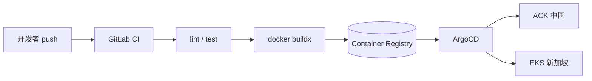

# CI/CD 基础设施

GitLab CI 构建镜像 → 容器仓库 → ArgoCD GitOps 部署到 K8s 双集群。

对应 [design-backend.md §2](../../docs/design-backend.md) 与开发计划 **T0.2**。

## 目录结构

```text
infra/ci/
├── README.md              # 本文档
├── variables.md           # GitLab CI/CD 变量说明
├── Dockerfile.template    # Go 微服务多阶段 Dockerfile 模板
└── docker-build.sh        # buildx 构建 / push 脚本

infra/argocd/              # 蓝绿 / ApplicationSet（与 k8s/argocd 互补）
infra/k8s/argocd/          # 单服务 Application 模板
```

## CI Pipeline 阶段

| Stage | Job | 触发条件 |
| --- | --- | --- |
| `lint` | `lint:repo`, `lint:contracts` | push / MR |
| `test` | `test:services`, `test:ios` | push / MR；iOS 限 `ios/**` 变更 |
| `build` | `build:services`, `build:ios` | 对应目录变更 |
| `docker` | `docker:hello`, … | push / MR + `services/**` 变更 |
| `deploy-staging` | `deploy:staging:hello` | main push + manual |

完整 job 列表见根目录 [`.gitlab-ci.yml`](../../.gitlab-ci.yml)。

## CI → 镜像 → ArgoCD 流程



### 1. 构建镜像

push 到 `services/<svc>/` 触发 `docker:<svc>` job：

```bash
# 本地预检
chmod +x infra/ci/docker-build.sh
DOCKER_PUSH=false ./infra/ci/docker-build.sh \
  --service hello \
  --context services/hello \
  --dockerfile services/hello/Dockerfile \
  --registry localhost:5000/baobao \
  --tag dev \
  --push false
```

CI 中使用 buildx + DinD，镜像 tag 为 `$CI_COMMIT_SHORT_SHA`，同时打 `:latest`。

### 2. 更新部署目标（GitOps）

**推荐**：CI 或 Renovate 更新 cluster values 中的镜像 tag：

```yaml
# infra/k8s/clusters/ack-cn/staging-hello-values.yaml
image:
  repository: registry.example.com/baobao/hello
  tag: "abc1234"   # CI_COMMIT_SHORT_SHA
```

ArgoCD Application（`infra/k8s/argocd/applications/`）监听 Git 变更自动 sync。

### 3. ArgoCD 同步

```bash
# 注册集群后应用 Application
kubectl apply -f infra/k8s/argocd/applications/hello-staging.yaml

# 手动同步（deploy job 占位逻辑）
argocd app sync hello-staging --grpc-web
```

蓝绿 / 渐进发布见 [infra/argocd/README.md](../argocd/README.md)。

## 新服务接入 Checklist

1. 从 `Dockerfile.template` 复制 Dockerfile 到 `services/<svc>/`
2. 在 `.gitlab-ci.yml` 添加 `docker:<svc>` job（extends `.docker_build_template`）
3. 创建 Helm chart 或扩展现有 chart
4. 添加 ArgoCD Application / ApplicationSet 条目
5. 在 GitLab 配置 `CI_REGISTRY_*` 变量（见 [variables.md](./variables.md)）

## iOS 端侧

- **GitLab MR**：`test:ios` 占位验证 fastlane 骨架（Linux runner）
- **macOS runner / Xcode Cloud**：执行 `fastlane test` / `xcodebuild test`
- 配置见 [ios/fastlane/README.md](../../ios/fastlane/README.md)

## 验收自检

| 项 | 命令 / 检查 | 预期 |
| --- | --- | --- |
| CI 语法 | 推送到 GitLab 或 `gitlab-ci-local` | pipeline 五阶段可见 |
| docker 脚本 | `sh -n infra/ci/docker-build.sh` | 无语法错误 |
| hello 镜像 | 本地 `docker-build.sh --push false` | build 成功 |
| contracts lint | MR 触发 `lint:contracts` | 占位通过 |
| iOS 单测 | MR 改 `ios/**` 触发 `test:ios` | fastlane 骨架检查通过 |
| ArgoCD 模板 | `test -f infra/argocd/applicationsets/baobao-staging.yaml` | 蓝绿 ApplicationSet 存在 |
| 无密钥 | `grep -rE '(password|secret|token)\s*=' infra/ci/` | 仅文档占位 |

## 安全说明

- 禁止提交 registry 密码、ArgoCD token、Apple 证书
- 生产凭据走 GitLab CI Variables（Masked）或 Vault（T0.7）
