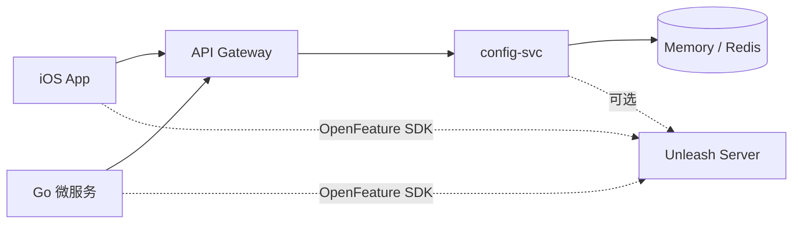

# Feature Flags 基础设施

T0.19 灰度配置方案：**默认走自建 `config-svc`**，可选接入 [Unleash](https://www.getunleash.io/) + [OpenFeature](https://openfeature.dev/) SDK。

## 架构



## 分流维度

| 维度 | 来源 | 用途 |
| --- | --- | --- |
| `region` | `X-Region` 头 / JWT `region` claim | CN/OS 功能开关、合规玩法下架 |
| `userIdHash` | `FNV-1a(userId) % 100` | 百分比灰度（0–99 桶） |
| `appVersion` | `X-App-Version` | 最低版本门槛 |

端侧与后端应使用**相同哈希算法**保证分桶一致，见 `services/config-svc/internal/feature/hash.go`。

## 方案选型

| 方案 | 适用阶段 | 说明 |
| --- | --- | --- |
| **config-svc（默认）** | P0–P2 | 内存/Redis 种子配置，REST 拉取 + TTL 缓存 |
| **Unleash + OpenFeature** | P2+ 运营频繁改 flag | 自助开关、策略编排、A/B variant |
| **网关灰度路由** | 服务版本切换 | Kong/APISIX 按 region + userIdHash 路由到 canary 实例 |

## 本地 Unleash（可选）

```bash
cd infra/feature-flags
docker compose up -d
# Admin UI: http://localhost:4242  (admin / unleash4all)
# API:      http://localhost:4242/api
```

详见 [docker-compose.yaml](./docker-compose.yaml)。

## SDK 接入

- Go 微服务：[openfeature-go.md](./openfeature-go.md)
- iOS 客户端：[openfeature-ios.md](./openfeature-ios.md)

## config-svc 快速验证

```bash
cd services/config-svc
make run

curl -s -H 'X-Region: cn' -H 'X-App-Version: 1.5.0' \
  -H 'Authorization: Bearer dev' \
  http://localhost:8009/v1/config/features | jq .
```

## T7.14 渐进发布灰度

App Store Phased Release（7 天）与 `rollout.ai_plays_percent` / `rollout.pricing_variant` 联动，紧急下架见 [PHASED_RELEASE_PLAN.md](../../docs/ops/PHASED_RELEASE_PLAN.md) 与 [remote-kill-switch.sh](../../scripts/ops/remote-kill-switch.sh)。服务端流量灰度见 T7.11 [traffic-shift.sh](../../scripts/ops/traffic-shift.sh)。

## 验收自检

- [ ] `GET /v1/config/features` 缺 `X-Region` 返回 400
- [ ] 同一 `userId` 多次请求 `userIdHash` 稳定
- [ ] `region=cn` 时 `ai.storybook` 可灰度，`region=os` 为 disabled
- [ ] `rolloutPercent=30` 时约 30% 用户 enabled（统计抽样）
- [ ] iOS / Go 使用相同 `UserIDHash` 算法
- [ ] OpenAPI `contracts/openapi/paths/config.yaml` lint 通过
