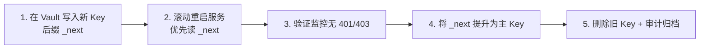

# HashiCorp Vault 集成 SOP

> 对应 dev-plan **T0.7**（Secret 管理）与 **T0.12**（第三方凭据入 Vault）。  
> 关联设计：`docs/design-backend.md` §2、§3。

---

## 1. 架构概览

| 维度 | 约定 |
| --- | --- |
| Vault 引擎 | KV Secrets Engine **v2** |
| 主 Mount | `secret/` |
| 环境 | `dev` / `staging` / `prod-cn` / `prod-os` |
| 路径模式 | `secret/data/{env}/{region}/{scope}/{provider}` |
| 区域 | `cn`（中国区 ACK）、`os`（海外 EKS）、`global`（跨区共享，如 Sentry） |
| 服务 Scope | 与后端微服务一一对应，见 `policies/` |

```
secret/data/
├── dev/cn/auth-family/aliyun-sms
├── staging/cn/ai-dispatch/bytedance
├── prod-cn/cn/audit/aliyun-green
├── prod-os/os/ai-dispatch/openai
└── prod-cn/global/platform/sentry
```

---

## 2. 凭据分类

| 类别 | 存放位置 | 示例 |
| --- | --- | --- |
| **产线 Key** | Vault（仅 prod-* 路径） | 模型 API Key、短信 AccessKey、广告 Server Key |
| **测试 Key** | Vault `dev`/`staging` 或本地 `.env`（不入 Git） | Sandbox IAP、测试短信模板 |
| **端侧 SDK Key** | CI Secret / Xcode 配置（**不进后端 Vault**） | 穿山甲 AppID、AdMob App ID、Bugly AppID |
| **用户 OAuth Token** | auth-family-svc 数据库（加密落库） | 百度网盘 refresh_token |

> 原则：**任何真实密钥不得写入 Git 仓库**。本目录仅含策略模板与占位文件。

---

## 3. 初始化与命名空间

### 3.1 启用 KV v2

```bash
# 在 Vault 管理节点执行（需已有 Vault 集群，见 T0.7）
vault secrets enable -path=secret kv-v2
```

### 3.2 创建策略与服务账号

```bash
# 示例：为 auth-family-svc 绑定最小权限策略
vault policy write auth-family-svc policies/auth-family-svc.hcl

vault write auth/kubernetes/role/auth-family-svc \
  bound_service_account_names=auth-family-svc \
  bound_service_account_namespaces=prod-cn \
  policies=auth-family-svc \
  ttl=1h
```

各服务策略文件见 [`policies/`](./policies/)。GitLab CI 只读策略见 [`policies/gitlab-ci-dev.hcl`](./policies/gitlab-ci-dev.hcl)。

### 3.3 写入凭据（产线）

```bash
# 示例：阿里云短信（占位值，实际由运维在 Vault UI 或 CLI 填入）
vault kv put secret/prod-cn/cn/auth-family/aliyun-sms \
  access_key_id="REPLACE_ME" \
  access_key_secret="REPLACE_ME" \
  sign_name="REPLACE_ME" \
  template_code_login="REPLACE_ME"
```

模板字段见 [`secrets-template/`](./secrets-template/)。

---

## 4. 目录结构（T0.7）

```text
infra/vault/
├── helm/                    # Vault Server dev/staging Helm values
├── kubernetes/              # Agent Injector + External Secrets 示例
├── sealed-secrets/          # SealedSecret 加密占位（bootstrap）
├── ci/                      # GitLab CI 读 Vault 集成文档
├── rotation/                # 密钥轮换 SOP
├── policies/                # 服务最小权限 HCL
└── secrets-template/        # 凭据字段模板（含 shared-postgres）
```

---

## 5. K8s / CI 集成

### 5.1 Pod 内注入（推荐）

使用 **Vault Agent Injector** 或 **External Secrets Operator**（见 [`kubernetes/`](./kubernetes/)）：

1. Pod 启动时按 `policies/{service}.hcl` 拉取对应路径。
2. 注入为 `/vault/secrets/{provider}.env` 或 K8s Secret `baobao-postgresql`。
3. DB 密码路径：`secret/data/{env}/{region}/shared/postgres-{service}`，与 [`infra/data/postgresql`](../data/postgresql/) 的 `existingSecret` 对齐。

完整部署示例：[`examples/auth-family-deployment.yaml`](../../examples/auth-family-deployment.yaml)。

### 5.2 GitLab CI

详见 [`ci/GITLAB_VAULT_INTEGRATION.md`](./ci/GITLAB_VAULT_INTEGRATION.md)：

- CI 使用 **短期 Token**（`ttl=15m`）仅读 `dev`/`staging` 路径。
- 镜像构建阶段**不得** bake 产线 Key；运行时从 Vault 挂载。
- iOS 端侧 Key 走 **GitLab CI Variables**（Protected + Masked），变量名见 `infra/accounts/THIRD_PARTY_ACCOUNTS.md`。

### 5.3 本地开发

```bash
# 开发者个人 Token，仅 dev 命名空间只读
export VAULT_ADDR=https://vault.dev.internal
vault login -method=oidc
vault kv get secret/dev/cn/auth-family/aliyun-sms
```

本地 `.env` 从 `secrets-template/*.env.example` 复制，**加入 .gitignore**。

---

## 6. 密钥轮换 SOP

完整流程见 [`rotation/SOP.md`](./rotation/SOP.md)。摘要如下。

### 6.1 轮换触发条件

| 场景 | 动作 |
| --- | --- |
| 定期轮换 | 高敏感 Key（模型 API、JWT 签名）每 **90 天** |
| 人员离职 | 相关账号立即轮换 + 吊销 Vault Token |
| 疑似泄露 | 15 分钟内完成轮换 + 审计日志回溯 |
| 厂商强制 | 按厂商通知窗口完成 |

### 6.2 轮换流程（双写窗口）



**步骤详解：**

1. **准备**：在变更单记录 Vault path、影响服务、回滚 Key（保留旧值 24h）。
2. **写入**：`vault kv patch secret/prod-cn/cn/ai-dispatch/openai api_key_next="NEW"`。
3. **灰度**：先重启 `staging` 单 Pod，跑 smoke（见 `infra/accounts/verification-checklist.md`）。
4. **推广**：ArgoCD 滚动更新 prod，每批 25% Pod，观察 5xx / 鉴权失败率。
5. **提升**：`vault kv patch ... api_key="@api_key_next"` 并删除 `_next` 字段。
6. **归档**：Vault audit log + 变更单关闭；Bugly/Sentry 标记 release。

### 6.3 各厂商特殊说明

| 厂商 | 轮换注意 |
| --- | --- |
| Apple Developer | APNs Key 可并存 2 把；IAP 公钥由 Apple 轮换，无需手动 |
| 阿里云 | RAM 子账号 AccessKey 支持双 Key 并存 |
| OpenAI / Google | 新 Key 创建后旧 Key 可设过期时间 |
| 广告联盟 | Server-side 回调 Secret 需与联盟后台同步更新 |
| 微信开放平台 | AppSecret 重置会使旧 Secret 立即失效，需协调端侧发版 |

---

## 7. 审计与合规

- 启用 Vault **Audit Device**（file 或 syslog），保留 ≥ 180 天。
- 产线路径访问仅限对应 K8s ServiceAccount；人工 break-glass 需双人审批。
- 儿童照片相关服务（`ai-dispatch`、`audit`）凭据访问日志纳入合规抽检。
- 与 PRD §6 对齐：模型协议须含「不用于训练」条款，Key 权限最小化。

---

## 8. 验收自检（T0.7 + T0.12）

| 检查项 | 命令 / 方法 | 期望 |
| --- | --- | --- |
| 策略最小权限 | `vault policy read auth-family-svc` | 无 `secret/data/prod-os/*` 读权限（CN 服务） |
| dev 可读 | Pod 内 `vault kv get secret/dev/cn/...` | 200 |
| prod 隔离 | dev Token 读 prod 路径 | 403 |
| 模板完整 | 对照 `secrets-template/` 与 `THIRD_PARTY_ACCOUNTS.md` | 字段一一对应 |
| 轮换演练 | staging 执行 rotation/SOP.md §4 | 无服务中断 |
| Helm 模板 | `helm template vault hashicorp/vault -f helm/values-dev.yaml` | YAML 无错误 |
| DB 路径对齐 | 对照 `secrets-template/shared-postgres.env.example` | 与 infra/data existingSecret 一致 |

---

## 9. 相关文档

- 第三方账号清单：[`../accounts/THIRD_PARTY_ACCOUNTS.md`](../accounts/THIRD_PARTY_ACCOUNTS.md)
- 连通性验证：[`../accounts/verification-checklist.md`](../accounts/verification-checklist.md)
- 后端服务划分：`docs/design-backend.md` §3
