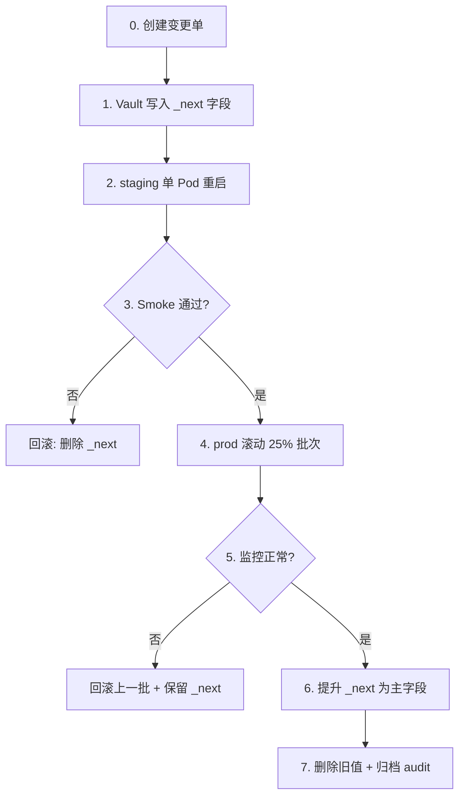

# 密钥轮换标准作业程序（SOP）

> 对应 T0.7 验收「密钥轮换 SOP」。  
> 扩展自 [`../README.md`](../README.md) §5，供运维 / On-call 执行。

---

## 1. 适用范围

| 凭据类型 | Vault 路径示例 | 轮换周期 | 负责方 |
| --- | --- | --- | --- |
| PostgreSQL 应用密码 | `secret/data/{env}/{region}/shared/postgres-{service}` | 90 天 | DBA + 服务 Owner |
| Redis 密码 | `secret/data/{env}/{region}/shared/redis-{service}` | 90 天 | DBA + 服务 Owner |
| JWT 签名密钥 | `secret/data/{env}/{region}/auth-family/jwt-signing` | 90 天 | auth-family Owner |
| 模型 API Key | `secret/data/{env}/{region}/ai-dispatch/{provider}` | 90 天 | ai-dispatch Owner |
| 短信 / 内容安全 | `secret/data/{env}/{region}/auth-family/aliyun-sms` 等 | 90 天 | 对应服务 Owner |
| Apple APNs Key | `secret/data/{env}/{region}/notification/apns` | 180 天或 Apple 通知 | notification Owner |

路径完整列表见 [`../secrets-template/`](../secrets-template/) 与 [`../policies/`](../policies/)。

---

## 2. 触发条件

| 场景 | SLA | 动作 |
| --- | --- | --- |
| 定期轮换 | 到期前 7 天创建变更单 | 按 §4 双写窗口执行 |
| 人员离职 | 24h 内 | 轮换其可接触的全部路径 + 吊销 Token |
| 疑似泄露 | **15 分钟**内完成轮换 | 紧急变更 + 审计回溯 |
| 厂商强制 | 按厂商窗口 | 优先 staging 验证再 prod |
| DB 密码策略 | 90 天 | 与 PostgreSQL `baobao` 用户同步 |

---

## 3. 角色与审批

| 环境 | 审批 | 执行 |
| --- | --- | --- |
| dev | 服务 Owner 自助 | 开发者 / Owner |
| staging | 服务 Owner | SRE |
| prod-cn / prod-os | **双人审批**（Owner + SRE） | SRE 操作，Owner 验证 |

Break-glass（Vault root / 人工 patch prod）：需 incident 工单 + 事后 24h 内复盘。

---

## 4. 标准轮换流程（双写窗口）

适用于：API Key、JWT 密钥、第三方 AccessKey 等**可并存**凭据。



### 步骤 0 — 准备

- [ ] 变更单编号：CHG-____
- [ ] Vault path：`secret/data/____________`
- [ ] 影响服务：____________
- [ ] 回滚方案：保留旧 Key 24h（写入 `*_prev` 或变更单附件）
- [ ] 通知：#baobao-oncall

### 步骤 1 — 写入新 Key（双写）

```bash
export VAULT_ADDR=https://vault.staging.internal
vault login -method=oidc   # 或 break-glass token

# 示例：OpenAI API Key
vault kv patch secret/staging/cn/ai-dispatch/openai \
  api_key_next="sk-NEW_KEY_REPLACE_ME"

# 示例：JWT 签名（auth-family）
vault kv patch secret/staging/cn/auth-family/jwt-signing \
  JWT_SIGNING_KEY_NEXT="NEW_BASE64_REPLACE_ME"
```

应用需支持「优先读 `*_next`，fallback 主字段」（或在灰度期仅读 `_next`）。新服务接入时在代码 / 模板中预留。

### 步骤 2 — Staging 灰度

```bash
# 重启单 Pod（Vault Agent 会拉取新 Secret）
kubectl rollout restart deployment/auth-family-svc -n staging
kubectl rollout status deployment/auth-family-svc -n staging

# Smoke（见 infra/accounts/verification-checklist.md）
curl -sf https://api-staging-cn.example.com/health
# 登录 / 发短信 / AI 生成 等按服务选测
```

### 步骤 3 — Prod 滚动发布

```bash
# ArgoCD 滚动或 kubectl rollout restart，每批 25%
kubectl rollout restart deployment/ai-dispatch-svc -n prod-cn
# 观察 5 分钟：5xx 率、鉴权失败、模型 401
```

Prometheus 告警：

- `rate(http_requests_total{status=~"5.."}[5m])` 升高
- `vault_agent_cache_hit` 异常（可选）

### 步骤 4 — 提升为主 Key

```bash
# 确认无 401/403 后
vault kv patch secret/prod-cn/cn/ai-dispatch/openai \
  api_key="sk-NEW_KEY_REPLACE_ME"

# 删除 _next（KV v2 patch 删除需 metadata 或 rewrite；推荐 read-modify-write）
vault kv get -format=json secret/prod-cn/cn/ai-dispatch/openai | \
  jq 'del(.data.data.api_key_next)' | vault kv put secret/prod-cn/cn/ai-dispatch/openai @-
```

### 步骤 5 — 归档

- [ ] Vault audit log 导出至变更单
- [ ] 旧 Key 在厂商控制台 **吊销**
- [ ] Sentry release 标记
- [ ] 变更单关闭

---

## 5. PostgreSQL 密码轮换（与 infra/data 对齐）

Vault path：`secret/data/{env}/{region}/shared/postgres-{service}`

字段：`password`（应用用户 baobao）、`postgres_password`（superuser，同步至 K8s Secret `postgres-password`）

### 5.1 流程

1. **DB 侧重置密码**（连接池允许的情况下）：

```sql
-- 在 PostgreSQL primary 执行
ALTER USER baobao WITH PASSWORD 'NEW_PASSWORD_REPLACE_ME';
```

2. **Vault patch**（与 Bitnami Secret keys 对齐）：

```bash
vault kv patch secret/prod-cn/cn/shared/postgres-auth-family \
  password="NEW_PASSWORD_REPLACE_ME" \
  postgres_password="NEW_SUPERUSER_IF_CHANGED"
```

3. **ESO 刷新**（若使用 External Secrets，`refreshInterval` 内自动；或强制）：

```bash
kubectl annotate externalsecret baobao-postgresql \
  force-sync=$(date +%s) -n prod-cn --overwrite
```

4. **滚动重启**依赖该库的服务（auth-family、notification 等）。

5. **不重启 PostgreSQL Pod**（除非 superuser 密码变更且 Chart 需 reload）。

### 5.2 验证

```bash
# Pod 内
. /vault/secrets/postgres.env && psql "postgresql://${POSTGRES_USER}:${POSTGRES_PASSWORD}@${POSTGRES_HOST}:${POSTGRES_PORT}/${POSTGRES_DB}" -c 'SELECT 1'

# 或 connectivity-test
POSTGRES_HOST=... POSTGRES_PASSWORD=... ./infra/data/scripts/connectivity-test.sh
```

---

## 6. 不可双写凭据（立即切换）

| 凭据 | 说明 | 流程 |
| --- | --- | --- |
| 微信 AppSecret | 重置后旧 Secret **立即失效** | 维护窗口 + 端侧协调 |
| 部分广告回调 Secret | 需与联盟后台同步 | 先后台后 Vault，5 分钟内完成 |
| SealedSecret | 重新 kubeseal + GitOps sync | 见 [`../sealed-secrets/README.md`](../sealed-secrets/README.md) |

---

## 7. 厂商特殊说明

| 厂商 | 轮换注意 |
| --- | --- |
| Apple Developer | APNs Key 可并存 2 把；IAP 公钥由 Apple 轮换 |
| 阿里云 RAM | AccessKey 支持双 Key 并存 |
| OpenAI / Google | 新 Key 创建后可设旧 Key 过期 |
| 字节 / 通义 | 控制台创建新 Key → Vault `_next` → 验证 → 吊销旧 Key |
| 微信开放平台 | AppSecret 重置需协调发版 |

---

## 8. 回滚

| 阶段 | 回滚动作 |
| --- | --- |
| 写入 `_next` 后、未提升 | 删除 `_next` 字段，重启 Pod |
| 已提升、旧 Key 仍有效 | `vault kv patch` 写回旧值，滚动重启 |
| 已吊销旧 Key | 只能用备份 `_prev` 或厂商重新签发 |

保留旧值 **24h** 于变更单附件（**不得**入 Git）。

---

## 9. 演练计划

| 频率 | 内容 | 环境 |
| --- | --- | --- |
| 每季度 | API Key 双写全流程 | staging |
| 每半年 | PostgreSQL 密码轮换 | staging |
| 每年 | 疑似泄露 15min 演练 | staging（ tabletop + 实操） |

演练记录模板：

```text
日期:
路径:
执行人:
Smoke 结果:
回滚测试:
Audit 归档编号:
```

---

## 10. 验收自检（T0.7）

| 项 | 检查 | 预期 |
| --- | --- | --- |
| SOP 完整 | 本文档 §4–§5 可独立执行 | 含 DB + API Key |
| 路径对齐 | 对照 `shared-postgres.env.example` | 与 `infra/data` existingSecret 一致 |
| staging 演练 | 执行 §4 一次 | 无服务中断 |
| audit | `vault audit list` | file/syslog 已启用 |
| CI 只读 | GitLab job 无 patch 权限 | 仅 read dev/staging |

---

## 11. 相关文档

- [`../README.md`](../README.md) — Vault 架构与初始化
- [`../ci/GITLAB_VAULT_INTEGRATION.md`](../ci/GITLAB_VAULT_INTEGRATION.md) — CI 读 Vault
- [`../../data/postgresql/values.yaml`](../../data/postgresql/values.yaml) — Bitnami Secret keys
- [`../../accounts/verification-checklist.md`](../../accounts/verification-checklist.md) — Smoke 清单
