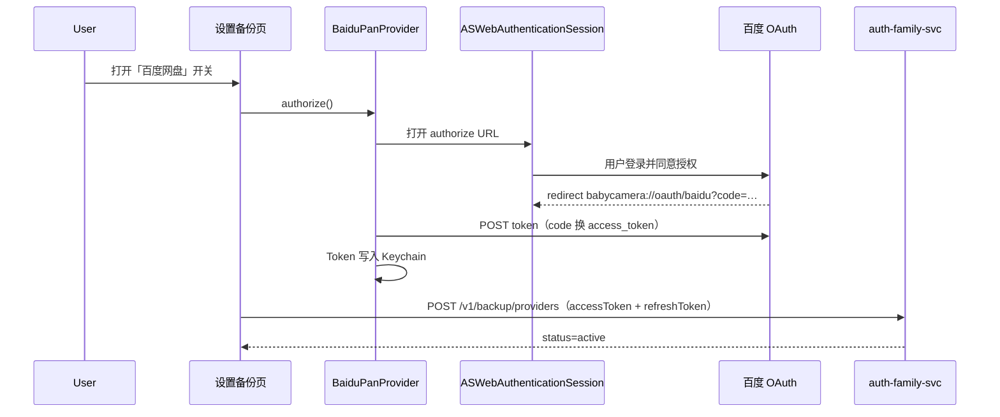

# 百度网盘备份 OAuth 真机联调（OPT-03）

> **范围**：设置 → 数据 → 备份目标 → 百度网盘；`ASWebAuthenticationSession` 授权 → Token 入 Keychain → `POST /v1/backup/providers`  
> **关联**：[`tests/e2e/README-p6-backup.md`](../../tests/e2e/README-p6-backup.md)、[`BabyCameraBackup` Provider](../Packages/BabyCameraBackup/Sources/BabyCameraBackup/Provider/BaiduPan/)

---

## 1. 模式切换

| 模式 | 适用场景 | OAuth 实现 | OpenAPI |
| --- | --- | --- | --- |
| **stub** | Debug 默认、`-UITesting`、模拟器无密钥 | `StubBaiduPanOAuthService` | `MockBaiduPanOpenAPIClient` |
| **live** | Staging / Release 真机 | `LiveBaiduPanOAuthService` + `ASWebAuthenticationSession` | `BaiduPanOpenAPIClient` |

### 1.1 编译条件（xcconfig → Info.plist）

| Build Configuration | `BAIDU_PAN_USE_LIVE_OAUTH` | 行为 |
| --- | --- | --- |
| Debug | `NO` | stub OAuth，开关仍可绑定 Mock API |
| Staging | `YES` | 真 OAuth（需 Secrets） |
| Release | `YES` | 真 OAuth（需产线密钥） |

Debug 真机走百度 OAuth：将 `Debug.xcconfig` 中 `BAIDU_PAN_USE_LIVE_OAUTH = YES` 并配置 Secrets 后 **Clean Build**。

验证注入：

```bash
cd ios
xcodebuild -project BabyCamera.xcodeproj -scheme BabyCamera-Staging -configuration Staging -showBuildSettings | rg 'BAIDU_PAN_'
```

### 1.2 UI 测试

启动参数含 `-UITesting` 时，`SettingsIntegrationContextFactory.make(forceStubBackupOAuth: true)` 强制 stub，与 `MockURLProtocol` 配套。

---

## 2. 百度开放平台配置

1. 登录 [百度开放平台](https://openapi.baidu.com/) → **控制台** → 创建应用（类型：**移动应用** 或 **轻应用**，需支持 OAuth 2.0）。
2. 记录 **AppKey（client_id）** 与 **Secret Key（client_secret）**。
3. **授权回调页（redirect_uri）** 登记为：

   ```
   babycamera://oauth/baidu
   ```

   须与 `BAIDU_PAN_REDIRECT_URI` 完全一致（区分大小写）。

4. **权限范围（scope）**：至少 `basic,netdisk`（网盘读写）。
5. iOS **Bundle ID**：`com.babycamera.app`（与 Xcode 工程一致）。
6. 应用审核通过后，在真机使用百度账号登录授权。

### 2.1 端侧密钥文件

```bash
cp ios/BabyCamera/Resources/Config/BaiduPan.Secrets.xcconfig.example \
   ios/BabyCamera/Resources/Config/BaiduPan.Secrets.xcconfig
```

编辑 `BaiduPan.Secrets.xcconfig` 填入 AppKey / Secret Key。

在 `Staging.xcconfig`（或 `Release.xcconfig`）取消注释：

```
#include "BaiduPan.Secrets.xcconfig"
```

### 2.2 Info.plist 键

| 键 | xcconfig | 说明 |
| --- | --- | --- |
| `BaiduPanUseLiveOAuth` | `BAIDU_PAN_USE_LIVE_OAUTH` | `YES` / `NO` |
| `BaiduPanClientID` | `BAIDU_PAN_CLIENT_ID` | 开放平台 AppKey |
| `BaiduPanRedirectURI` | `BAIDU_PAN_REDIRECT_URI` | 默认 `babycamera://oauth/baidu` |
| `BaiduPanClientSecret` | `BAIDU_PAN_CLIENT_SECRET` | Secrets 文件注入，不入库 |

`CFBundleURLSchemes` 已注册 `babycamera`，供 OAuth 回调拦截。

---

## 3. OAuth 流程



**本地存储**：`KeychainBaiduPanTokenStore`（`com.babycamera.app.baidu-pan`）。解绑时 `revoke()` 清除 Keychain 并 `DELETE /v1/backup/providers/{id}`。

---

## 4. 验证步骤

### 4.1 Stub（Debug / 模拟器）

1. Scheme：`BabyCamera`（Debug），`BAIDU_PAN_USE_LIVE_OAUTH = NO`。
2. 启动 Mock API：`cd tests/mocks/api && python3 mock_server.py`。
3. 登录 → **我的 → 设置 → 数据 → 备份目标**。
4. 打开「百度网盘」开关 → 应秒绑成功（无浏览器弹窗）。
5. 列表显示「已绑定」；Mock API `GET /v1/backup/providers` 含 `baidu_pan`。

### 4.2 Live（Staging 真机）

1. 完成 §2 开放平台与 Secrets 配置；Scheme：`BabyCamera-Staging`。
2. 真机安装后登录 Staging / Mock 账号。
3. **设置 → 数据 → 备份目标** → 打开「百度网盘」。
4. 预期：弹出 `ASWebAuthenticationSession` 百度登录页 → 授权后回到 App → 开关保持开启。
5. 关闭开关再打开：若 Token 未过期，跳过浏览器（`authorize()` 复用 Keychain）。
6. 解绑：关闭开关 → Keychain 清空 + 服务端 `baidu_pan` 记录删除。

### 4.3 单测

```bash
cd ios/Packages/BabyCameraBackup && swift test --filter BaiduPanOAuth
cd ios/Packages/BabyCameraSettings && swift test --filter BackupTargets
```

---

## 5. 常见问题

| 现象 | 排查 |
| --- | --- |
| `BaiduPanClientSecret missing` | 创建 `BaiduPan.Secrets.xcconfig` 并 `#include` |
| `redirect_uri_mismatch` | 开放平台回调页与 `BAIDU_PAN_REDIRECT_URI` 不一致 |
| 授权后无回调 | 确认 Info.plist 含 `babycamera` URL Scheme |
| Staging 仍走 stub | 检查 `BAIDU_PAN_USE_LIVE_OAUTH`、Clean Build |
| 绑定 API 400 | Mock 需 `accessToken` 非空；live 模式检查 OAuth 是否成功 |

---

## 6. 安全说明

- **client_secret** 仅用于 token 换票，存放在本地 Secrets 文件，**禁止提交仓库**。
- 产线 Secret 建议走 CI / Vault 注入 `BAIDU_PAN_CLIENT_SECRET` build setting。
- 业务服务器仅托管 Token 元数据（`design-api.md` §备份），原图走百度 OpenAPI 直传。
