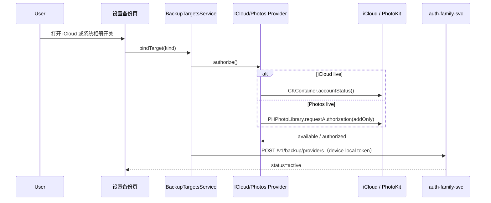

# iCloud / 系统相册备份真机联调（OPT-04）

> **范围**：设置 → 数据 → 备份目标 → iCloud / 系统相册；CloudKit Private DB + PhotoKit addOnly  
> **关联**：[`tests/e2e/README-p6-backup.md`](../../tests/e2e/README-p6-backup.md)、[`BabyCameraBackup` Provider](../Packages/BabyCameraBackup/Sources/BabyCameraBackup/Provider/)

---

## 1. 模式切换

| 模式 | 适用场景 | iCloud | 系统相册 |
| --- | --- | --- | --- |
| **stub** | Debug 默认、`-UITesting`、模拟器 | `StubCloudKitPrivateDatabase`（内存） | `StubPhotosAddOnlyPermissionService` + `StubPhotosLibraryWriter` |
| **live** | Staging / Release 真机 | `LiveCloudKitPrivateDatabase`（CloudKit 私有库） | `LivePhotosAddOnlyPermissionService` + `LivePhotosLibraryWriter`（PhotoKit） |

> **说明**：iCloud 备份走 **CloudKit Private Database**，数据存于用户不可见的私有库，**不占用 iCloud Drive 可见目录**。系统相册仅申请 **addOnly** 权限，写入「宝宝成长相机」专用相册，**不读取**用户其他照片。

### 1.1 编译条件（xcconfig → Info.plist）

| Build Configuration | `ICLOUD_USE_LIVE_BACKUP` | `PHOTOS_USE_LIVE_BACKUP` | 行为 |
| --- | --- | --- | --- |
| Debug | `NO` | `NO` | stub，开关可秒绑 |
| Staging | `YES` | `YES` | 真机权限 + CloudKit / PhotoKit |
| Release | `YES` | `YES` | 产线行为 |

Debug 真机走 live：将 `Debug.xcconfig` 中两项改为 `YES` 后 **Clean Build**。

验证注入：

```bash
cd ios
xcodebuild -project BabyCamera.xcodeproj -scheme BabyCamera-Staging -configuration Staging -showBuildSettings | rg 'ICLOUD_USE_LIVE|PHOTOS_USE_LIVE'
```

### 1.2 UI 测试

启动参数含 `-UITesting` 时，`SettingsIntegrationContextFactory.make(forceStubBackupOAuth: true)` 强制 iCloud / 相册 / 百度均为 stub。

---

## 2. Apple 开发者配置

### 2.1 iCloud / CloudKit

1. [Apple Developer](https://developer.apple.com/account) → **Identifiers** → App ID `com.babycamera.app`。
2. 启用 **iCloud**，勾选 **CloudKit**。
3. 创建或确认 Container：`iCloud.app.babycamera`（与 `ICLOUD_BACKUP_CONTAINER_ID` 一致）。
4. 在 Xcode → Signing & Capabilities 确认 **iCloud** + **CloudKit** 已勾选，Container 已选中。
5. Provisioning Profile 需包含 iCloud entitlement（`fastlane match` 重新生成）。

`BabyCamera.entitlements` 已包含：

- `com.apple.developer.icloud-services` → `CloudKit`
- `com.apple.developer.icloud-container-identifiers` → `iCloud.app.babycamera`

### 2.2 系统相册（PhotoKit addOnly）

Info.plist 键：

| 键 | 说明 |
| --- | --- |
| `NSPhotoLibraryAddUsageDescription` | 首次绑定「系统相册」时弹出「添加照片」权限说明 |

无需 `NSPhotoLibraryUsageDescription`（不读取相册）。

---

## 3. 绑定流程



**解绑**：

- **系统相册**：`revoke()` 清除本地写入台账（不删除已写入相册的照片）。
- **iCloud**：仅 `DELETE /v1/backup/providers/{id}`，**不删除** CloudKit 已有备份记录。

---

## 4. 验证步骤

### 4.1 Stub（Debug / 模拟器）

1. Scheme：`BabyCamera`（Debug），`ICLOUD_USE_LIVE_BACKUP = NO`，`PHOTOS_USE_LIVE_BACKUP = NO`。
2. 启动 Mock API：`cd tests/mocks/api && python3 mock_server.py`。
3. 登录 → **我的 → 设置 → 数据 → 备份目标**。
4. 分别打开 **iCloud**、**系统相册** 开关 → 应秒绑成功（无系统权限弹窗）。
5. `GET /v1/backup/providers` 含 `icloud`、`photos`，metadata `provider_mode=stub`。

### 4.2 Live iCloud（Staging 真机）

1. 完成 §2.1 CloudKit 配置；Scheme：`BabyCamera-Staging`。
2. 真机 **设置 → Apple ID → iCloud** 已登录，iCloud Drive 有足够配额。
3. **设置 → 数据 → 备份目标** → 打开 **iCloud**。
4. 预期：无浏览器；若未登录 iCloud，页面显示错误「未登录 iCloud…」。
5. 绑定成功后拍照备份，可在 CloudKit Dashboard（Development 环境）查看 `BabyCameraBackupPhoto` 记录类型。

### 4.3 Live 系统相册（Staging 真机）

1. `PHOTOS_USE_LIVE_BACKUP = YES`；真机安装 Staging 包。
2. **设置 → 数据 → 备份目标** → 打开 **系统相册**。
3. 预期：弹出「添加照片」权限 → 允许 → 开关保持开启。
4. 触发备份（或 P6 Harness）后，在 **照片 App → 相册** 查看「宝宝成长相机」相册有新图。
5. 拒绝权限：开关回弹，页面显示「未获得添加照片权限…」。

### 4.4 单测

```bash
cd ios/Packages/BabyCameraBackup && swift test --filter DeviceLocalBackup
cd ios/Packages/BabyCameraSettings && swift test --filter BackupTargets
```

---

## 5. 常见问题

| 现象 | 排查 |
| --- | --- |
| iCloud 绑定报「未登录 iCloud」 | 真机设置中登录 Apple ID；检查 iCloud 总开关 |
| CloudKit 写入失败 | Container ID 与 Developer Portal 一致；Profile 含 CloudKit entitlement |
| 相册权限弹窗不出现 | 确认 `PHOTOS_USE_LIVE_BACKUP=YES`；此前拒绝过需到系统设置手动开启 |
| Staging 仍走 stub | 检查 xcconfig、`Clean Build Folder` |
| 绑定 API 400 | Mock 需 `accessToken` 非空；authorize 失败则不会发 POST |

---

## 6. 安全说明

- iCloud 备份数据存于用户 **CloudKit 私有库**，App 无法访问其他 App 的 iCloud 数据。
- 系统相册 **addOnly** 不读取用户现有照片，符合儿童隐私最小权限原则。
- 服务端仅记录绑定元数据（`device-local` token），原图不上传业务服务器。
