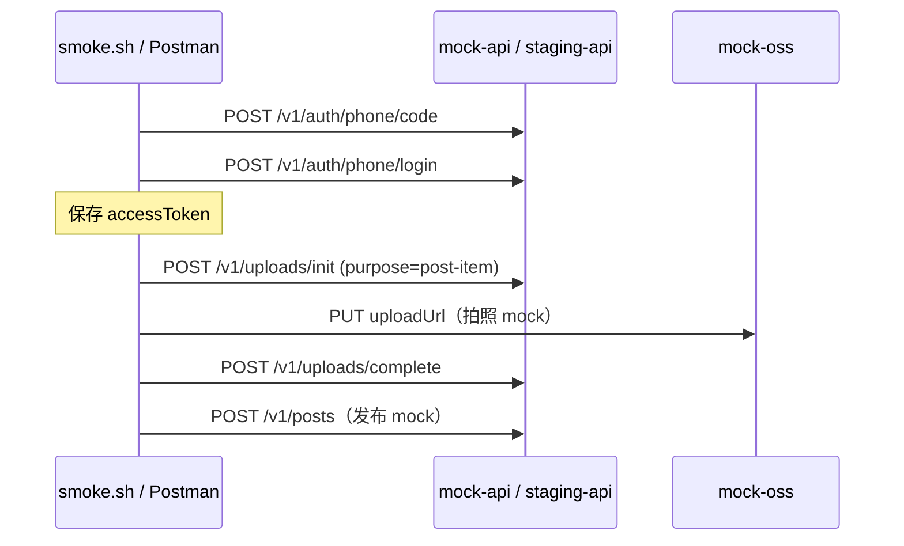

# QA 测试基础设施

> 任务 **T0.20** · 契约：[contracts/openapi/openapi.yaml](../contracts/openapi/openapi.yaml)

## 目录结构

```text
tests/
├── README.md                 # 本文件
├── staging/
│   └── README.md             # Staging 拓扑与访问方式
├── accounts/
│   └── test-accounts.yaml    # 测试账号池（占位）
├── mocks/
│   ├── docker-compose.yaml   # IAP / 微信 / 广告 / 审核 / AI + API Mock
│   ├── README.md
│   └── */mappings/           # WireMock 映射
├── smoke/
│   ├── smoke.sh              # P0 冒烟 shell
│   ├── smoke.env.example
│   ├── baobao-p0-smoke.postman_collection.json
│   └── README.md
├── e2e/                      # P1 端到端（T1.20）
│   ├── e2e.sh
│   ├── baobao-p1-e2e.postman_collection.json
│   └── ios/                  # XCUITest 源文件
└── performance/              # T7.6 性能压测基准
    ├── README.md
    ├── device-matrix.md      # iPhone 12 / 16 等基线机型
    ├── benchmark-feed.sh
    ├── benchmark-ai-mock.sh
    └── PERF_BASELINE_REPORT_TEMPLATE.md
```

## 快速开始（P0 验收）

```bash
# 1. 启动 Mock API
cd tests/mocks && docker compose up -d mock-api

# 2. 跑冒烟
cd ../smoke && chmod +x smoke.sh && ./smoke.sh
```

预期输出末尾：`P0 smoke PASSED: login → photo(mock) → publish(mock)`。

## 冒烟流程



| 阶段 | 说明 | OpenAPI operationId |
| --- | --- | --- |
| 登录 | 手机号 + 验证码 | authPhoneSendCode → authPhoneLogin |
| 拍照 mock | 申请直传凭据 + mock OSS PUT | uploadInit → uploadComplete |
| 发布 mock | 创建家庭圈作品 | postCreate |

## 环境与 Mock

| 文档 | 内容 |
| --- | --- |
| [staging/README.md](./staging/README.md) | 双区域 staging 域名、请求头、VPN 访问 |
| [accounts/test-accounts.yaml](./accounts/test-accounts.yaml) | 手机号 / Apple / 微信 / IAP 测试账号占位 |
| [mocks/README.md](./mocks/README.md) | docker compose 启动三方 Mock |
| [performance/README.md](./performance/README.md) | T7.6 性能压测基准与复现 |
| [performance/device-matrix.md](./performance/device-matrix.md) | 性能基线机型与预算 |

## 后续扩展（P1+）

- `e2e/` — P1 端到端（T1.20）：[e2e/README.md](./e2e/README.md)
- `integration/` — 跨服务契约测试（待 P1 微服务就绪）

## P1 E2E 快速开始

```bash
cd tests/mocks && docker compose up -d mock-api   # 或 python3 api/mock_server.py
cd ../e2e && chmod +x e2e.sh && ./e2e.sh
```

## 验收自检清单

- [ ] `docker compose up -d mock-api` 成功，`curl localhost:18080/health` 返回 200
- [ ] `./tests/smoke/smoke.sh` 全部断言通过
- [ ] Postman 集合 7 步 Run 通过（mock 模式）
- [ ] `test-accounts.yaml` 含 CN/OS 账号占位与 `devices` 条目
- [ ] `device-matrix.md` 含 iPhone 12 + iPhone 16 基线
- [ ] `mocks/docker-compose.yaml` 含 IAP / 微信 / 广告 / 审核 / AI 五类服务
- [ ] 响应结构符合 `ApiResponse` / `AuthTokens`（见 common.yaml）

## 相关任务

- T0.20：本目录
- T0.8：staging 监控 — [infra/observability](../infra/observability/)
- T1.20：登录 → 家庭 → 宝宝 E2E — [e2e/](./e2e/)
